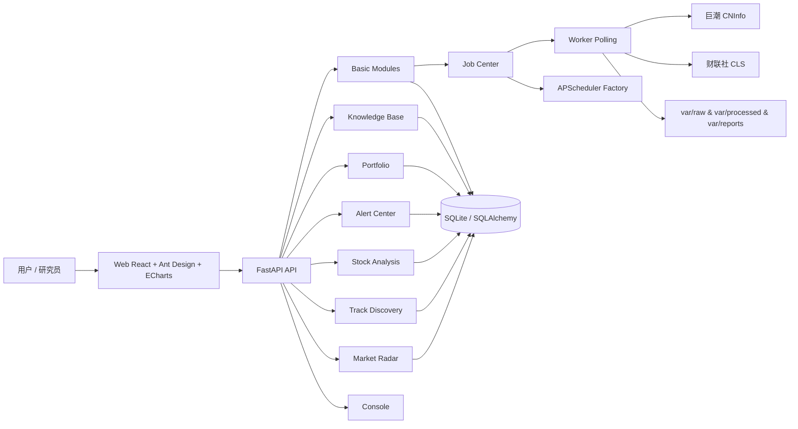
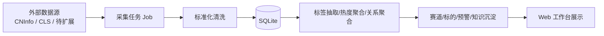
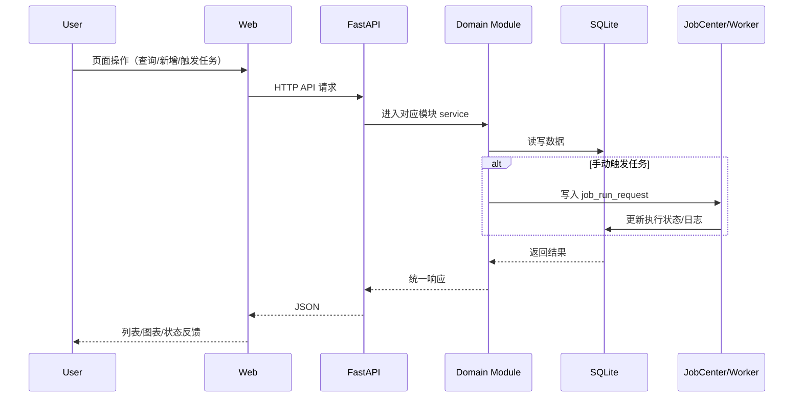

# Liuli v2


> 面向个人投资者的“研究-执行-复盘”辅助系统。将新闻、公告、赛道、标的、预警与组合管理串成可持续演进的数据与认知闭环。

---

## ✨ 快速开始（新人优先）

### 1) 一键启动（Windows）

```powershell
.\start.bat
```

启动后访问：

- Web: <http://127.0.0.1:5173>
- API Health: <http://127.0.0.1:8000/api/health>

停止：

```powershell
.\stop.bat
```

默认账号：`admin / admin123`

### 2) 手动启动

```powershell
# API
python -m uvicorn invest_assistant.main:app --host 127.0.0.1 --port 8000

# Worker（任务执行轮询）
python -m invest_assistant.worker

# Web
cd invest_assistant\ui\web
npm.cmd install --no-audit --no-fund
npm.cmd run dev -- --host 127.0.0.1 --port 5173
```

---

## 🧭 系统架构

当前实现采用「FastAPI + 模块化后端 + React Web + SQLite（默认）」的单体分层架构：

- **前端层**：`invest_assistant/ui/web` 提供业务工作台与控制台。
- **API 层**：`invest_assistant/main.py` + `bootstrap/app.py` 组装 FastAPI 与所有业务路由。
- **领域模块层**：`invest_assistant/modules/*` 按业务模块拆分 `models/schemas/service/router/jobs`。
- **任务调度与执行层**：
  - APScheduler 工厂（已实现）
  - Job Center 任务注册、手动触发、运行日志
  - Worker 轮询执行 `job_run_request`
- **数据层**：SQLAlchemy + 默认 SQLite `var/db/liuli.sqlite3`。
- **文件层**：`var/raw`、`var/processed`、`var/reports`、`var/exports` 等目录承载原始/处理后资产。
- **AI 相关模块**：知识库包含 `skills/agents/feedback` 数据结构；配置层预留 `openai_api_key`、`qwen_api_key`，当前主要是模块结构与任务入口，深度 AI 链路为后续演进项。
- **外部数据源**：已见到巨潮资讯（公告财报）与财联社新闻抓取任务。

### 架构图（Mermaid）



---

## 🧱 技术栈

| 层级 | 技术 |
|---|---|
| 前端（Web） | React 18, TypeScript, Vite 5, Ant Design 6, React Router 6, Axios, ECharts + echarts-for-react |
| 后端（API） | Python 3.11+, FastAPI, Uvicorn, Pydantic v2, SQLAlchemy 2 |
| 调度/任务 | APScheduler, 自研 Job Center + Worker 轮询执行 |
| 鉴权 | python-jose, passlib[bcrypt], python-multipart |
| 数据库 | SQLite（默认，`database_url` 可通过环境变量覆盖） |
| 测试 | Pytest（unit + integration） |

---

## 🧩 核心功能（按业务模块）

> 说明聚焦“解决什么问题 / 主要能力 / 数据流向”。

### 1) Market Radar（市场雷达）
- **解决问题**：把分散信息流（新闻、标签、热度）汇总成可观测市场脉搏。
- **主要能力**：新闻入库、标签抽取、热度快照、标签关系快照、候选标签管理。
- **数据流向**：外部新闻/公告 → `source_item` → 标签/热度/关系计算 → 前端工作台展示。

### 2) Track Discovery（赛道发现）
- **解决问题**：从热点线索沉淀“赛道假设—证据—关联标的”的研究对象。
- **主要能力**：候选赛道生成、赛道别名、赛道论点、证据、验证指标、关联标的维护。
- **数据流向**：市场雷达标签热度/人工输入 → `track*` 数据表 → 赛道页面与详情页。

### 3) Stock Analysis（标的分析）
- **解决问题**：把个股研究过程结构化，便于评分、对比、复盘。
- **主要能力**：标的池、研究笔记、评分快照、对比组、标的与赛道关系、投资论点。
- **数据流向**：股票主数据 + 研究输入 → `stock_*` 研究表 → 标的分析视图。

### 4) Alert Center（预警中心）
- **解决问题**：将规则化监控转成可追踪告警事件。
- **主要能力**：预警规则管理、规则执行任务、预警事件生成与状态流转。
- **数据流向**：规则配置 + 市场/研究数据 → 规则评估任务 → `alert_event`。

### 5) Portfolio（组合管理）
- **解决问题**：将研究与实际持仓、调仓、复盘对齐。
- **主要能力**：组合、分组、持仓、复盘记录。
- **数据流向**：用户维护组合数据 → `portfolio*` 表 → 组合工作台展示。

### 6) Knowledge Base（知识库）
- **解决问题**：把研究经验沉淀成可复用的策略资产。
- **主要能力**：知识笔记、skills、agents、反馈日志；提炼与编排任务入口。
- **数据流向**：研究笔记/复盘输入 → 知识结构化 → 后续 AI/策略复用。

### 7) Console（控制台）
- **定位**：运维与配置面板，不承载业务能力归属。
- **主要能力**：系统状态、任务中心、数据源管理入口、基础库/配置巡检。
- **数据流向**：Console 操作 → 基础模块（job_center/system_config/stock_master 等）→ DB。

---

## 🔌 API 总览（按模块）

> 仅列关键前缀与代表性端点，完整定义以各模块 `router.py` 为准。

| 模块 | 前缀 | 代表性端点 |
|---|---|---|
| Health | `/api` | `GET /health` |
| Auth | `/api/auth` | `POST /login`, `POST /logout`, `GET /me` |
| Stock Master | `/api/stocks` | `GET /`, `GET /search`, `POST /import`, `GET/PUT /{stock_id}`, `GET/POST /{stock_id}/aliases` |
| System Config | `/api/system-config` | `GET/POST /`, `GET/PUT /{config_key}` |
| Job Center | `/api/jobs` | `GET /`, `POST /sync-definitions`, `GET /run-requests`, `GET/PUT /{job_name}`, `POST /{job_name}/run`, `GET /{job_name}/logs` |
| Report Library | `/api/reports` | `GET/POST /`, `GET/PUT/DELETE /{report_id}`, `GET /{report_id}/content`, `GET /{report_id}/download` |
| Disclosure Library | `/api/disclosures` | `GET/POST /`, `POST /fetch`, `GET/PUT /{id}`, `POST /{id}/download`, `POST /{id}/parse`, `GET /{id}/file`, `GET /{id}/parsed`, `POST /{id}/to-source-item` |
| Market Radar | `/api/market-radar` | `GET /overview`, `GET/POST /source-items`, `POST /source-items/sync-cls`, `GET/POST /tags`, `GET /rankings`, `GET /graphs/stock-track`, `GET /tag-candidates` |
| Track Discovery | `/api/track-discovery` | `GET/POST /tracks`, `GET/PUT /tracks/{id}`, `GET/POST /tracks/{id}/evidence`, `GET/POST /tracks/{id}/stocks`, `POST /tracks/{id}/status` |
| Stock Analysis | `/api/stock-analysis` | `GET/POST/PUT /pool`, `GET /candidates`, `GET /stocks/{id}`, `GET/POST /stocks/{id}/notes`, `GET/POST /stocks/{id}/scores`, `GET/POST /compare-groups`, `GET /reports` |
| Alert Center | `/api/alerts` | `GET/POST/PUT/DELETE /rules`, `GET/POST /events`, `POST /events/{id}/read`, `POST /events/{id}/handle` |
| Portfolio | `/api/portfolios` | `GET/POST /`, `GET/PUT /{id}`, `GET/POST /{id}/groups`, `GET/POST/PUT/DELETE /{id}/positions`, `GET/POST /{id}/review` |
| Knowledge Base | `/api/knowledge` | `GET/POST/PUT/DELETE /notes`, `GET/POST/PUT /skills`, `GET/POST/PUT /agents`, `POST /agents/{id}/run`, `GET /feedback-logs` |
| Console | `/api/console` | `GET /dashboard`, `GET /system-status`, `GET /data-sources`, `GET /ai-logs` |

---

## 🗂️ 项目目录结构（关键）

```text
.
├── invest_assistant/                     # 后端主包
│   ├── main.py                           # FastAPI 入口
│   ├── worker.py                         # Worker 入口（轮询执行任务）
│   ├── bootstrap/                        # 启动与基础设施（配置/日志/DB/调度）
│   ├── shared/                           # 通用工具与基础类型
│   ├── modules/
│   │   ├── basic/                        # 基础能力（auth/job/report/disclosure/stock/config）
│   │   ├── market_radar/                 # 市场雷达
│   │   ├── track_discovery/              # 赛道发现
│   │   ├── stock_analysis/               # 标的分析
│   │   ├── alert_center/                 # 预警中心
│   │   ├── portfolio/                    # 组合管理
│   │   ├── knowledge_base/               # 知识库
│   │   └── console/                      # 控制台路由
│   └── ui/web/                           # React Web 前端
├── tests/                                # 单元 + 集成测试
├── docs/                                 # 系统规范、数据库规范、UI/实施文档
├── var/                                  # 运行时数据目录（db/logs/raw/processed/...）
├── start.bat                             # Windows 一键启动
├── stop.bat                              # Windows 一键停止
├── pyproject.toml                        # Python 依赖与测试配置
└── README.md
```

---

## 🔄 数据流与业务流程

### 1) 核心数据加工流



### 2) 用户交互请求流



---

## 🗃️ 数据库设计（核心表摘要）

> 完整字段请以 `models.py` 与数据库规范文档为准。

| 表名 | 用途 | 关键字段（示例） | 关系摘要 |
|---|---|---|---|
| `user_account` | 账号与鉴权 | `username`, `password_hash`, `is_active` | 基础认证 |
| `job_config` / `job_run_request` / `job_run_log` | 任务配置、执行请求、执行日志 | `job_name`, `status`, `requested_at` | Job Center 核心链路 |
| `stock` / `stock_alias` | 股票主数据与别名 | `symbol`, `name`, `exchange` | 被多个业务模块引用 |
| `company_disclosure` | 公告财报库 | `title`, `source_url`, `publish_time` | 可转写 `source_item` |
| `report` | 报告索引 | `title`, `source`, `publish_time` | 报告库 |
| `tag` / `source_item` / `source_tag` | 市场标签与信息源 | `tag_type`, `content`, `source_name` | 雷达核心输入输出 |
| `tag_heat_snapshot` / `tag_edge_snapshot` / `tag_candidate` | 热度与关系快照、候选标签 | `window`, `heat_score`, `edge_weight` | 支撑可视化分析 |
| `track*` 系列表 | 赛道对象、证据、指标、关联标的 | `track_name`, `thesis`, `evidence_type` | 连接市场雷达与标的分析 |
| `stock_pool` / `stock_research_note` / `stock_score_snapshot` / `stock_track_relation` | 标的研究数据 | `symbol`, `score_total`, `track_id` | 标的研究主链路 |
| `alert_rule` / `alert_event` | 预警规则与事件 | `rule_type`, `triggered_at`, `status` | 规则执行产物 |
| `portfolio` / `portfolio_position` / `portfolio_review` | 组合、持仓、复盘 | `name`, `symbol`, `review_date` | 投资执行与复盘 |
| `knowledge_note` / `knowledge_skill` / `knowledge_agent` / `knowledge_feedback_log` | 知识沉淀 | `topic`, `skill_name`, `agent_name` | AI/策略沉淀基础 |

---

## 🧪 开发规范（项目内落地版）

### 代码风格
- 后端遵循“模块内 `models/schemas/service/router/jobs` 分层”。
- 通用能力放 `shared/`，避免跨模块复制逻辑。
- 保持路径短、单函数职责单一。

### 模块划分原则
- 业务能力归属固定在六大业务模块。
- Console 仅做运营操作入口，不抢占业务域职责。
- `basic/*` 负责共性底座（认证、任务、配置、基础库、资料库）。

### 命名规范
- Python 包/文件：`snake_case`。
- 数据表：`snake_case` 单数/业务语义名（以现有模型为准）。
- Job 名称：`module.action`（如 `market_radar.fetch_news`）。

### 日志规范
- 运行日志沉淀到 `var/logs`，任务日志入 `job_run_log`。
- 任务执行状态需覆盖 `pending/running/success/failed` 流转。

### 错误处理
- 对外接口统一响应结构（见 `shared/response.py`）。
- 外部依赖失败要可追踪（任务 message 或 error_message）。

### 测试规范
- `tests/unit`：模块功能与服务逻辑。
- `tests/integration`：应用启动与路由集成。
- 提交前至少执行 `pytest -q --basetemp=var/cache/pytest`。

### 新增功能放置建议
- 新业务能力：`invest_assistant/modules/<new_module>/`。
- 新基础能力：`invest_assistant/modules/basic/<new_basic_module>/`。
- 新页面：`invest_assistant/ui/web/src/pages/<module>/`。
- 新 API 客户端：`invest_assistant/ui/web/src/api/`。

---

## 🛣️ Roadmap（基于当前代码与文档推断）

> 注意：以下是路线图，不代表全部已完成。

### ✅ 已完成
- 后端 6 大业务模块 + basic 基础模块 + console 路由骨架。
- Job Center + Worker 任务执行闭环。
- Web 首版导航、主题切换、模块工作台基础页面。
- 市场雷达与公告库的部分外部数据抓取链路。

### 🚧 开发中
- Web 各模块深层详情页与高密度交互完善。
- 图表数据与真实业务字段的更细绑定。
- Console 运维体验持续优化（任务中心、日志抽屉等）。

### 📝 计划中
- 更完整的 AI 分析链路落地（当前为结构与入口预留）。
- Android 端实现。
- Web 路由懒加载与 chunk 拆分优化。
- K 线/分时图能力（届时再评估引入 `lightweight-charts`）。

---

## ⚠️ 代码与文档一致性说明

- 当前实现与协作已切换到 `docs/liuli_system_spec_v20.md` 作为系统规范基线；`v6` 文档仍在仓库中，主要用于历史追溯。
- 某些设计文档提到的“完整 AI 能力”在代码中目前仍以配置与知识库结构预留为主，README 已按“Roadmap/待深化”表述。
- 如遇文档描述与代码冲突，README 已优先反映代码当前可见实现。

---

## 📚 关键文档

- 系统规范（当前基线）：`docs/liuli_system_spec_v20.md`（已切换为 v20）
- 数据库规范：`docs/liuli_database_schema_spec_v5.md`
- Web UI 规范：`docs/superpowers/specs/2026-05-16-liuli-web-ui-spec.md`
- 其它设计/计划：`docs/superpowers/specs/` 与 `docs/superpowers/plans/`

