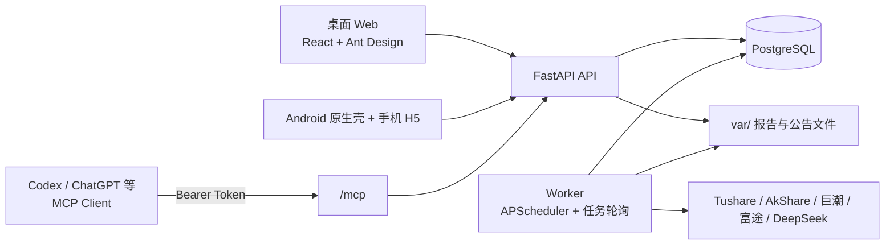

# Liuli v2（琉璃）


> 面向个人投资者的投资辅助系统。把信息流、行情、公告、舆情和外部 AI 研究，转化为"发现赛道 → 筛选标的 → 等待时机 → 调整组合 → 沉淀认知"的闭环。系统不直接给出买卖指令。

当前版本 **1.0.0**（2026-10-08）。系统规格以 [docs/liuli_system_spec.md](docs/liuli_system_spec.md) 为准，版本迭代见 [docs/CHANGELOG.md](docs/CHANGELOG.md)。

---

## 快速开始

### 线上（阿里云 Ubuntu + RDS PostgreSQL）

只能用标准脚本整体启停，不要手工单独启停某个进程：

```bash
bash start_ubuntu_pg.sh   # 启动 API、Worker、桌面 Web、手机 H5
bash stop.sh
```

### 本地开发（Windows）

```powershell
.\start.bat
.\stop.bat
```

本地未设置 `DATABASE_URL` 时使用 SQLite `var/db/liuli.sqlite3`。这只是开发便利，线上数据库是 PostgreSQL。

| 服务 | 地址 |
|---|---|
| API | <http://127.0.0.1:8000/api/health>（OpenAPI：`/docs`） |
| 桌面 Web | <http://127.0.0.1:5173> |
| 手机 H5 | <http://127.0.0.1:5174> |
| 对外 MCP | `http://127.0.0.1:8000/mcp/` |

首次启动会创建默认账号 `admin / admin123`，请登录后立即修改密码。

---

## 系统组成


```mermaid
flowchart LR
  W[桌面 Web<br/>React + Ant Design] --> API
  H5[Android 原生壳 + 手机 H5] --> API
  EXT[Codex / ChatGPT 等<br/>MCP Client] -->|Bearer Token| MCP["/mcp"]
  MCP --> API[FastAPI API]
  API --> DB[(PostgreSQL)]
  API --> FS["var/ 报告与公告文件"]
  WRK[Worker<br/>APScheduler + 任务轮询] --> DB
  WRK --> FS
  WRK --> SRC[Tushare / AkShare / 巨潮 / 富途 / DeepSeek]
```

| 进程 | 端口 | 职责 |
|---|---|---|
| API | 8000 | 鉴权、业务读写、手动任务请求、报告读取，挂载 `/mcp` |
| Worker | — | 定时抓取、打标、热度聚合、行情同步、日报、预警、微操评估 |
| 桌面 Web | 5173 | 完整研究工作台与控制台 |
| 手机 H5 | 5174 | 供 Android 原生壳加载，并把 `/api/` 代理到 8000 |

API 与 Worker 不互相调用，只通过数据库、`var/` 文件和任务请求表协作。

---

## 业务模块

| 模块 | 作用 | 主要内容 |
|---|---|---|
| 市场雷达 | 发现市场在关注什么 | 信息流（财联社、富途、东方财富、巨潮公告、社交媒体舆情）、标签热度榜、关系图谱、AI 推荐词、市场热词、每日日报 |
| 赛道发现 | 判断方向是否值得跟踪 | 赛道库、赛道动态材料、六维评分与 S—D 评级、资金热度档位、赛道对比 |
| 标的分析 | 找出能承接赛道的公司 | 标的池、标的事件材料、评级 / 估值 / 趋势快照、K 线、标的对比 |
| 预警中心 | 跟踪时机与风险 | 热度规则、任务失败规则、微操风险警示 |
| 组合管理 | 管理实盘资产结构 | 实盘持仓、调仓记录（含价格与理由来源）、现金、每日市值、组合复盘、微操建议跟踪与评估 |
| 知识库 | 沉淀认知并对接外部 AI | 知识笔记、对内 Prompt、对外 Skills、研究员 profile、研究回流导入 |
| 控制台 | 操作面板 | 系统状态、任务中心、数据源、股票基础库、标签索引、公告财报库、系统配置、AI 审计日志 |

外部 AI 研究协作链路：外部执行器读取 Skills 和研究员 profile，经 MCP 查询琉璃数据，把 Markdown 报告回流到知识库，再按标题自动导入评级、估值、趋势、赛道趋势、微操等业务表。

Android 底栏为 看板 / 资讯 / 笔记 / 待办 / 我的，定位是随身查看和处理待办，不承担控制台和深度分析。

---

## 技术栈

| 层 | 技术 |
|---|---|
| 后端 | Python 3.11+、FastAPI、Pydantic v2、SQLAlchemy 2、APScheduler、python-jose（JWT） |
| 数据库 | 线上 PostgreSQL（psycopg 3）；本地开发可用 SQLite |
| 桌面 Web | React 18、TypeScript、Vite 5、Ant Design 6、ECharts（echarts-for-react）、lightweight-charts（K 线） |
| Android | Kotlin + Jetpack Compose 原生壳（单 WebView）+ 独立手机 H5（React、Vite、TanStack Query、ECharts） |
| 对外 MCP | MCP Python SDK（FastMCP，Streamable HTTP） |
| 数据源 | Tushare、AkShare、巨潮资讯、富途快讯 |
| AI | DeepSeek |

---

## 目录结构

```text
.
├── invest_assistant/
│   ├── main.py / worker.py          # API 与 Worker 入口
│   ├── bootstrap/                   # 配置、数据库、日志、调度
│   ├── modules/
│   │   ├── basic/                   # auth、stock_master、system_config、job_center、
│   │   │                            # report_library、disclosure_library、ai_audit、mcp
│   │   ├── market_radar/  track_discovery/  stock_analysis/
│   │   ├── alert_center/  portfolio/  knowledge_base/
│   │   └── console/
│   ├── services/                    # tushare、akshare、deepseek client
│   ├── shared/                      # 无业务含义的通用工具
│   └── ui/
│       ├── web/                     # 桌面 Web
│       └── android/{app,h5}/        # Android 原生壳与手机 H5
├── tests/                           # pytest
├── tools/migrations/                # 线上 PostgreSQL 列变更脚本
├── docs/                            # 系统规格、CHANGELOG、专题文档、归档
├── var/                             # 运行时数据（不进 Git）
├── start_ubuntu_pg.sh / start.sh / stop.sh
└── start.bat / stop.bat
```

---

## 开发约定

- 业务能力收敛在所属模块内（`models / schemas / service / router / jobs`），两个以上模块真实复用才上移 `services` 或 `shared`；Console 只是操作面板，不拥有业务能力。
- 新表在 API 启动时由 `create_all` 自动创建；**已有表加列或改列必须写 `tools/migrations/YYYY-MM-DD_<name>.sql`，在线上 PostgreSQL 手工执行**。
- 定时任务在模块 `jobs.py` 中注册，命名为 `模块名.动作名`，由任务中心同步到 `job_config`。
- 每次功能变更都要同步：在 `docs/CHANGELOG.md` 追加版本条目，修改 `docs/liuli_system_spec.md` 对应章节和版本号。
- 提交说明采用 Conventional Commits：`<type>(<scope>): <中文 subject>`。
- 部分测试会重建或清空数据库，运行前先确认目标库，并先备份 `var/db/liuli.sqlite3`。

---

## 文档

| 文档 | 内容 |
|---|---|
| [docs/liuli_system_spec.md](docs/liuli_system_spec.md) | 系统规格：架构、部署、模块规则、API 汇总、表结构 |
| [docs/CHANGELOG.md](docs/CHANGELOG.md) | 版本迭代记录 |
| [docs/liuli_mcp_design.md](docs/liuli_mcp_design.md)、[docs/liuli_mcp_tools.md](docs/liuli_mcp_tools.md) | 对外 MCP 设计与工具清单 |
| [docs/liuli_android_app_spec.md](docs/liuli_android_app_spec.md) | Android 原生壳与手机 H5 规格 |
| [docs/archive/liuli_system_spec_mvp.md](docs/archive/liuli_system_spec_mvp.md) | MVP 阶段（v7–v48）规格归档，只作历史追溯 |
