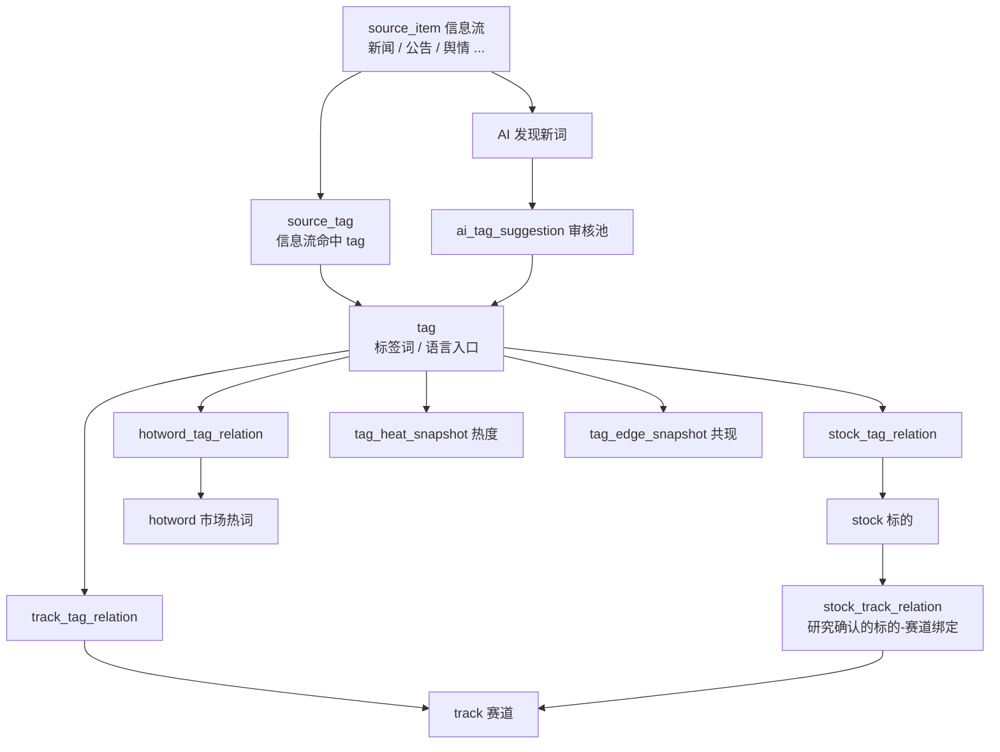

# liuli 系统规格说明书

> 项目名称：`liuli`（琉璃）
> 当前版本：**1.0.3**（2026-10-09）
> 定位：个人投资辅助系统
> 形态：后端服务 + 桌面 Web + Android（原生薄壳 + 手机 H5）
> 用户模式：单用户安全登录，按个人投资系统设计
> 架构原则：业务与数据分层，模块内聚优先，复用后置抽象，AI 作为业务工具，不做过度平台化

本文件只描述系统**当前是什么样**，是架构、模块边界、表结构和接口的唯一长期规格源。

- 版本迭代记录：`docs/CHANGELOG.md`
- MVP 阶段（v7–v48）的完整演进与决策过程：`docs/archive/liuli_system_spec_mvp.md`（已冻结，只作历史追溯）
- 配套专题文档：`docs/liuli_mcp_design.md`、`docs/liuli_mcp_tools.md`（对外 MCP）、`docs/liuli_android_app_spec.md`（Android）

## 0. 版本与维护规则

### 0.1 版本号

采用 `主版本.次版本.修订号`：

| 变更类型 | 版本号 | 示例 |
|---|---|---|
| 常规迭代：缺陷修复、口径调整、小功能、增删列或接口 | 修订号 +1 | 1.0.1 |
| 里程碑：一批功能形成新的业务能力 | 次版本 +1 | 1.1.0 |
| 架构调整、模块边界重划、不兼容的数据模型重构 | 主版本 +1 | 2.0.0 |

升哪一位由用户决定发版粒度，不按单个改动机械升级。

### 0.2 每次迭代必须同步

1. 在 `docs/CHANGELOG.md` 顶部追加版本条目：日期、变更内容、原因、影响面（Web / Android / MCP / 数据库）。以功能调整为主，纯样式调整一行带过，写法见 CHANGELOG 的"记录规则"。
2. 修改本文件对应章节，使正文始终等于当前系统；**不在正文里写"vX 改为……"这类演进描述**，演进只写进 CHANGELOG。
3. 涉及线上 PostgreSQL 的列变更，必须提供 `tools/migrations/YYYY-MM-DD_<name>.sql`，并在 CHANGELOG 条目中写明脚本路径。
4. 修改本文件顶部的"当前版本"。

### 0.3 版本记录

| 版本 | 日期 | 摘要 |
|---|---|---|
| 1.0.3 | 2026-10-09 | 微操风险警示收紧：年线向下最高只到观察，同级警示不重复推送 |
| 1.0.2 | 2026-10-09 | 手机端组合页布局：记调仓按钮移到最近调仓下方，组合选择改为卡片标题 |
| 1.0.1 | 2026-10-09 | 手机端记调仓（增量调仓接口、可选同步现金）；删除持仓成本价 |
| 1.0.0 | 2026-10-08 | MVP 结束，按当前代码重写系统规格基线；旧规格归档 |

---

## 1. 系统目标与边界

### 1.1 目标

`liuli` 把外部信息流、行情变化、公司公告、财报和舆情评论，转化为可跟踪、可复盘、可反哺 AI 的投资认知闭环。系统不直接给出买卖指令，而是辅助完成：

1. **发现好赛道**：持续更新、持续验证、持续证伪。
2. **发现好标的**：持续筛选、持续 PK、持续冒泡。
3. **发现好时机**：持续预警、持续跟踪、持续等待。
4. **调整资产结构**：持续复盘、持续优化、持续调整。

### 1.2 核心投资闭环

```text
市场雷达 → 赛道发现 → 标的分析 → 预警中心 → 组合管理 → 知识库沉淀
   → 对外 Skills / 研究员体系 → 外部 AI 研究协作（经 MCP）→ 研究回流 → 回写各业务模块
```

| 模块 | 层级 | 作用 |
|---|---|---|
| 市场雷达 `market_radar` | 信号层 | 发现市场正在关注什么 |
| 赛道发现 `track_discovery` | 判断层 | 判断方向是否值得长期跟踪 |
| 标的分析 `stock_analysis` | 研究层 | 找出能承接赛道的公司 |
| 预警中心 `alert_center` | 时机层 | 跟踪热度、任务异常、组合风险警示 |
| 组合管理 `portfolio` | 行动层 | 管理实盘持仓、调仓记录、组合复盘、微操建议跟踪 |
| 知识库 `knowledge_base` | 认知沉淀层 | 笔记、对内 Prompt、对外 Skills、研究员、研究回流 |
| 控制台 `console` | 操作面板 | 数据源、任务、标签、配置、系统状态；不拥有业务能力 |

### 1.3 不做什么

```text
1. 不直接输出买入/卖出指令。
2. 不做多人协作 SaaS，不做租户隔离和权限管理系统。
3. 不把 AI Gateway 抽象成中心化平台。
4. 不把热度误当成投资价值。
5. 不为了组件复用而过度拆分目录。
6. 不在系统内部编排外部 AI 执行（复杂研究由外部 AI 执行器完成，结果经研究回流沉淀）。
```

---

## 2. 架构原则

### 2.1 业务模块内聚优先

```text
1. 一个业务能力尽量收敛在一个模块目录内。
2. 外部接口 client 优先贴近使用模块，两个以上模块稳定复用才上移 services。
3. shared 只放无业务含义的通用工具。
4. 优先保证上下文集中、修改路径短、业务边界清晰，不追求形式上的复用优雅。
```

| 目录 | 作用 | 业务逻辑 | 业务数据 |
|---|---|---:|---:|
| `modules` | 业务能力归属（六大业务模块 + `basic/*` 基础模块 + `console`） | 有 | 有 |
| `shared` | 时间、分页、响应、异常、文件路径、DB 类型等无业务工具 | 无 | 无 |
| `services` | 跨模块复用的外部接口 client（Tushare、AkShare、DeepSeek） | 很少 | 无 |

`shared` 不放：标签抽取、数据抓取、评分、财报解析、AI Prompt、股票匹配、预警规则、组合计算。

### 2.2 页面路径与能力归属分离

```text
页面路径 = 用户从哪里操作
代码目录 = 能力归哪个业务模块
console 是操作面板，不是业务能力归属地
```

### 2.3 标签模型

系统采用三层模型：信息层 `source_item` → 语言层 `tag` → 业务层 `stock / track / hotword`。



```text
tag 是语言入口和离散语义锚点，不是业务主体；
stock / track / hotword 是业务实体；
*_tag_relation 是绑定（人工确认、稳定归属）——"这个实体叫什么"；
stock_track_relation 是研究确认的标的-赛道业务绑定；
source_tag / tag_edge_snapshot 是关联（信息流自动发现、统计共现）。
```

不使用"别名"概念：同一实体的多种叫法统一表现为"一个实体绑定多个 tag"。不建 `*_alias`、`tag_candidate` 表。

### 2.4 候选对象不单独建表

```text
候选赛道 = track.status = candidate
候选标的 = stock_pool.status = candidate
AI 推荐词 = ai_tag_suggestion.status = pending
```

### 2.5 存储与契约约定

```text
枚举一律存英文小写码，中文映射放在前端展示层；
判断描述、长文本一律 TEXT，只有枚举码用 VARCHAR；
结构化附属内容（JSON）存 TEXT，不用 JSONB，查询要用的字段才单独成列；
派生值可冗余存储以便 SQL 排序筛选，但口径只在一处代码定义（如 track_discovery/scoring.py）；
允许被删除的来源对象（研究回流、预警事件、微操建议条目）在引用方只存 ID，不建外键；
材料引用表（track_material / stock_material）不保存原文，标题正文从源表读取。
```

---

## 3. 部署与运行

### 3.1 线上环境

| 项 | 现状 |
|---|---|
| 服务器 | 阿里云 ECS，Ubuntu，项目目录 `/home/liuli-v2`，Python 虚拟环境 `/home/liuli-v2/.venv` |
| 数据库 | 阿里云 RDS **PostgreSQL**（驱动 `psycopg` 3；`DATABASE_URL` 的 `postgresql://` 自动规范为 `postgresql+psycopg://`） |
| 文件存储 | 服务器本地 `var/`（报告、公告原文与解析文本、日志、PID） |
| MCP 公网 HTTPS | Caddy 反向代理到 `127.0.0.1:8000/mcp/`，由 `configure_liuli_mcp_https.sh` / `restore_liuli_mcp_https.sh` 管理 |

**线上服务只能用标准脚本整体启停**：

```bash
bash start_ubuntu_pg.sh   # 注入 DATABASE_URL、MCP_PUBLIC_BASE_URL 后调用 start.sh
bash stop.sh
```

不得拆解或替代这两个脚本，不得手工单独启停后端、Worker、Web 或 H5 进程。

### 3.2 进程模型

`start.sh` 启动四个进程，日志写 `var/logs/`，PID 写 `var/run/`：

| 进程 | 命令 | 端口 | 日志 |
|---|---|---|---|
| API | `python -m uvicorn invest_assistant.main:app --host 0.0.0.0 --port 8000` | 8000 | `api.log` |
| Worker | `python -m invest_assistant.worker` | — | `worker.log` |
| 桌面 Web | Vite dev server（`invest_assistant/ui/web`） | 5173 | `web.log` |
| 手机 H5 | `npm run build` 后 `node server.mjs`（`invest_assistant/ui/android/h5`） | 5174 | `h5.log` |

```text
API 进程：鉴权、查询、增删改、写入手动任务请求、读报告；挂载 /mcp；不执行重任务。
Worker 进程：APScheduler（时区 Asia/Shanghai）定时调度 + 每 5 秒轮询 job_run_request + 每 30 秒同步调度配置。
API 与 Worker 不直接互相调用，只通过 数据库 / var 文件目录 / job_run_request / job_run_log 协作。
```

API 启动时（`create_app`）执行 `create_all_tables()`：建缺失表、执行各模块 `ensure_*_schema()`、同步默认对内 Prompt。

### 3.3 本地开发环境

`DATABASE_URL` 缺省为 `sqlite:///./var/db/liuli.sqlite3`，**SQLite 只是本地开发便利，不是系统特性**。代码中仅对 SQLite 生效的分支（`PRAGMA table_info` 补列、旧表重建等）只服务本地老库，线上不走这些路径。Windows 本地用 `start.bat` / `stop.bat`。

### 3.4 数据库 Schema 管理（以 PostgreSQL 为准）

```text
新表：由 SQLAlchemy Base.metadata.create_all 在 API 启动时自动建表，不需要迁移脚本。
已有表的列变更：必须写 tools/migrations/YYYY-MM-DD_<name>.sql，在线上 PostgreSQL 手工执行；
                create_all 不会给已有表加列。
索引：模型中声明的索引由 ensure_*_schema 以 checkfirst 方式补建；
      仅 PostgreSQL 支持的索引（如 source_item 的 publish_time DESC NULLS LAST, id DESC）只在 PG 上建。
数据迁移工具：tools/dev/migrate_sqlite_to_postgres.py（本地库迁移到 PG）；
              tools/db/pgsql/*.sql 为历史 PG 修补脚本，只作追溯。
```

时间口径：业务时间统一为**北京时间**（`shared/time_utils.beijing_now()`；`utc_now()` 实际也返回北京时间），时间列为 `DateTime(timezone=True)`，在 PostgreSQL 中即 `timestamptz`。日界、"今日"、交易日判定一律按北京时间。

---

## 4. 配置

### 4.1 启动级配置（环境变量 / `.env`）

由 `bootstrap/config.py` 的 `Settings` 读取：

```text
DATABASE_URL                 线上为 RDS PostgreSQL，由 start_ubuntu_pg.sh 注入
SECRET_KEY                   JWT 签名密钥
ACCESS_TOKEN_EXPIRE_MINUTES  默认 4320（3 天）
TUSHARE_TOKEN / DEEPSEEK_API_KEY / OPENAI_API_KEY / QWEN_API_KEY
LOG_LEVEL
MCP_PUBLIC_BASE_URL          MCP 对外地址，推导 host/origin 校验
```

### 4.2 运行配置 `system_config`

非启动级、可在控制台"系统配置"页调整的配置。当前在用的配置键：

| config_key | 用途 |
|---|---|
| `mcp.clients` | 对外 MCP 客户端 map（token、allowed_tools、max_result_limit） |
| `mcp.debug_log.enabled` | MCP 调试日志开关 |
| `ai.debug_log.enabled` | AI 调用调试日志开关 |
| `tushare-token` / `tushare_token` / `TUSHARE_TOKEN` | Tushare Token，优先于环境变量 |
| `deepseek-api-key` / `deepseek_api_key` / `DEEPSEEK_API_KEY` | DeepSeek Key，优先于环境变量 |

系统配置列表展示 `mcp.clients` 时遮罩 token。

### 4.3 运行态 `runtime_state`

保存任务水位、游标、模块运行状态（`namespace + state_key` 唯一），由 market_radar、stock_analysis、track_discovery 等任务使用。不是用户配置，不在控制台编辑。

---

## 5. 用户与鉴权

```text
单用户安全登录，不是权限系统、不是租户系统。
密码：pbkdf2_sha256（120000 轮，随机盐）。
令牌：JWT（python-jose），Bearer 方式，默认 3 天过期。
除 /api/auth/login 与 /api/health 外，所有 /api 路由在 router 级依赖 get_current_user。
/mcp 使用独立 Bearer Token（system_config.mcp.clients），不复用 Web 登录态。
```

---

## 6. 数据源

| 数据 | 来源 | 接入方式 | 归属模块 |
|---|---|---|---|
| A 股基础库 | Tushare（失败时 AkShare 兜底） | `services/tushare`、`services/akshare` | `basic/stock_master` |
| 标的日线（前复权）、主要指数日线 | Tushare | `services/tushare` | `stock_analysis` |
| 实时行情（持仓、主要指数） | Tushare 实时行情 | `services/tushare` | `portfolio`、`stock_analysis` |
| 公告 | 巨潮资讯 | `disclosure_library/cninfo_client.py` | `basic/disclosure_library` |
| 财联社快讯 | AkShare | `services/akshare` | `market_radar` |
| 富途快讯 | 富途官网快讯接口（直连，15 秒超时，按 `seqMark` 翻页，带 `level` 重要标记） | `market_radar/futu_client.py` | `market_radar` |
| 东方财富个股新闻 | AkShare | `services/akshare` | `market_radar` |
| 社交媒体舆情（雪球 / 微博 / 知乎） | 外部程序经 MCP 批量导入 | `market_radar.import_sentiment_items` | `market_radar` |
| AI | DeepSeek | `services/deepseek` | 各模块 `ai.py` / 任务 |

```text
行情看交易，新闻看注意力，公告财报看兑现，舆情看情绪。
```

---

## 7. 术语

- 只使用"赛道"（`track`），不引入题材、theme、topic。长期产业方向和短期市场方向都是赛道。
- 标签类型只有 `stock / track / hotword`（`tag.type` 可空，表示通用词）。
- "资讯热度"：系统统计的信息流标签命中数（`tag_heat_snapshot`）。
- "资金热度"：研究员对资金与叙事关注度打的 0—10 分（`track_trend_snapshot.market_heat_score`，展示名"资金热度"，档位 `heat_tier`）。二者不可混用。
- "看板"：各模块首页统一叫看板（今日看板、市场看板、赛道看板、标的看板、组合看板）。

---

## 8. 代码目录

```text
liuli-v2/
├── invest_assistant/
│   ├── main.py                  # FastAPI app（create_app）
│   ├── worker.py                # Worker 入口 → job_center.worker.run_worker
│   ├── bootstrap/               # app、config、database、logging、scheduler
│   ├── modules/
│   │   ├── basic/
│   │   │   ├── auth/
│   │   │   ├── stock_master/
│   │   │   ├── system_config/   # system_config + runtime_state
│   │   │   ├── job_center/
│   │   │   ├── report_library/
│   │   │   ├── disclosure_library/   # 含 cninfo_client.py、parser.py
│   │   │   ├── ai_audit/
│   │   │   └── mcp/             # 对外 MCP：server、auth、registry、service、projection、debug_logger、tools/
│   │   ├── market_radar/        # 含 futu_client.py、daily_report.py、backfill_requests.py
│   │   ├── track_discovery/     # 含 scoring.py、material_generation.py、ai.py
│   │   ├── stock_analysis/      # 含 ai.py
│   │   ├── alert_center/
│   │   ├── portfolio/           # 含 adjust_advice.py、position_change_review.py
│   │   ├── knowledge_base/      # 含 prompts/（对内 Prompt 文件）、external/（Skills、研究员 profile）
│   │   └── console/             # 只有 router.py：聚合各模块数据
│   ├── services/                # akshare/、tushare/、deepseek/、ai_debug_logger.py
│   ├── shared/                  # db_types、enums、errors、file_utils、pagination、response、time_utils
│   └── ui/
│       ├── web/                 # 桌面 Web（React + Vite + Ant Design）
│       └── android/
│           ├── app/             # 原生薄壳（Kotlin + Compose + WebView）
│           └── h5/              # 手机 H5（React + Vite，独立工程）
├── tests/                       # pytest
├── tools/                       # migrations/（线上 PG 列变更脚本）、dev/、db/
├── data/                        # 种子、样例、导入导出模板
├── var/                         # 运行时数据（不进 Git）
├── docs/
├── start.sh / stop.sh / start_ubuntu_pg.sh
└── old/                         # 旧项目，仅作功能参考，不复用结构
```

模块标准文件：`models.py / schemas.py / service.py / router.py / jobs.py`，按需增加 `ai.py`、client、领域子文件。

### 8.1 var 目录

```text
var/
├── db/                 # 仅本地开发 SQLite
├── logs/               # api / worker / web / h5 日志，mcp_debug.log
├── run/                # 进程 PID
├── reports/{source_module}/YYYY-MM/   # 报告文件本体
├── raw/disclosures/                   # 公告原文
├── processed/disclosures/{markdown,text}/
├── cache/
└── exports/
```

---

## 9. 基础模块 basic

### 9.1 basic/auth

见第 5 节。表：`user_account`。

### 9.2 basic/stock_master

股票基础主数据：标的身份识别、代码名称映射、拼音与简称检索。

```text
stock 只表示 A 股主数据，stock.status 不表示研究状态；
同步基础库只写 stock，不批量生成 tag；
(stock_code, exchange) 唯一。
```

### 9.3 basic/system_config

`system_config`（运行配置）与 `runtime_state`（运行态），见第 4 节。

### 9.4 basic/ai_audit

每一次 AI 请求写一条 `ai_request_log`：provider、model、task_name、status、token、耗时、错误信息。不保存完整请求和响应。控制台"AI 审计日志"展示列表、汇总和按日用量（`/api/console/ai-logs*`），没有独立 `/api/ai-audit` 路由。

### 9.5 basic/job_center

```text
job_center 管"任务怎么跑"，各业务模块管"任务具体干什么"。
```

- 各模块 `jobs.py` 暴露 `JOBS: list[JobDefinition]`，`registry.py` 汇总为 `JOB_REGISTRY`。
- 代码里的 `JobDefinition` 是任务定义源头；`job_config` 是运行时配置状态。同步时新增缺失任务、更新展示信息，不覆盖控制台改过的启停和 Cron。
- `job_config` 只存身份、展示信息和 `config_json`（trigger_type、cron_expr、enabled、timeout_seconds、max_retries、params、params_schema）/ `ext_json`（tags、category、ui_order、notes），不把调度参数摊平成列。
- 手动执行：控制台 → API 写 `job_run_request` → Worker 轮询执行 → 写 `job_run_log`。
- 任务命名：`模块名.动作名`。`JobResult` 统一返回 success、message 和 fetched / processed / inserted / updated / skipped 计数。

当前注册任务（Cron 为默认值，北京时间）：

| 任务 | 名称 | 触发 | 默认 Cron |
|---|---|---|---|
| `stock_master.sync_stock_basic` | 同步股票基础库 | 手动 | — |
| `stock_analysis.refresh_major_indices_realtime` | 刷新 A 股主要指数实时行情 | 手动 | — |
| `stock_analysis.sync_daily_bars` | 同步标的日线行情（前复权 + MA） | 定时/手动 | `30 18 * * 1-5` |
| `stock_analysis.review_stock_events_deepseek` | AI 审核标的事件 | 手动 | — |
| `disclosure_library.fetch_stock_announcements` | 按标的池拉取巨潮公告并转写信息流 | 定时/手动 | `30 8 * * *` |
| `disclosure_library.download_file` | 下载公告财报文件 | 手动 | — |
| `disclosure_library.parse_pdf` | 解析公告财报文件 | 手动 | — |
| `market_radar.fetch_stock_news` | 抓取东方财富个股新闻 | 定时/手动 | `0 8 * * *` |
| `market_radar.fetch_news` | 抓取财联社快讯 | 定时/手动 | `*/30 * * * *` |
| `market_radar.fetch_futu_news` | 抓取富途快讯 | 定时/手动 | `*/30 * * * *` |
| `market_radar.extract_tags` | 规则抽取信息流标签 | 定时/手动 | `*/5 * * * *` |
| `market_radar.backfill_source_tags` | 信息流标签回溯打标 | 手动 | — |
| `market_radar.extract_daily_hotwords_deepseek` | DeepSeek 新闻热词候选 | 定时/手动 | `30 16 * * *` |
| `market_radar.aggregate_heat` | 聚合 24h/7d/30d 标签热度 | 定时/手动 | `*/10 * * * *` |
| `market_radar.aggregate_edges` | 聚合标签共现关系 | 定时/手动 | `*/10 * * * *` |
| `market_radar.generate_daily_report` | 生成前一自然日市场雷达日报 | 定时/手动 | `0 3 * * *` |
| `track_discovery.review_track_events_deepseek` | AI 审核赛道事件 | 手动 | — |
| `portfolio.refresh_all_realtime_quotes` | 刷新全部组合实时行情 | 手动 | — |
| `portfolio.capture_daily_value_snapshot` | 保存组合每日市值快照 | 定时/手动 | `0 17 * * *` |
| `portfolio.evaluate_adjust_advice` | 评估微操建议 | 定时/手动 | `15 19 * * 1-5` |
| `alert_center.evaluate_rules` | 执行预警规则 | 定时/手动 | `*/5 * * * *` |

### 9.6 basic/report_library

报告索引与阅读入口，不生成报告。

```text
report 表管"报告索引"，var/reports/{source_module}/YYYY-MM/ 管"报告文件本体"；
报告由各业务模块（如 market_radar.generate_daily_report）或外部 MCP 上传产生；
报告不设一级菜单，入口嵌在工作台、列表卡片、详情页和 Android 报告页。
```

### 9.7 basic/disclosure_library

公告财报库：巨潮元数据入库、原文下载归档、PDF 解析为 text/Markdown、关联 `stock_id`、解析状态。

```text
原文：var/raw/disclosures/；解析：var/processed/disclosures/{markdown,text}/；
拉取任务默认把公告转写为摘要型 source_item(source_type=announcement,
  related_type=company_disclosure, related_id=公告ID)，参与市场雷达标签与热度；
公告正文不入库（只落 parsed_text_path），公告类材料详情的 material_content 为空，靠标题和原文链接兜底。
```

### 9.8 basic/mcp

对外 MCP 协议层，见第 21 节。它不是 Console 子模块，也不放 `services`。

---

## 10. 市场雷达 market_radar

### 10.1 定位

把信息流转化为市场注意力结构：市场在关注什么、哪些词升温、哪些标的被哪些赛道和热词带出来、AI 发现了哪些值得确认的新词。不判断赛道好坏、公司值不值得买。

### 10.2 数据流

```text
新闻 / 公告摘要 / 舆情
  → source_item
  → 规则匹配已有 tag（market_radar.extract_tags）→ source_tag
  → tag_heat_snapshot（热度）/ tag_edge_snapshot（共现）
  → 实体热度：经 *_tag_relation 聚合到 stock / track / hotword
  → 命中赛道/标的的信息流生成待审材料 track_material / stock_material(status=pending)

AI 新词：当日 news 信息流 → DeepSeek → ai_tag_suggestion(pending)
  → 人工审核（可修正名称）→ 创建或绑定 tag → 绑定到 stock / track / hotword → 回溯打标
```

### 10.3 source_item 信息流

统一信息流条目，`source_type`：`news / announcement / policy / sentiment / research`。

```text
is_important：来源自带的重要标记，入库时由来源给出，不按关键词推断。
  当前只有富途快讯有（接口字段 level=1），其他来源一律 false。信息流 important_only 按此列过滤。
author：只有 sentiment 使用。
related_type / related_id：可选回链原始业务对象（company_disclosure、report 等）。
```

去重：URL 去重（`source_type, source_name, source_url`）与标题时间去重（`source_type, source_name, publish_time, title`）。富途快讯按 `seqMark` 从新往旧翻页，翻到已入库即停，单次上限 300 条。

**舆情导入**（只经 MCP `market_radar.import_sentiment_items`）：

```text
platform   → source_name，只允许 雪球 / 微博 / 知乎
author     → author，按平台显示名原样保存，不跨平台合并；作者不做成 tag
date       → 不入库，只用于校验（不晚于今天）和限定去重范围
content    → content，去首尾空白，最长 2000 字
important  → is_important，可选，默认 false
title      → 服务端取正文第一行前 40 字，展示时不显示
publish_time → 导入时间
去重       → 同平台、同作者、正文完全相同，且在 date 当天 00:00（北京时间）之后已导入过
单次 ≤ 200 条，逐条校验，单条失败不影响同批；调用日志只记条数不记正文
```

舆情照常参与标签命中、热度、图谱和材料生成，不进待办，不进 AI 推荐词任务。

### 10.4 AI 推荐词

AI 只输出 `name / score / reason`，不判断实体类型。审核时 `final_tag_name` 为空则用 `suggested_text`；通过后写 `final_tag_id`，人工选择绑定到 stock / track / hotword。拒绝累计 `rejected_count`，可恢复。

### 10.5 热度与排名

```text
统计层级：source_item → source_tag → tag，不受材料审核状态影响。
窗口：24h / 7d / 30d，各自独立统计。
heat_score = trigger_count（source_tag 命中次数）；source_count 为去重条数，仅内部诊断。
不使用百分比变化率。
```

排名变化用参照快照而非上一轮快照：

| 窗口 | 参照 | 最大向前容忍 |
|---|---|---|
| 24h | 1 小时前 | 3 小时 |
| 7d | 24 小时前 | 36 小时 |
| 30d | 7 天前 | 10 天 |

```text
rank_change = previous_rank_no - current_rank_no；rank_movement = up / down / flat / new
排名口径随榜单分类：hotword / track / stock 为类内排名，all 为全局排名；
默认排名变化取 7d。
```

`tag_edge_snapshot` 记录 stock 标签与 track / hotword 标签的共现，是关联不是绑定。

### 10.6 市场雷达日报

`market_radar.generate_daily_report` 每天 03:00 用 DeepSeek 生成前一自然日的 Markdown 日报，写入报告库。

---

## 11. 赛道发现 track_discovery

### 11.1 定位

判断层：管理赛道认知与跟踪状态。市场雷达发现信号，赛道发现解释信号；不做成另一个标签管理系统。

### 11.2 赛道实体

```text
status：active 跟踪中 / candidate 候选 / archived 归档（等同软删除，只在 Web 可见）；
        列表与筛选一律跟踪中在前、候选在后。
新建赛道：ensure tag(name=track.name) → 写 track_tag_relation。
赛道多种叫法 = 一个 track 绑定多个 tag（主入口：赛道详情 → 标签）。
产业阶段 industry_phase：intro / expansion / mature / contraction
市场阶段 market_phase：latent / start / ferment / accelerate / climax / divergence / recede
current_view / industry_phase / market_phase 是快照导入回填的缓存，结论真相在 track_trend_snapshot；
latest_snapshot_id 是看板排序的快捷指针。
状态与阶段变化写 track_status_history。
```

### 11.3 赛道材料 track_material

```text
材料来源只有 source_item（信息流）和 knowledge_note（笔记）；
UNIQUE(track_id, material_type, material_id)；
direction：support / weaken / neutral / noise；importance_level：high / medium / low；
信息流命中赛道 → 自动生成 pending；用户主动引用 → 直接 confirmed；
pending → confirmed / ignored；可由 track_discovery.review_track_events_deepseek 辅助审核。
```

### 11.4 赛道趋势快照 track_trend_snapshot

一份"赛道趋势研究"报告的一个赛道 = 一条快照，由研究回流导入写入，纯追加，同日允许多份，经 `report_id` 回溯原文。

六维量化评分（0—10，必填，一律"分高 = 更有利"）：

| 列 | 展示名 | 含义 |
|---|---|---|
| `market_heat_score` | 资金热度 | 资金与叙事当前关注程度（与资讯热度无关） |
| `growth_speed_score` | 发展速度 | 产业与需求扩张斜率 |
| `concentration_score` | 行业集中度 | 10 = 格局收敛、龙头有定价权 |
| `cycle_resilience_score` | 周期韧性 | 10 = 弱周期、能穿越周期 |
| `current_market_size_score` | 当前市场规模 | 已兑现的可寻址规模 |
| `future_market_size_score` | 远期市场规模 | 3—5 年可兑现空间 |

```text
派生三列由 scoring.derive_track_scores 在写入时计算，不接受外部传值：
  overall_score = 六项等权平均；track_grade = S/A/B/C/D（按 overall_score 分档）；
  heat_tier = T0—T4（只由 market_heat_score 决定，T0 最热）。
阈值只在 track_discovery/scoring.py 一份；改阈值需重算历史快照。
缺任一维或越界分数整条拒绝，不夹到边界。
评级与热度档位并排展示、不合成一个角标；研究优先级由评级推导（S/A 优先研究、B 持续跟踪、C/D 降低关注），不单独存。
其余内容：headline_cycle（short/mid/long）、core_judgment、六项分析（需求空间、供给竞争、盈利现金、政策催化、市场资金、定价预期差）、
key_contradiction、segments_json、scenarios_json、next_verification、risk_falsification、change_vs_last、data_gaps、data_sources_json。
代表公司只作报告留存；可检索的标的绑定只走 stock_track_relation。
```

### 11.5 赛道热度

```text
赛道资讯热度 = track_tag_relation + tag_heat_snapshot 聚合，不单独落表；
对外露出窗口统一为 7d（常量 TRACK_HEAT_WINDOW），详情、看板排行、赛道库排序共用；
详情 summary 带 heat_change：相对一天前同窗口的变化量。
```

### 11.6 不建设

`track_thesis / track_validation_indicator / track_evidence / track_heat_snapshot / track_related_stock / track_alias`。

---

## 12. 标的分析 stock_analysis

### 12.1 定位

研究层：公司是否真正受益、竞争力、估值成长与风险、哪些材料影响判断、是否进入重点跟踪。

### 12.2 标的池 stock_pool

```text
status：candidate / watching / focused / archived；
source：manual / ai / market_radar / track_discovery；
加入标的池：ensure tag(name=stock.stock_name) → 写 stock_tag_relation；
AI 不直接创建 stock，只能推荐已有 A 股进入标的池；
日线同步、公告拉取、个股新闻抓取均以标的池为范围。
```

### 12.3 关系与材料

```text
stock_tag_relation：这只股票叫什么（主入口：标的详情 → 标签；辅入口：控制台股票基础库）。
stock_track_relation：这只股票属于哪个赛道（UNIQUE(stock_id, track_id)；relation_type、conviction、reason）；
  主入口标的详情，辅入口赛道详情。
stock_material：与 track_material 平行，impact_direction = positive / negative / neutral / noise；
  信息流命中 → pending，主动引用 → confirmed；可由 review_stock_events_deepseek 辅助审核。
```

### 12.4 研究快照（均由研究回流导入，纯追加）

| 表 | 来源报告 | 要点 |
|---|---|---|
| `stock_score_snapshot` | 标的评级报告 | 护城河、管理层、治理、战略、确定性、成长六项分 + total_score + investment_level |
| `stock_valuation_snapshot` | 标的估值报告 | 财务表现、趋势参考、指引核对、利润/FCF/收入模型、三年合理市值；导入时按当前市值重算 `expectation_gap_rate` |
| `stock_trend_snapshot` | 趋势研究 | trend_level T0—T5（T0 最强）、六维（赛道三周期、公司地位、市场认可、资金认可、位置、周期）、建议分组 |

```text
stock_valuation_snapshot.valuation_assumptions_json 是估值导入唯一的选填字段：
  previous_period + last_assumptions_vs_actual[] + current_assumptions[]；
  result 只认 超预期 / 符合预期 / 不如预期，超出退化为 null；assumed / actual 为带单位字符串；
  缺失或结构不对退化为 NULL，前端整块不渲染。
stock_trend_snapshot：suggested_group 只是建议，不改 stock_pool.status；
  main_track 按名称匹配 track.name，匹配不到只留文本，不自动建赛道、不写 stock_track_relation；
  行情派生数据不入表，按 market_data_date 从 stock_daily_bar 读取。
```

### 12.5 行情

```text
stock_daily_bar：Tushare 前复权日线 + MA5/20/60/250，UNIQUE(stock_id, trade_date, adj, source)；
market_index_daily_bar：主要指数日线，沪深300 日线同时充当交易日历；
market_index_realtime_quote：六个 A 股主要指数实时报价缓存。
```

其余表：`stock_research_note`（研究笔记）、`stock_thesis`（投资假设）、`stock_compare_group`（对比组）。

---

## 13. 预警中心 alert_center

```text
alert_rule：rule_type + target_type + target_id + condition_json；
alert_event：event_level、title、message、status（unread / read / handled），rule_id 可空。
```

当前生效的事件来源：

| 来源 | 说明 |
|---|---|
| `heat` 规则 | 目标标签在指定窗口（默认 24h）满足 min_heat / min_rank_change / min_trigger_count |
| `job_failure` 规则 | 任务执行失败 |
| 微操风险警示 | 微操建议条目 `risk_level` 为 warning / severe，且比同口径、同研究员上一份报告中该标的的级别更高（新出现或升级）时，导入即生成未读事件（warning / critical），不经规则；维持同级不重复推送 |

预警事件进入 Android"待办"。

---

## 14. 组合管理 portfolio

### 14.1 定位

```text
组合管理 = 实盘组合管理；标的分析 = 研究对象管理。
候选、观察、重点跟踪由 stock_pool 承载，组合管理不放观察池、非实盘分组。
```

Web 实盘持仓、调仓记录等页面支持"全部组合"视图。系统只关心资源配置，不记持仓买入成本，也不计算浮盈浮亏。

### 14.2 持仓、现金与调仓

```text
portfolio_group：实盘分组（core / satellite / defensive / cash / custom），目标权重、个股数量上限；
portfolio_position：真实持仓数量与实时价缓存（current_price、previous_close、quote_time、price_source）；
portfolio_cash_balance / portfolio_cash_flow：现金余额与现金流水；
  flow_type：deposit 入金 / withdraw 出金 / adjustment 校准（覆盖余额）/ dividend 分红 / interest 利息 / trade 调仓同步；
  trade 只由系统生成、金额带符号（买入为负），手动新增流水不接受 trade；
  只有 deposit / withdraw 算外部资金，日盈亏、区间盈亏和复盘收益只扣减这两类；
portfolio_value_snapshot：每日 17:00 保存含现金的组合总市值，UNIQUE(portfolio_id, snapshot_date)；
portfolio_review：阶段性复盘记录。
```

调仓记录 `portfolio_position_change`：

```text
调仓 = 个股持仓数量的变动，持仓新增、修改、删除自动留痕；不是成交流水，不记手续费、税费；
调仓可选择同步现金：按 变动股数 × 调仓价格 写一条 trade 流水并增减余额；公司行为和价格为空时不同步；
  现金校准（adjustment）仍是余额的最终依据，手续费、税费等误差靠它修正；
调仓统一走增量接口 POST /{id}/trades（side = buy / sell / close），Web 和手机端都用它：
  同一事务里读最新持仓、只改股数，分组、目标权重、备注、行情缓存等其余字段不动；
  卖出超过持仓拒绝；清仓删除持仓行；关联建议的方向须与 side 一致；sync_cash 默认 true；
  Web 表单填调整后总数，页面现取最新持仓换算成增量；手机端直接填本次成交股数，不提供公司行为；
整条覆盖的持仓接口（POST/PUT positions）保留但前端不再使用，它会把未传的持仓字段置空，不要用于调股数；
change_date 默认当天，可补录；
price 选填：留空按调仓日前复权收盘价估算（日线未同步时取持仓现价），price_source = manual / estimated；
reason_type：ai_advice / personal / fund_allocation / corporate_action / other；公司行为不估价；
advice_item_id：reason_type = ai_advice 时可关联近 10 天同标的的增持/减持建议，只存 ID。
```

"组合复盘"页的"调仓来源对比"：按理由来源 × 加减方向统计实际调仓的 5/20/60 日效果和 20 日胜率，口径与微操复盘一致（收益基准取 T 日前复权收盘，不用手填价），公司行为不计入，查询时现算。

### 14.3 微操建议跟踪

研究员 `portfolio_001`（组合微操大师）每个交易日收盘后或早盘前出一份报告，标题 `实盘组合-YYYY-MM-DD-微操报告`，末尾 JSON 经研究回流导入。微操建议不是成交，导入、评估都不改持仓和调仓记录。

```text
portfolio_adjust_advice：一份报告一条
  portfolio_id 可空 = 全部实盘组合（研究员默认按所有账户合计持仓出报告）；
  feedback_id 唯一防重导；target_trade_date = 适用交易日 T，所有评估的锚点；
  status：active / superseded（同组合、同研究员、同 T 重导时旧的作废）。
portfolio_adjust_advice_item：每只持仓一条，含维持和等待
  action：add / reduce / hold / wait；只有查询、统计、评估要用的字段成列，其余原样存 detail_json；
  stock_id 由证券代码解析，失败则整份报告导入失败（整份成功或整份失败）。
风险警示：
  级别口径在研究员 profile：年线向下（value_trend_down）单独出现最高只到 watch，且不能作为 warning 的主风险代码；
  warning 需要 K 线（放量跌破 MA60 或 20 日跑输沪深300 超 8%）与经证实资讯两类证据，或已公告的实质经营事件；
  维持 warning 须有新证据，连续 5 个交易日无新证据降级；风险代码命中率 ≥10 样本且 < 40% 时不得单凭它定 warning。
  推送：warning / severe 且相对上一份报告（同口径、同研究员、T 不晚于本次的最近一份有效报告）新出现或升级时，
  导入同时生成未读 alert_event；维持同级只入库不推送，仍参与命中率评估。
```

评估任务 `portfolio.evaluate_adjust_advice`（工作日 19:15，排在 18:30 日线同步之后，可重复执行，数据未到的条目下次补上）：

```text
交易日：用沪深300 日线数交易日；T 非交易日取其后第一个交易日。
收益：前复权 close(T+N) / close(T) - 1，N = 5 / 20 / 60；停牌取此前最近收盘，日线未同步到评估日则跳过。
触及：增持看 T 日最低价 ≤ price_high，减持看 T 日最高价 ≥ price_low，T 日停牌视为未触及。
执行：手动关联该建议的调仓（不限日期）+ T 日同标的、同方向且未关联其他建议的调仓，数量合计；
      达到建议数量为 executed，不足为 partial（推断部分：报告绑定组合时只看该组合，否则跨全部组合）。
只评估 add、reduce 以及 warning 及以上的条目。
verdict（20 日）：增持 > +1% 或减持 < -1% 为 correct，反向超过 1% 为 wrong，其余 neutral。
risk_verdict：20 日收益 - 沪深300 同期收益 < -3% 为 hit。
胜率只统计 touched 的增持、减持；连续多份报告对同一标的同方向、一直未执行的建议只算一次。
信号大类、相对不调整的效果、评估日期等可推导项不落列，查询时计算。
```

展示：Web"组合复盘"页的"微操复盘"板块（20 日胜率、执行率、警示命中率、报告列表、信号表现表——样本不足 10 条置灰）。研究员经 MCP `portfolio.list_adjust_advice_reviews` 读取，评价由系统按固定口径计算，不由研究员自评。安卓端不做。

---

## 15. 知识库 knowledge_base

### 15.1 定位

把个人经验、研究方法和关键素材沉淀为可复用研究资产：

```text
琉璃提供世界观、方法论和关键素材 → 外部 AI 执行器完成复杂研究 → 研究结果回流琉璃沉淀
```

| 子模块 | 存储 | 说明 |
|---|---|---|
| 知识笔记 | `knowledge_note` + `knowledge_note_group` + `knowledge_note_tag_relation` | 心得、复盘、原则、错误案例、MCP 短笔记 |
| 对内 Prompt | 文件 `knowledge_base/prompts/{module}/{task}/{system,user}.md` → 启动时同步到 `knowledge_prompt` | 内部 AI 任务提示词 |
| 对外 Skills | 文件 `knowledge_base/external/skills/{slug}/SKILL.md`，不建表 | Web 只读浏览，frontmatter 提供 name / description / status / version |
| 研究员 | 文件 `external/researchers/{code}/profile.md` + `knowledge_researcher` 索引 | 简介 intro / 价值观 soul / 方法论 method |
| 研究回流 | `knowledge_research_feedback` + 报告库 | 外部研究报告收件箱与业务导入 |

### 15.2 知识笔记

```text
group_id = NULL 即"未分组"（收件箱）；list_notes 支持 ungrouped 与 note_type 过滤；
归档分组不改成员笔记的 group_id；分组可排序（note-groups/reorder）；
MCP knowledge_base.create_note：只收 content，单行、≤ 80 字，同一 client 五分钟内同正文幂等；
  平台侧写死 group_id=NULL、note_type=mcp、related_module=<client 名>、status=active；不提供更新和删除。
Android 待办"笔记"只收 note_type=mcp 的未分组笔记，点开进笔记编辑页归组和打标签。
```

### 15.3 研究员

当前 profile：`analyst_001` 标的分析师、`valuator_001` 标的估值师、`trend_001` 趋势投资者、`track_001` / `track_analyst_001` 赛道趋势分析者、`portfolio_001` 组合微操大师。profile 文件带 `researcher_code / display_name` frontmatter，数据库只存路径、hash 和状态。MCP `knowledge_base.get_researcher_profile` 按展示名、code 或 ID 一次返回完整 profile 和三段正文，文件访问限制在研究员目录内。

### 15.4 研究回流与导入

外部执行器经 MCP `knowledge_base.upload_research_feedback` 上传 Markdown：先写报告库文件和 `report` 索引，再建回流记录。回流只存通用字段，不存正文和领域解析字段。

标题格式 `研究对象-YYYY-MM-DD-报告类型`，导入时按最后两个 `-` 拆出对象、日期和类型，**只看标题识别，不在页面选目标表**。标题第一段只是可读标签，不参与业务解析。

| 报告类型 | 末尾 JSON | 写入 |
|---|---|---|
| 标的评级报告 | 对象 | `stock_score_snapshot` |
| 标的估值报告 | 对象 | `stock_valuation_snapshot` |
| 趋势研究 | **数组**（单标的也是长度 1 的数组） | `stock_trend_snapshot`（每元素一条） |
| 赛道趋势研究 | **数组**（多赛道） | `track_trend_snapshot`（赛道解析不到即该条失败，不自动建赛道） |
| 微操报告 | 对象 | `portfolio_adjust_advice` + `_item` |

```text
company_code 必须匹配已有 stock.stock_code，系统不自动创建标的；
评级必填：company_code + 六项分 + total_score + investment_level + core_logic + primary_risk；
估值必填：company … researcher_code 等 17 个字段（VALUATION_IMPORT_FIELDS），valuation_assumptions 选填；
趋势元素必填只有标的身份、research_date、trend_level；硬校验：trend_level ∈ T0—T5、
  suggested_group ∈ focused/candidate/watching/archived、research_date 与标题日期一致；
数组类导入逐条写入、部分成功：有一条成功即置 parsed，全部失败才算失败；
快照表无唯一键，一键导入不重跑已 parsed 的回流，重导由人工单条触发。
"待导入"判定（pending_import=true）：状态为收到、类型可导入、未导入、且正文末尾能解析出形状正确的 JSON；
  Android"待处理报告"与 Web 一键导入共用此判定；一键导入失败时逐条列出原因。
```

---

## 16. 控制台 console

后端只有 `console/router.py`，聚合各基础模块数据；能力归属仍在 `basic/*`。

| 二级页 | 能力归属 |
|---|---|
| 系统状态 | 各模块汇总 |
| 任务中心 | `basic/job_center`：列表、启停、立即执行、改 Cron、执行日志、同步定义 |
| 数据源 | 第 6 节各数据源的条数、最近更新时间和对应任务 |
| 股票基础库 | `basic/stock_master`；标的标签绑定的辅入口 |
| 标签索引 | `market_radar` 的 tag：统一查看、异常修正、重复合并、停用；不作为 stock / track 标签创建入口 |
| 公告财报库 | `basic/disclosure_library`：列表、手动拉取、下载、解析、转信息流、加入赛道/标的材料 |
| 系统配置 | `basic/system_config` |
| AI 审计日志 | `basic/ai_audit` |

标签创建入口：研究标的 → 标的池；赛道 → 赛道库；市场热词 → 市场雷达"市场热词"。`/console/tags` 不是业务实体与标签绑定的主流程。

---

## 17. Web

### 17.1 技术栈

```text
React 18 + Vite 5 + TypeScript + React Router 6
Ant Design 6（界面、表格、表单）
ECharts（echarts + echarts-for-react：热度、趋势、关系图、组合结构、收益曲线、日历）
lightweight-charts（只用于标的详情 K 线）
react-markdown + remark-gfm（报告阅读）
主题：默认浅色，支持浅色 / 深色 / 跟随系统
```

### 17.2 路由与菜单

一级路由：`/`（工作台）、`/market-radar`、`/track-discovery`、`/stock-analysis`、`/alerts`、`/portfolio`、`/knowledge`、`/console`、`/login`；详情动态路由：`/track-discovery/tracks/:id`、`/stock-analysis/stocks/:id`、`/portfolio/:id`。二级菜单是模块页内的页签（`app/navigation.tsx` 的 `moduleTabs`），不是独立 URL。

```text
工作台    今日看板 | 操作面板 | 最新报告
市场雷达  市场看板 | 信息流 | 热度榜 | 关系图谱 | AI 推荐词 | 市场热词
赛道发现  赛道看板 | 赛道库 | 赛道动态 | 赛道对比
标的分析  标的看板 | 标的池 | 标的事件 | 标的对比
预警中心  预警事件 | 预警规则 | 预警复盘
组合管理  组合看板 | 实盘持仓 | 调仓记录 | 组合复盘
知识库    知识笔记 | 对内 Prompt | 对外 Skills | 研究员 | 研究回流
控制台    系统状态 | 任务中心 | 数据源 | 股票基础库 | 标签索引 | 公告财报库 | 系统配置 | AI 审计日志
```

菜单边界：

```text
报告不设一级菜单；新增赛道、添加标的是页面按钮不是菜单；
候选赛道、候选标的是库内状态筛选；赛道分布是组合页内的分析视角，不单独成菜单；
标签管理在控制台，研究判断不放控制台。
```

---

## 18. Android

详细规格见 `docs/liuli_android_app_spec.md`，此处只列系统级约束。

```text
形态：原生 Android 薄壳（Kotlin + Jetpack Compose + 单 WebView + DataStore）+ 独立手机 H5。
H5：invest_assistant/ui/android/h5，React + Vite + TypeScript + HashRouter + TanStack Query + ECharts 按需；
    与桌面 Web 源码、依赖、产物、进程完全隔离，只共享后端 REST 契约；不引入 Ant Design。
H5 服务（server.mjs）监听 5174，把同源 /api/ 反向代理到 8000 的 API。
底栏五项：看板 | 资讯 | 笔记 | 待办 | 我的（原生绘制）。
定位：随身看板 + 资讯浏览 + 笔记收件箱 + 待办（预警、AI 推荐词、待处理报告、MCP 笔记）+ 报告阅读
      + 记调仓（看板 → 组合"记一笔调仓"，/portfolio/trade/new，确认页预览仓位与现金占比变化）；
      不做标签库维护、数据源与任务管理、组合深度分析、关系图大屏、控制台。
```

---

## 19. AI 使用原则

```text
业务优先，数据优先，AI 后置；AI 是模块内部工具，不做中心化 AI Gateway。
当前接入服务商：DeepSeek（services/deepseek，默认模型 deepseek-v4-flash，日报使用 Pro 模型）。
Prompt 文件放 knowledge_base/prompts/{module}/{task}/，由各模块 ai.py 或任务调用。
所有 AI 请求必须写 ai_request_log；开发排障另有 AI 调试日志（ai.debug_log.enabled）。
复杂研究不在系统内跑：由外部 AI 执行器读取 Skills 与研究员 profile，经 MCP 查询数据、回流报告。
```

当前 AI 任务：市场热词候选、市场雷达日报、赛道事件审核、标的事件审核。

---

## 20. API 汇总

> 所有业务接口以 `/api` 开头；除 `/api/auth/login`、`/api/health` 外均需 Bearer JWT。本节按 `invest_assistant/modules/**/router.py` 整理，具体字段以 OpenAPI（`/docs`）为准。

### 20.1 鉴权 `/api/auth`

| 方法 | 路径 | 说明 |
|---|---|---|
| POST | `/api/auth/login` | 登录，返回 Token |
| POST | `/api/auth/logout` | 退出 |
| GET | `/api/auth/me` | 当前用户 |
| POST | `/api/auth/change-password` | 修改密码 |

### 20.2 控制台 `/api/console`

| 方法 | 路径 | 说明 |
|---|---|---|
| GET | `/dashboard` | 控制台首页汇总 |
| GET | `/workbench-today` | 今日工作台：大盘、组合、今日入库报告（`today_reports`，按 `created_at` 与北京时间日界） |
| POST | `/workbench-today/refresh-market` | 触发市场刷新相关任务 |
| GET | `/system-status` | 系统状态 |
| GET | `/data-sources` | 数据源状态 |
| GET | `/ai-logs/stats` | AI 调用汇总 |
| GET | `/ai-logs/daily-usage` | AI 按日用量（`days` 默认 14） |
| GET | `/ai-logs` | AI 请求审计分页 |

### 20.3 任务中心 `/api/jobs`

| 方法 | 路径 | 说明 |
|---|---|---|
| GET | `/api/jobs` | 任务配置列表 |
| POST | `/api/jobs/sync-definitions` | 从代码 `JOBS` 同步到 `job_config` |
| GET | `/api/jobs/run-requests` | 手动触发请求列表 |
| GET | `/api/jobs/{job_name}` | 任务详情 |
| PUT | `/api/jobs/{job_name}` | 更新启停、Cron、超时等 |
| POST | `/api/jobs/{job_name}/run` | 手动触发，写 `job_run_request` |
| GET | `/api/jobs/{job_name}/logs` | 执行日志 |

### 20.4 股票基础库 `/api/stocks`

| 方法 | 路径 | 说明 |
|---|---|---|
| GET | `/api/stocks` | 列表 |
| GET | `/api/stocks/search` | 按代码、名称、拼音、简称、绑定标签搜索 |
| POST | `/api/stocks/import` | 导入基础数据 |
| GET | `/api/stocks/{stock_id}` | 详情 |
| PUT | `/api/stocks/{stock_id}` | 修正基础信息 |

### 20.5 系统配置 `/api/system-config`

| 方法 | 路径 | 说明 |
|---|---|---|
| GET | `/api/system-config` | 列表（`mcp.clients` token 遮罩） |
| POST | `/api/system-config` | 新增 |
| GET | `/api/system-config/{config_key}` | 单项 |
| PUT | `/api/system-config/{config_key}` | 修改 |
| DELETE | `/api/system-config/{config_key}` | 删除 |

### 20.6 公告财报库 `/api/disclosures`

| 方法 | 路径 | 说明 |
|---|---|---|
| GET / POST | `/api/disclosures` | 列表 / 新增索引 |
| POST | `/api/disclosures/fetch` | 手动拉取巨潮公告（生成任务请求） |
| POST | `/api/disclosures/to-source-items-missing` | 缺失的公告批量补写信息流 |
| GET / PUT | `/api/disclosures/{id}` | 详情 / 更新元数据 |
| POST | `/api/disclosures/{id}/download` | 下载或重新下载原文 |
| POST | `/api/disclosures/{id}/parse` | 解析为 text / Markdown |
| GET | `/api/disclosures/{id}/file` | 读取原文 |
| GET | `/api/disclosures/{id}/parsed` | 读取解析结果 |
| POST | `/api/disclosures/{id}/to-source-item` | 写入信息流 |
| POST | `/api/disclosures/{id}/to-track-material` | 加入赛道材料 |
| POST | `/api/disclosures/{id}/to-stock-analysis` | 加入标的材料 |

### 20.7 报告库 `/api/reports`

| 方法 | 路径 | 说明 |
|---|---|---|
| GET / POST | `/api/reports` | 列表（分页，`report_kind` = market / track / stock）/ 新增索引 |
| GET / PUT / DELETE | `/api/reports/{id}` | 详情 / 更新 / 删除（可选删文件） |
| GET | `/api/reports/{id}/content` | 读取正文 |
| GET | `/api/reports/{id}/download` | 下载文件 |

### 20.8 市场雷达 `/api/market-radar`

| 方法 | 路径 | 说明 |
|---|---|---|
| GET | `/overview` | 市场看板 |
| GET / POST | `/source-items` | 信息流（`q`、`source_name`、`source_type`、`important_only`、`tag_id`、`author` 精确筛选，分页）/ 新增 |
| GET | `/source-items/daily-stats` | 信息流日统计 |
| POST | `/source-items/sync-cls` | 同步财联社 |
| GET | `/source-items/{id}` | 信息流详情 |
| GET / POST | `/tags` | 标签列表 / 新增 |
| GET / PUT / DELETE | `/tags/{tag_id}` | 详情 / 更新 / 归档 |
| GET | `/tags/{tag_id}/trend` | 标签热度趋势 |
| GET | `/tags/{tag_id}/sources` | 标签命中的信息流 |
| GET / POST | `/hotwords` | 市场热词列表 / 新增 |
| GET | `/hotwords/stats` | 热词统计 |
| GET / POST | `/hotwords/{hotword_id}/tags` | 热词绑定标签 / 新增绑定 |
| DELETE | `/hotwords/tag-relations/{relation_id}` | 删除热词标签绑定 |
| GET | `/rankings` | 热度榜（窗口、分类、排名变化） |
| GET | `/graphs/stock-track` · `/graphs/stock-hotword` · `/graphs/track-hotword` | 关系图谱 |
| GET / POST | `/ai-tag-suggestions` | AI 推荐词列表 / 新增 |
| POST | `/ai-tag-suggestions/{id}/approve` · `/reject` · `/restore` | 审核通过 / 拒绝 / 恢复 |

### 20.9 赛道发现 `/api/track-discovery`

| 方法 | 路径 | 说明 |
|---|---|---|
| GET | `/dashboard` | 赛道看板 |
| GET / POST | `/tracks` | 赛道库（`status`、`q`；带评级、热度档位、综合分）/ 新增 |
| GET / PUT / DELETE | `/tracks/{track_id}` | 赛道 / 更新 / 删除 |
| GET | `/tracks/{track_id}/detail` | 详情聚合：`trend_snapshots` 只回简表，`latest_snapshot` 回全文；`include_heat_trends=false` 跳过 90 天热度序列 |
| POST | `/tracks/{track_id}/status` | 更新状态 / 阶段 |
| GET / POST | `/tracks/{track_id}/tags` | 赛道绑定标签 |
| DELETE | `/tracks/tag-relations/{relation_id}` | 删除赛道标签绑定 |
| GET / POST | `/tracks/{track_id}/stocks` | 赛道绑定标的（`stock_track_relation`） |
| GET / POST | `/tracks/{track_id}/materials` | 某赛道材料 / 主动引用 |
| PUT | `/tracks/materials/{material_id}` | 更新材料判断 |
| GET | `/materials` | 赛道材料全局列表 |
| GET | `/materials/{material_id}` | 材料详情（含未截断 `material_content`） |
| GET / POST | `/tracks/{track_id}/trend-snapshots` | 赛道趋势快照 |

### 20.10 标的分析 `/api/stock-analysis`

| 方法 | 路径 | 说明 |
|---|---|---|
| GET | `/dashboard` | 标的看板 |
| GET / POST | `/pool` | 标的池 / 加入 |
| PUT | `/pool/{pool_id}` | 更新状态 |
| GET | `/candidates` | 候选标的 |
| GET | `/stocks/{stock_id}` | 标的主页 |
| GET | `/stocks/{stock_id}/detail` | 详情聚合 |
| GET | `/stocks/{stock_id}/daily-bars` | 日线 / K 线 |
| GET / POST | `/stocks/{stock_id}/notes` | 研究笔记 |
| GET / POST | `/stocks/{stock_id}/scores` | 评分快照 |
| DELETE | `/scores/{score_id}` | 删除评分 |
| GET / POST | `/stocks/{stock_id}/trends` | 趋势快照 |
| DELETE | `/trends/{trend_id}` | 删除趋势快照 |
| GET | `/score-comparison` · `/valuation-comparison` | 评分 / 估值对比 |
| GET / POST | `/compare-groups` | 对比组 |
| GET | `/reports` | 标的相关报告 |
| GET / POST | `/stocks/{stock_id}/tracks` | 所属赛道 / 绑定 |
| PUT / DELETE | `/track-relations/{relation_id}` | 更新 / 停用标的赛道关系 |
| GET / POST | `/stocks/{stock_id}/tags` | 标的绑定标签 |
| DELETE | `/stocks/tag-relations/{relation_id}` | 删除标的标签绑定 |
| GET | `/materials` | 标的事件材料全局列表 |
| GET / PUT | `/materials/{material_id}` | 材料详情（含未截断正文）/ 更新判断 |
| GET / POST | `/stocks/{stock_id}/materials` | 某标的材料 / 主动引用 |

### 20.11 预警中心 `/api/alerts`

| 方法 | 路径 | 说明 |
|---|---|---|
| GET / POST | `/rules` | 规则列表 / 新增 |
| PUT / DELETE | `/rules/{id}` | 修改 / 删除 |
| POST | `/rules/{id}/enable` · `/disable` | 启用 / 停用 |
| GET | `/events` | 事件列表 |
| GET | `/events/stats` | 事件统计 |
| POST | `/events/read-all` | 全部已读 |
| GET / DELETE | `/events/{id}` | 详情 / 删除 |
| POST | `/events/{id}/read` · `/handle` | 标记已读 / 已处理（含备注） |

### 20.12 组合管理 `/api/portfolios`

| 方法 | 路径 | 说明 |
|---|---|---|
| GET / POST | `/api/portfolios` | 组合列表 / 新建 |
| GET | `/overview` | 全组合概览 |
| GET | `/dashboard` | 全部组合看板 |
| POST | `/refresh-quotes` | 刷新全部组合实时行情 |
| GET | `/value-snapshots` | 市值快照序列 |
| GET | `/review-performance` | 复盘表现汇总 |
| GET | `/position-changes` | 全部组合调仓记录（`limit` 默认 200） |
| GET | `/cash-flows` | 全部组合现金流水 |
| GET | `/position-change-review` | 调仓来源对比（`portfolio_id`、`start_date` 可选） |
| GET | `/adjust-advice` | 微操复盘（`portfolio_id`、`limit` 默认 30，含全历史 `summary`） |
| GET | `/adjust-advice/candidates` | 调仓可关联的微操建议（`stock_id`、`change_date`、`portfolio_id`） |
| GET / PUT / DELETE | `/{id}` | 组合详情 / 更新 / 删除 |
| GET | `/{id}/dashboard` | 单组合看板 |
| GET / POST | `/{id}/groups` | 分组 |
| PUT | `/{id}/groups/{group_id}` | 修改分组 |
| GET / POST | `/{id}/positions` | 持仓 / 新增（整条覆盖，前端不再使用） |
| POST | `/{id}/trades` | 增量记一笔调仓（buy / sell / close），只改股数，默认同步现金；Web 与手机端共用 |
| PUT / DELETE | `/{id}/positions/{position_id}` | 修改（整条覆盖，前端不再使用）/ 删除持仓（自动写调仓记录） |
| POST | `/{id}/positions/refresh-quotes` | 刷新该组合实时行情 |
| GET / PUT | `/{id}/cash` | 现金余额 |
| GET | `/{id}/position-changes` | 该组合调仓记录 |
| GET / POST | `/{id}/cash-flows` | 现金流水 |
| GET / POST | `/{id}/review` | 组合复盘 |

### 20.13 知识库 `/api/knowledge`

| 方法 | 路径 | 说明 |
|---|---|---|
| GET / POST | `/notes` | 笔记列表（`ungrouped`、`note_type`、分组等过滤）/ 新增 |
| GET / PUT / DELETE | `/notes/{id}` | 详情 / 编辑 / 删除 |
| POST | `/notes/{id}/archive` · `/restore` | 归档 / 恢复 |
| GET / POST | `/note-groups` | 分组列表 / 新增 |
| PUT | `/note-groups/reorder` | 分组排序 |
| PUT | `/note-groups/{id}` | 编辑分组 |
| POST | `/note-groups/{id}/archive` | 归档分组 |
| GET / POST | `/prompts` | 对内 Prompt |
| PUT / DELETE | `/prompts/{id}` | 编辑 / 删除 |
| GET | `/external-skills` | 扫描 Skill 列表 |
| GET | `/external-skills/files` · `/external-skills/files/content` | 只读文件树 / 文件内容 |
| GET / POST | `/researchers` | 研究员列表 / 新增（写 profile 文件） |
| PUT / DELETE | `/researchers/{id}` | 编辑 / 删除 |
| GET / POST | `/research-feedback` | 回流列表（`pending_import=true` 为待导入）/ 新增 |
| PUT / DELETE | `/research-feedback/{id}` | 更新 / 删除 |
| POST | `/research-feedback/{id}/import` | 按标题自动识别并导入业务表 |

### 20.14 其他

| 方法 | 路径 | 说明 |
|---|---|---|
| GET | `/api/health` | 健康检查，无需鉴权 |
| MCP | `/mcp` | 对外 MCP 入口（Streamable HTTP），不在 `/api` 下，见第 21 节 |

---

## 21. 对外 MCP

完整设计与工具参数见 `docs/liuli_mcp_design.md`、`docs/liuli_mcp_tools.md`。

```text
Codex / ChatGPT 等 MCP Client
  ↓ Streamable HTTP（FastMCP，挂载于 /mcp）+ Bearer Token
basic/mcp（auth 鉴权 → registry 权限 → tools/* 包装 → projection 裁剪 → service 统一执行与错误映射）
  ↓
各业务模块 service（不直接 SQL，不直接读写任意文件）
```

### 21.1 鉴权与配置

```text
客户端配置在 system_config.mcp.clients（该项须 enabled），按客户端名为键：
  enabled、token、allowed_tools、max_result_limit（默认 50，上限 100，个别工具单独放宽）、local_only、note；
token 命中启用的客户端后，与 allowed_tools ∩ 全局 TOOL_REGISTRY 校验；
local_only 字段保留在配置结构中，当前代码未据此限制来源；
不新增 MCP 专用表，不使用 OAuth。
```

### 21.2 工具

只读工具：

```text
market_radar.search_source_items      market_radar.get_hotwords        market_radar.get_tag_trend
track_discovery.list_tracks           track_discovery.get_track_detail
stock_analysis.list_pool              stock_analysis.get_stock_profile stock_analysis.get_daily_bars（≤ 800 根）
knowledge_base.get_researcher_profile
report_library.list_reports           report_library.read_report_content
portfolio.get_overview                portfolio.list_position_changes（≤ 200）
portfolio.list_adjust_advice_reviews
```

受控写入工具（必须显式加入客户端 `allowed_tools`）：

```text
market_radar.import_sentiment_items   舆情批量导入（见 10.3）
knowledge_base.create_note            单行短笔记（见 15.2）
knowledge_base.upload_research_feedback  研究报告回流（见 15.4）
report_library.upload_markdown_report    Markdown 报告写入 var/reports/{source_module}/YYYY-MM/ 并建索引
```

```text
stock_analysis.list_pool 是外部获取 stock_id 的入口（标的池范围内按代码/名称/拼音/简称模糊匹配），不暴露全量股票表。
详情类工具默认返回精简集，材料、公告、笔记、标签、历史序列经 sections 显式索取并按条数裁剪，
  裁剪信息经 {字段}_total 与 truncated 回传；裁剪只在 MCP 层做，业务 service 返回结构不变。
错误统一带前缀：[FORBIDDEN] / [NOT_FOUND] / [INVALID_ARGUMENT] / [INTERNAL]。
不暴露：删除或清空数据、直接 SQL、任意文件读写、Shell、任意任务触发、修改组合/预警/标签/赛道/标的。
```

### 21.3 日志

每次调用写 `var/logs/mcp_debug.log`（10MB 滚动，保留 `.1`—`.5`）：client 名（不记 token）、工具、脱敏入参、权限命中、耗时、结果规模、异常。开关为 `mcp.debug_log.enabled`。不复用 api.log、job_run_log 或 AI 审计日志。

---

## 22. 表结构汇总

> 按 SQLAlchemy `Base.metadata`（`invest_assistant/modules/**/models.py`）整理，共 54 张表。新表由 `create_all` 建立；已有表的列变更走 `tools/migrations/*.sql`（见 3.4）。

### 22.1 basic/auth

#### `user_account`：登录账户

```text
id, username, password_hash, display_name, email, status, last_login_at, created_at, updated_at
```

唯一：(username)

### 22.2 basic/stock_master

#### `stock`：A 股基础主数据

```text
id, symbol, stock_code, stock_name, name_pinyin, name_abbr, market, exchange, status, created_at, updated_at
```

唯一：(stock_code, exchange)

### 22.3 basic/system_config

#### `system_config`：运行配置（非敏感、可在控制台调整）

```text
id, config_key, config_value, config_type, module_name, description, enabled, created_at, updated_at
```

唯一：(config_key)

#### `runtime_state`：任务水位、游标等运行态

```text
id, namespace, state_key, state_value, value_type, ext_json, created_at, updated_at
```

唯一：(namespace, state_key)

### 22.4 basic/ai_audit

#### `ai_request_log`：AI 请求审计，每次请求一条

```text
id, request_id, provider, model, task_name, status, prompt_tokens, completion_tokens, total_tokens, duration_ms, error_message, created_at
```

唯一：(request_id)

### 22.5 basic/job_center

#### `job_config`：任务身份、展示信息、config_json / ext_json 与最近运行状态

```text
id, job_name, module_name, display_name, description, config_json, ext_json, last_run_at, last_status, next_run_at, created_at, updated_at
```

唯一：(job_name)

#### `job_run_request`：手动触发请求（pending / running / success / failed / canceled）

```text
id, job_name, params_json, status, requested_by, requested_at, started_at, finished_at, error_message
```

#### `job_run_log`：任务执行日志与计数

```text
id, job_name, module_name, trigger_type, status, params_json, result_json, started_at, finished_at, duration_ms, fetched_count, processed_count, inserted_count, updated_count, error_message
```

### 22.6 basic/report_library

#### `report`：报告索引，文件本体在 var/reports

```text
id, title, report_type, source_module, target_type, target_id, summary, file_format, file_path, generated_by, status, publish_time, created_at, updated_at
```

### 22.7 basic/disclosure_library

#### `company_disclosure`：公告财报索引、文件路径与解析状态

```text
id, stock_id, source, disclosure_type, title, publish_time, report_period, source_url, file_path, parsed_text_path, parsed_markdown_path, parse_status, created_at, updated_at
```

### 22.8 market_radar

#### `tag`：标签词（语言入口），name 唯一

```text
id, name, type, source, status, created_at, updated_at
```

唯一：(name)

#### `stock_tag_relation`：标的-标签绑定

```text
id, stock_id, tag_id, source, status, created_at, updated_at
```

唯一：(stock_id, tag_id)

#### `track_tag_relation`：赛道-标签绑定

```text
id, track_id, tag_id, source, status, created_at, updated_at
```

唯一：(track_id, tag_id)

#### `hotword`：市场热词实体

```text
id, name, description, status, created_at, updated_at
```

唯一：(name)

#### `hotword_tag_relation`：热词-标签绑定

```text
id, hotword_id, tag_id, source, status, created_at, updated_at
```

唯一：(hotword_id, tag_id)

#### `source_item`：统一信息流条目（news / announcement / policy / sentiment / research）

```text
id, source_type, source_name, title, content, source_url, publish_time, related_type, related_id, author, is_important, created_at
```

#### `source_tag`：信息流命中标签

```text
id, source_item_id, tag_id, trigger_text, confidence, extractor, created_at
```

唯一：(source_item_id, tag_id)

#### `tag_heat_snapshot`：标签热度快照（24h / 7d / 30d）

```text
id, tag_id, window_type, stat_time, trigger_count, source_count, heat_score, avg_count, rank_no, created_at
```

#### `tag_edge_snapshot`：stock 标签与 track / hotword 标签的共现快照

```text
id, stock_tag_id, related_tag_id, related_tag_type, window_type, stat_time, cooccur_count, source_count, weight, latest_source_item_id, created_at
```

#### `ai_tag_suggestion`：AI 推荐词审核池（pending / approved / rejected）

```text
id, suggested_text, final_tag_name, score, reason, status, rejected_count, final_tag_id, ext_json, created_at, updated_at
```

### 22.9 track_discovery

#### `track`：赛道实体与导入回填的当前判断缓存

```text
id, name, description, status, current_view, industry_phase, market_phase, confidence_level, latest_snapshot_id, created_at, updated_at
```

唯一：(name)

#### `track_material`：赛道材料引用与赛道视角判断

```text
id, track_id, material_type, material_id, direction, importance_level, status, note, created_at, updated_at
```

唯一：(track_id, material_type, material_id)

#### `track_trend_snapshot`：赛道趋势研究快照（六维评分 + 派生评级）

```text
id, track_id, research_date, researcher_code, report_id, market_heat_score, growth_speed_score, concentration_score, cycle_resilience_score, current_market_size_score, future_market_size_score, overall_score, track_grade, heat_tier, headline_cycle, core_judgment, demand_space, supply_competition, profit_cashflow, policy_catalyst, market_capital, pricing_expectation_gap, key_contradiction, segments_json, industry_phase, market_phase, scenarios_json, next_verification, risk_falsification, change_vs_last, data_gaps, data_sources_json, created_at
```

#### `track_status_history`：赛道状态与阶段变化历史

```text
id, track_id, old_status, new_status, old_industry_phase, new_industry_phase, old_market_phase, new_market_phase, reason, changed_by, changed_at
```

### 22.10 stock_analysis

#### `stock_pool`：标的研究池

```text
id, stock_id, status, source, reason, created_at, updated_at
```

#### `stock_research_note`：标的研究笔记

```text
id, stock_id, note_type, title, content, related_track_id, created_at, updated_at
```

#### `stock_score_snapshot`：标的评级快照

```text
id, stock_id, report_time, researcher_code, business_moat_score, management_score, governance_score, strategy_score, certainty_score, growth_score, total_score, investment_level, core_logic, primary_risk, created_at
```

#### `stock_daily_bar`：标的日线（前复权）与均线

```text
id, stock_id, ts_code, trade_date, open, high, low, close, pre_close, change, pct_chg, vol, amount, ma5, ma20, ma60, ma250, source, adj, created_at, updated_at
```

唯一：(stock_id, trade_date, adj, source)

#### `market_index_realtime_quote`：主要指数实时报价缓存

```text
id, code, name, price, change, pct_chg, quote_time, source, status, error_message, created_at, updated_at
```

唯一：(code)

#### `market_index_daily_bar`：主要指数日线（沪深300 兼作交易日历）

```text
id, code, name, trade_date, open, high, low, close, pre_close, change, pct_chg, vol, amount, source, created_at, updated_at
```

唯一：(code, trade_date, source)

#### `stock_valuation_snapshot`：标的估值快照

```text
id, stock_id, company, company_code, report_period, report_release_date, current_market_value, financial_performance_json, trend_reference_json, guidance_check_json, quarter_performance, quarter_main_reason, profit_model_json, fcf_model_json, revenue_model_json, valuation_assumptions_json, primary_model, expected_market_value_3y, expectation_gap_rate, analysis_date, researcher, created_at
```

#### `stock_trend_snapshot`：标的趋势研究快照

```text
id, stock_id, research_date, market_data_date, researcher_code, track_id, main_track, trend_level, track_short, track_mid, track_long, company_position, market_recognition, capital_recognition, stock_stage, mainline_cycle, remaining_upside, trend_duration, suggested_group, priority_rank, core_logic, primary_risk, next_verification, data_gaps, report_id, created_at
```

#### `stock_compare_group`：标的对比组

```text
id, name, track_id, stock_ids, description, created_at, updated_at
```

#### `stock_track_relation`：研究确认的标的-赛道绑定

```text
id, stock_id, track_id, relation_type, conviction, reason, status, created_at, updated_at
```

唯一：(stock_id, track_id)

#### `stock_thesis`：标的投资假设

```text
id, stock_id, thesis_text, key_logic, validation_indicators, falsification_conditions, status, created_at, updated_at
```

#### `stock_material`：标的材料引用与标的视角判断

```text
id, stock_id, material_type, material_id, impact_direction, importance_level, status, note, created_at, updated_at
```

唯一：(stock_id, material_type, material_id)

### 22.11 alert_center

#### `alert_rule`：预警规则

```text
id, user_id, name, rule_type, target_type, target_id, condition_json, enabled, status, created_at, updated_at
```

#### `alert_event`：预警事件

```text
id, rule_id, event_time, event_level, title, message, status, created_at
```

### 22.12 portfolio

#### `portfolio`：实盘组合

```text
id, user_id, name, base_currency, created_at, updated_at
```

#### `portfolio_group`：实盘分组

```text
id, portfolio_id, name, group_type, target_weight, max_stock_count, sort_order, note, status, created_at, updated_at
```

#### `portfolio_position`：实盘持仓与行情缓存

```text
id, portfolio_id, group_id, stock_id, quantity, current_price, previous_close, market_value, quote_time, price_source, target_weight, note, status, created_at, updated_at
```

#### `portfolio_position_change`：调仓记录（持仓数量变动自动留痕）

```text
id, portfolio_id, stock_id, quantity_before, quantity_after, quantity_delta, change_date, price, price_source, reason_type, advice_item_id, note, created_at
```

#### `portfolio_review`：组合复盘

```text
id, portfolio_id, title, content, risk_summary, created_at
```

#### `portfolio_cash_balance`：组合现金余额

```text
id, portfolio_id, amount, currency, note, created_at, updated_at
```

唯一：(portfolio_id)

#### `portfolio_cash_flow`：现金流水

```text
id, portfolio_id, flow_type, amount, currency, flow_date, note, created_at
```

#### `portfolio_value_snapshot`：组合每日市值快照

```text
id, portfolio_id, snapshot_date, total_value, position_market_value, cash_amount, day_pnl, day_pct, position_count, source, created_at, updated_at
```

唯一：(portfolio_id, snapshot_date)

#### `portfolio_adjust_advice`：微操报告（一份一条）

```text
id, portfolio_id, feedback_id, report_id, researcher_code, data_as_of_date, news_as_of, target_trade_date, has_opportunity, total_asset, cash, cash_ratio_before, cash_ratio_after, continuity_note, status, created_at
```

唯一：(feedback_id)

#### `portfolio_adjust_advice_item`：微操建议条目与事后评估（每只持仓一条）

```text
id, advice_id, stock_id, action, rating, quantity, quantity_before, price_low, price_high, primary_signal_code, value_zone, long_trend, bias60_pct, risk_level, primary_risk_code, alert_event_id, detail_json, trigger_status, execution_status, executed_quantity, base_price, return_5d, return_20d, return_60d, benchmark_return_20d, verdict, risk_verdict, evaluated_at
```

### 22.13 knowledge_base

#### `knowledge_note_group`：笔记分组

```text
id, name, sort_order, status, created_at, updated_at
```

#### `knowledge_note`：知识笔记（group_id 为空即未分组）

```text
id, title, content, note_type, group_id, related_module, related_id, tags, status, created_at, updated_at
```

#### `knowledge_note_tag_relation`：笔记-标签绑定

```text
id, note_id, tag_id, created_at
```

唯一：(note_id, tag_id)

#### `knowledge_researcher`：研究员 profile 索引

```text
id, researcher_code, display_name, profile_path, profile_hash, status, created_at, updated_at
```

唯一：(researcher_code)

#### `knowledge_prompt`：对内 Prompt（由 prompts/ 文件同步）

```text
id, prompt_key, title, target_task, provider, model, system_prompt, user_prompt, response_format, status, created_at, updated_at
```

唯一：(prompt_key)

#### `knowledge_research_feedback`：研究回流记录

```text
id, title, report_id, report_path, researcher_code, skill_name, business_module, source, status, returned_at, created_at, updated_at
```

对外 Skills 不建表：以 `knowledge_base/external/skills/{slug}/SKILL.md` 文件目录为唯一资产源。

不得恢复 `track_thesis / track_validation_indicator / track_evidence / track_heat_snapshot / track_related_stock / *_alias / tag_candidate` 等已废弃的表。


---

## 23. 一句话总结

```text
用市场雷达感知变化，用赛道发现判断方向，用标的分析筛选公司，
用预警中心等待时机，用组合管理调整结构，用知识库沉淀认知，
再通过对外 Skills、研究员体系和 MCP 研究回流吸收外部研究成果，
形成个人投资认知与行动闭环。
```
