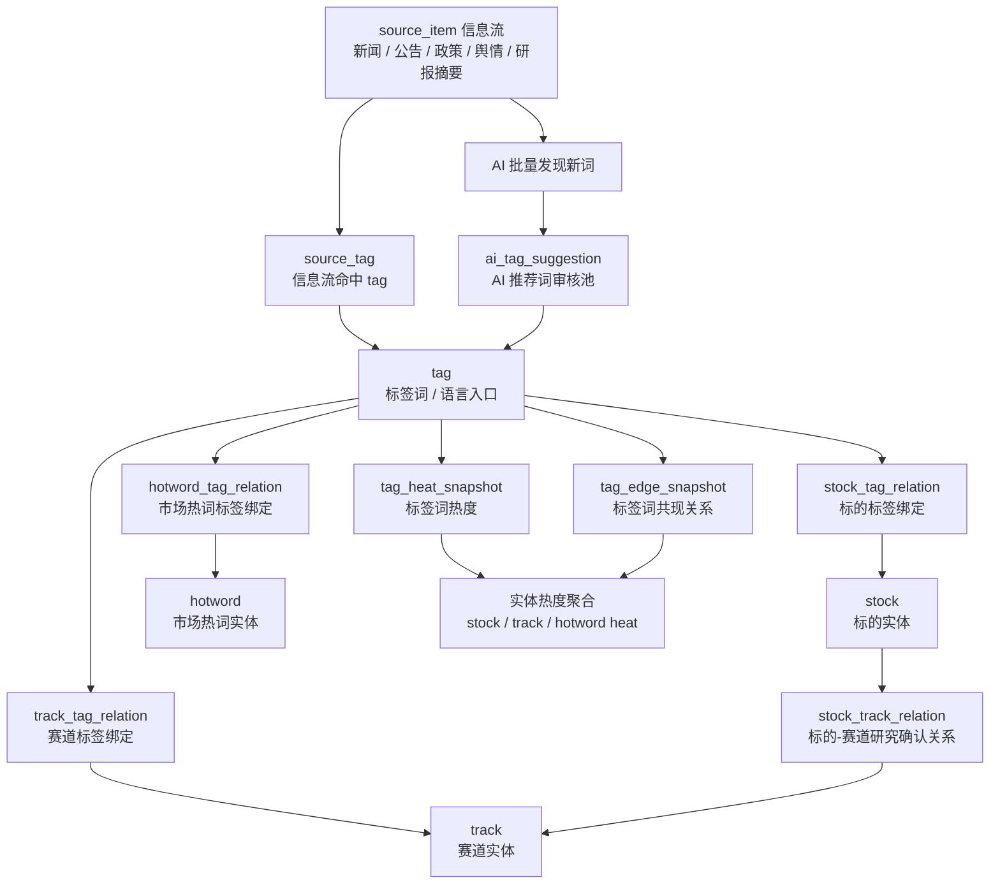

# liuli 系统规格说明书 v25

> 项目名称：`liuli`  
> 定位：个人投资辅助系统  
> 形态：Web + Android + 后端服务  
> 用户模式：单用户安全登录，业务上按个人投资系统设计  
> 架构原则：业务与数据分层，模块内聚优先，复用后置抽象，AI 作为业务工具，不做过度平台化  
## 0. 历史版本更新点

- v25：统一各模块首页命名为“看板”（今日看板、市场看板、赛道看板、标的看板、组合看板）；赛道发现最小重构：删除历史遗留 `track_related_stock`，统一使用 `stock_track_relation`；不建设 `track_thesis / track_validation_indicator / track_evidence / track_heat_snapshot`；新增 `track_material`、`track_analysis_snapshot`；标的分析新增 `stock_material`，用于承接标的事件；赛道热度从 `track_tag_relation + tag_heat_snapshot` 聚合，不单独落表。
- v24：重构标签模型为“信息层 source_item → 语言层 tag → 业务层 stock/track/hotword”；取消 stock_alias/track_alias/hotword_alias/tag_candidate；新增 stock_tag_relation、track_tag_relation、hotword、hotword_tag_relation、ai_tag_suggestion；明确 tag 是语言入口，实体通过 relation 绑定多个 tag，source_tag 是信息流命中关系，实体热度通过绑定关系聚合；同步更新 API、表结构汇总和架构图。
- v23：补充三类别名维护入口；明确标的别名主入口在股票基础库、辅入口在标的详情；赛道绑定标签主入口在赛道详情；市场热词别名主入口在市场热词详情、辅入口在标签索引；AI 推荐词审核页提供快捷转别名入口。
- v22：收敛 `job_config` 表设计；任务调度参数、启停、Cron、超时、重试、参数 Schema、标签等不再摊平成字段，统一进入 `config_json / ext_json`；`job_config` 只保存任务身份、展示信息、配置 JSON 和最近运行状态。
- v21：曾尝试将 `job_config` 的调度参数摊平成字段（v22 已撤回，统一收敛到 `config_json / ext_json`）。
- v20：统一修正前后矛盾：删除 `/console/tag-candidates`；`/console/tags` 改为标签索引治理；`market_radar/tags` 不再作为普通新增标签入口，新增市场热词 API；组合管理去除非实盘/观察分组，收敛为实盘组合；`track_discovery` API 改为以 `tracks` 为主体；补充 `hotword_alias` 与 `alias_resolver` 服务口径。
- v19：同步更新 Web 两级菜单；市场雷达使用“信息流”而非“新闻流”；赛道发现、标的分析、组合管理二级菜单按稳定页面重新收敛；组合管理明确为实盘组合管理。
- v18：明确 `source_item` 是市场雷达统一信息流条目，不只包含新闻，也包含公告摘要、政策、舆情、研报摘要；市场雷达二级菜单将“新闻流”改为“信息流”；`source_item` 增加可选 `related_type / related_id`，用于关联 `company_disclosure`、`report` 等原始业务对象。
- v17：明确候选赛道、候选标的不单独建候选表；候选赛道由 `track.status=candidate` 承载，候选标的由 `stock_pool.status=candidate` 承载；报告不设一级菜单，也不作为各模块固定二级菜单，只放工作台、列表页卡片和详情页关联入口；补充 Web 两级菜单结构；曾补充组合分组 `portfolio_group.is_real_position` 设计（v20 已改为实盘分组模型）。
- v16：调整赛道建模：新增独立 `track` 与 `track_alias` 表，`track` 与 `tag(type=track)` 一对一自动投影；市场雷达仍只处理标签，赛道发现专注赛道实体，标的分析专注标的实体；标的-赛道确认关系由 `stock_track_relation(stock_id, track_id)` 承载。
- v15：明确当前不单独建设 `track` 表；赛道身份由 `tag(type=track)` 承载，赛道研究由 `track_thesis` 承载，标的-赛道确认关系由 `stock_track_relation` 承载，市场自动共现信号由 `tag_edge_snapshot` 承载；后续如赛道专属属性增多，再增加 `track_profile` 扩展表。
- v14：明确标的、标的标签、赛道标签之间的关系；`tag(type=stock)` 由 `stock` 自动派生并随标的生命周期同步；标的可绑定多个赛道标签，绑定关系保存到 `stock_track_relation`，主操作入口为 `/stock-analysis/[stock_id]`，辅入口为 `/track-discovery/[id]`。
- v13：将文档顶部的“本版重点更新”改为“历史版本更新点”，方便 AI 理解文档演进脉络。
- v12：最小化修正 `tag_candidate` 设计；候补标签不再设计分类字段，只保留 `suggested_type = stock / track / hotword`，新增 `trigger_text` 与可选 `target_tag_id`。
- v11：明确 Agent 工具第一版只支持系统内部 Python 函数；`tool_registry.py` 使用 `ToolDefinition` 保存工具名、描述、入参 schema、出参 schema、handler、风险等级和只读属性；Agent YAML 只声明工具白名单。
- v10：明确多个业务 Agent 的描述文件统一放在 `modules/knowledge_base/agents/*.yaml`；`AgentRunner` 统一执行，业务模块只提供工具能力，不分散管理 Agent。
- v9：明确 AI Agent 第一版采用 `knowledge_base` 内部轻量编排；工具注册表放 `modules/knowledge_base/tool_registry.py`；不引入重型 Agent 框架，后续复杂状态机再考虑 LangGraph。
- v8：新增 `basic/ai_audit` AI 请求审计模块；增加 `ai_request_log` 表，用于统计 AI 调用次数、服务商、模型、Token、上下文用量、耗时、失败率和成本。
- v7：补充并明确技术栈选型；Web 前端采用 React + Vite + Ant Design + ECharts + lightweight-charts；后端采用 FastAPI + SQLAlchemy + APScheduler + Pydantic + SQLite。


---

## 2. 系统目标

`liuli` 是一个面向个人投资者的投资辅助系统，用于把外部信息流、行情变化、公司公告、财报、舆情评论，转化为可跟踪、可复盘、可反哺 AI 的投资认知闭环。

系统核心不是直接给出买卖建议，而是辅助完成：

1. **发现好赛道**：持续更新、持续验证、持续证伪。
2. **发现好标的**：持续筛选、持续 PK、持续冒泡。
3. **发现好时机**：持续预警、持续跟踪、持续等待。
4. **调整资产结构**：持续复盘、持续优化、持续调整。

---

## 3. 核心投资闭环

```text
市场雷达
  ↓
赛道发现
  ↓
标的分析
  ↓
预警中心
  ↓
组合管理
  ↓
知识库沉淀
  ↓
Skills 提炼
  ↓
Agent 编排
  ↓
业务反哺
```

### 3.1 模块定位

| 模块 | 层级 | 作用 |
|---|---|---|
| 市场雷达 `market_radar` | 信号层 | 发现市场正在关注什么 |
| 赛道发现 `track_discovery` | 判断层 | 判断方向是否值得长期跟踪 |
| 标的分析 `stock_analysis` | 研究层 | 找出能承接赛道的公司 |
| 预警中心 `alert_center` | 时机层 | 跟踪价格、估值、事件、热度异动 |
| 组合管理 `portfolio` | 行动层 | 管理实盘持仓、调仓记录、组合复盘 |
| 知识库 `knowledge_base` | 认知沉淀层 | 沉淀经验，提炼 Skills，编排 Agent |
| 控制台 `console` | 后台管理层 | 管理数据源、任务、标签、配置、系统状态 |

---

## 4. 核心边界

### 4.1 系统要做什么

```text
1. 接入行情、新闻、公告财报、舆情评论等数据源。
2. 用标签把信息流结构化。
3. 用热度统计展示市场注意力。
4. 用赛道假设管理投资者认知。
5. 用标的分析筛选高质量候选公司。
6. 用预警中心跟踪时机和风险。
7. 用组合管理持续调整资产结构。
8. 用知识库沉淀经验，并反哺 AI 分析能力。
```

### 4.2 系统不做什么

```text
1. 不直接输出买入/卖出指令。
2. 不做多人协作 SaaS。
3. 不做复杂租户隔离。
4. 不把 AI Gateway 过度抽象成中心化平台。
5. 不把市场热度误当成投资价值。
6. 不为了组件复用而过度拆分目录。
```

---

## 5. 核心架构原则

### 5.1 业务模块内聚优先

本项目采用 **业务模块内聚优先** 的代码组织方式。

原则：

```text
1. 一个业务能力尽量收敛在一个模块目录内。
2. 外部接口 client 优先贴近使用模块，不提前抽象到 services。
3. 只有当两个以上模块真实复用时，才上移到 services 或 shared。
4. shared 只放无业务含义的通用工具。
5. 不追求组件复用的形式优雅，优先保证 AI 编码时上下文集中、修改路径短、业务边界清晰。
```

一句话：

```text
先让功能在一个目录里长完整，再根据真实复用关系向外抽象。
```

### 5.2 modules、shared、services 的边界

```text
modules = 业务房间
shared  = 公共工具箱
services = 外部接口插座
```

| 目录 | 作用 | 是否有业务逻辑 | 是否有业务数据 |
|---|---|---:|---:|
| `modules` | 业务能力归属 | 有 | 有 |
| `shared` | 无业务工具 | 无 | 无 |
| `services` | 跨模块外部服务适配 | 很少 | 无 |

#### shared 存在的必要性

`shared` 用于承载无业务归属、跨模块稳定复用的基础工具，例如：

```text
时间工具
分页结构
统一响应格式
通用异常
日志辅助
金额/百分比格式化
少量全局枚举
文件路径基础工具
```

不应该放：

```text
标签抽取
巨潮拉取
财联社抓取
赛道评分
标的评分
财报解析
AI Prompt
股票匹配
预警规则
组合计算
```

#### services 存在的必要性

`services` 用于承载已经跨模块复用的外部接口适配，例如：

```text
Tushare
AkShare
AI 服务商
东方财富
财联社
巨潮
```

但不是所有外部接口都必须一开始放进 `services`。

判断规则：

```text
一个模块使用 → 放模块内部
两个以上模块稳定复用 → 上移 services
```

例如：

```text
cninfo_client 第一版只服务 disclosure_library，可放在 disclosure_library 内。
Tushare 高概率被 stock_master、stock_analysis、alert_center、portfolio 多模块使用，适合放 services/tushare。
```

---


## 5.5 标签模型架构图



核心边界：

```text
tag 是语言入口，不是业务主体；
stock / track / hotword 是业务主体；
stock_tag_relation / track_tag_relation / hotword_tag_relation 是绑定；
source_tag / tag_edge_snapshot 是关联。
```

## 6. Python 服务进程模型

第一版采用两个 Python 进程：

```text
1. API 进程：处理 Web / Android 请求
2. Worker 进程：后台执行定时任务和耗时任务
```

### 6.1 API 进程

API 进程负责：

```text
登录鉴权
页面数据查询
新增/编辑/删除
手动触发任务请求
读取任务结果
读取报告
读取新闻/标签/预警/组合数据
```

启动示例：

```bash
uvicorn invest_assistant.main:app --host 0.0.0.0 --port 8000 --workers 1
```

如果长期运行并切换到 MySQL/PostgreSQL，可改为：

```bash
uvicorn invest_assistant.main:app --host 0.0.0.0 --port 8000 --workers 2
```

API 进程不要直接执行重任务。

### 6.2 Worker 进程

Worker 进程负责：

```text
抓财联社新闻
抽取标签
聚合市场热度
聚合标签关系
同步股票基础库
拉取标的公告
下载 PDF
解析 PDF
生成报告
执行预警规则
知识沉淀 → Skills 提炼 → Agent 编排
```

启动示例：

```bash
python -m invest_assistant.worker
```

内部运行：

```text
APScheduler
job_center
各模块 jobs.py
```

### 6.3 API 与 Worker 协作方式

```text
Web / Android
     ↓
API 进程
     ↓
数据库 / 文件系统

Worker 进程
     ↓
定时抓取、解析、聚合、生成报告
     ↓
数据库 / var 文件目录
```

API 和 Worker 不直接互相调用，主要通过：

```text
数据库
var 文件目录
job_run_request
job_run_log
```

协作。

### 6.4 手动触发任务

控制台点击“立即执行”时：

```text
/console/jobs
  ↓
API 写入 job_run_request
  ↓
Worker 轮询 pending request
  ↓
执行对应 JobDefinition.handler
  ↓
写入 job_run_log
```

原则：

```text
API 负责响应用户；
Worker 负责搬砖干活。
```

---

## 7. 用户与权限

第一版只做安全登录鉴权。

```text
用户系统 = 访问安全层
不是业务协作层
不是权限管理系统
不是 SaaS 租户系统
```

### 7.1 功能

```text
登录
退出
修改密码
密码哈希
JWT / Session
接口鉴权
登录过期
登录失败限制，可后置
```

### 7.2 模块位置

```text
invest_assistant/modules/basic/auth/
├── models.py
├── schemas.py
├── service.py
├── router.py
├── security.py
└── dependencies.py
```

### 7.3 用户表

```sql
user_account
- id
- username
- password_hash
- display_name
- email
- status
- last_login_at
- created_at
- updated_at
```

第一版只需要一个默认用户。

---

## 8. 数据源体系

系统一级数据源分为四类。

| 数据源类型 | 作用 | 典型来源 |
|---|---|---|
| 行情数据 | 看价格、成交量、资金流、估值、技术状态 | AkShare、Tushare、东方财富 |
| 市场新闻 | 看市场注意力、事件驱动、热点变化 | 财联社、东方财富、证券时报、RSS |
| 公司公告财报 | 看公司真实变化、业绩兑现、风险披露 | 巨潮资讯、交易所、Tushare |
| 舆情评论 | 看市场叙事、观点扩散、情绪变化 | 雪球、股吧、微博、公众号、社群 |

一句话：

```text
行情看交易，新闻看注意力，公告财报看兑现，舆情看情绪。
```

---

## 9. 术语统一：只使用“赛道”

系统不引入“题材”作为新的标签类型。

统一三类标签：

```text
stock    标的标签
track    赛道标签
hotword  市场热词标签
```

### 9.1 赛道标签 track

赛道不必都是长期产业方向，短期市场方向也可以算赛道。

例如：

```text
AI算力
智能汽车
先进封装
电子特气
低空经济
黄金避险
航运
军工
出口链
中特估
人民币升值受益
```

长期赛道、短期赛道都统一归到 `track`。

不再引入：

```text
theme
topic
subject
题材
```

如果后续需要区分长短期，不靠新增类型，而靠字段或分析判断：

```text
horizon = short / mid / long
```

或者由 `track_discovery` 判断：

```text
短期事件型赛道
中期景气型赛道
长期生产力赛道
```

---

## 10. 代码目录结构

项目根目录：

```text
liuli/
├── invest_assistant/       # 主程序代码
├── data/                   # 种子数据、样例数据、导入模板
├── docs/                   # 架构与系统文档
├── tools/                  # 手动脚本、调试脚本、运维工具
├── tests/                  # 自动化测试
├── var/                    # 运行时数据、日志、缓存、SQLite、报告文件、原始文件
├── pyproject.toml
├── README.md
└── .env.example
```

### 10.1 主程序结构

```text
invest_assistant/
├── __init__.py
├── main.py
├── worker.py

├── bootstrap/
│   ├── __init__.py
│   ├── config.py
│   ├── database.py
│   ├── logging.py
│   ├── scheduler.py
│   └── app.py

├── modules/
│   ├── basic/
│   │   ├── auth/
│   │   ├── stock_master/
│   │   ├── system_config/
│   │   ├── job_center/
│   │   ├── report_library/
│   │   ├── disclosure_library/
│   │   └── ai_audit/
│   │
│   ├── market_radar/
│   ├── track_discovery/
│   ├── stock_analysis/
│   ├── alert_center/
│   ├── portfolio/
│   ├── knowledge_base/
│   └── console/
│
├── services/
│   ├── market_data/
│   ├── news/
│   ├── disclosure/
│   ├── sentiment/
│   ├── akshare/
│   ├── tushare/
│   ├── cls/
│   ├── cninfo/              # 只有跨模块复用后才需要
│   └── ai/
│
└── shared/
    ├── enums.py
    ├── errors.py
    ├── time_utils.py
    ├── pagination.py
    ├── response.py
    ├── file_utils.py
    └── db_types.py
```

---

## 11. data、var、tools、tests

### 11.1 data

静态数据资产目录，可进 Git。

```text
data/
├── seed/
│   ├── stocks.csv
│   ├── tags.csv
│   ├── track_tags.csv
│   └── hotword_tags.csv
├── samples/
├── import/
└── export/
```

### 11.2 var

运行时数据目录，通常不进 Git。

```text
var/
├── db/
│   └── liuli.sqlite3
├── logs/
├── cache/
├── ai_logs/
│   ├── market_radar/
│   ├── track_discovery/
│   ├── stock_analysis/
│   ├── knowledge_base/
│   └── report_generation/
├── raw/
│   ├── news/
│   ├── disclosures/
│   └── financial_reports/
├── processed/
│   └── disclosures/
│       ├── markdown/
│       └── text/
├── reports/
│   ├── market_radar/
│   ├── track_discovery/
│   ├── stock_analysis/
│   ├── alert_center/
│   ├── portfolio/
│   └── knowledge_base/
└── exports/
```

### 11.3 tests

自动化测试目录。

```text
tests/
├── unit/
├── integration/
├── fixtures/
└── conftest.py
```

### 11.4 tools

人工操作脚本与调试工具。

```text
tools/
├── dev/
├── jobs/
├── debug/
└── export/
```

判断规则：

```text
能被 pytest 稳定重复执行的 → tests/
为了手动跑、调试、修数据的 → tools/
运行时生成的日志、缓存、数据库、报告 → var/
样例数据、种子数据、导入模板 → data/
```

---

## 12. 基础模块 basic

### 12.1 basic/auth

安全登录鉴权。

### 12.2 basic/stock_master

股票基础库，属于基础业务主数据模块。

定位：

```text
标的主数据 / 标的身份识别 / 代码名称映射
```

它负责回答：

```text
这个标的是谁？
代码是什么？
属于哪个市场？
不同数据源里的名称怎么统一？
新闻里提到的公司如何映射到 stock_id？
```

第一版字段：

```sql
stock
- id
- stock_code
- stock_name
- market
- exchange
- status
- created_at
- updated_at
```

后续扩展：

```text
stock_alias
stock_industry
stock_market_status
stock_sync_log
```

### 12.3 basic/system_config

系统配置模块，第一版保持轻量。

`.env` 放敏感和启动级配置：

```text
DATABASE_URL
TUSHARE_TOKEN
OPENAI_API_KEY
QWEN_API_KEY
SECRET_KEY
LOG_LEVEL
```

`system_config` 表放业务运行配置：

```text
数据源启停
抓取频率
热度窗口
预警阈值
标签抽取策略
AI任务使用哪个模型
```

表结构：

```sql
system_config
- id
- config_key
- config_value
- config_type
- module_name
- description
- enabled
- created_at
- updated_at
```

---

## 13. basic/ai_audit AI 请求审计

### 13.1 定位

`ai_audit` 是 AI 请求审计模块，属于基础支撑能力。

它不负责 AI 配置，也不负责模型路由，只负责记录和统计 AI 请求。

定位：

```text
AI 请求日志
AI 调用审计
AI Token 用量统计
AI 上下文使用统计
AI 成本与失败率追踪
```

它服务于所有可能调用 AI 的模块：

```text
market_radar      标签抽取、新闻摘要
track_discovery   赛道动态分析
stock_analysis    财报分析、标的研报
alert_center      预警解释
knowledge_base    Skills 提炼、Agent 编排
```

一句话：

```text
AI 不需要单独配置中心，但必须有 AI 请求审计日志表。
```

### 13.2 模块目录

```text
modules/basic/ai_audit/
├── models.py
├── schemas.py
├── service.py
└── router.py
```

### 13.3 核心表

#### `ai_request_log`：AI 请求审计日志表，每一次 AI 请求一条记录

```sql
ai_request_log
- id
- request_id              -- 本次 AI 请求唯一 ID
- source_module           -- 来源模块：market_radar / stock_analysis / knowledge_base
- task_name               -- 任务名：tag_extraction / report_generation / skill_extraction
- provider                -- 厂家：openai / qwen / kimi / deepseek / gemini
- model_name              -- 模型名
- prompt_version          -- Prompt 版本，可选

- input_tokens            -- 输入 token
- output_tokens           -- 输出 token
- total_tokens            -- 总 token
- context_window          -- 模型最大上下文窗口
- context_used_tokens     -- 本次实际上下文 token
- context_usage_ratio     -- 上下文使用比例

- input_chars             -- 输入字符数
- output_chars            -- 输出字符数
- messages_count          -- messages 数量
- input_hash              -- 输入内容 hash，用于去重和追溯
- output_hash             -- 输出内容 hash

- raw_request_path        -- 原始请求保存路径，可选
- raw_response_path       -- 原始响应保存路径，可选

- latency_ms              -- 耗时
- success                 -- 是否成功
- error_code              -- 错误码
- error_message           -- 错误信息

- cost_amount             -- 估算成本，可选
- currency                -- CNY / USD，可选

- related_type            -- 关联对象类型：source_item / report / disclosure / stock / track
- related_id              -- 关联对象 ID

- created_at
```

### 13.4 是否保存完整请求上下文

默认不直接把完整请求/响应存入数据库。

推荐方式：

```text
数据库保存元数据、Token、Hash、路径；
完整请求/响应可选保存到 var/ai_logs。
```

数据库中只保存：

```text
raw_request_path
raw_response_path
```

### 13.5 AI 调用记录流程

```text
业务模块 ai.py
    ↓
services/ai/xxx_client.py
    ↓
basic/ai_audit.record_ai_request()
    ↓
ai_request_log
```

不做复杂 AI Gateway，但必须统一记录 AI 请求审计日志。

### 13.6 控制台入口

页面路径：

```text
/console/ai-logs
```

展示字段：

```text
时间
来源模块
任务名
厂家
模型
输入 Token
输出 Token
总 Token
上下文使用比例
耗时
是否成功
错误信息
成本估算
```

### 13.7 后续可选聚合表

第一版只需要 `ai_request_log`。

后续如果 AI 用量变大，可以增加：

```sql
ai_usage_daily_snapshot
- id
- stat_date
- source_module
- task_name
- provider
- model_name
- request_count
- success_count
- failed_count
- input_tokens
- output_tokens
- total_tokens
- total_cost
- avg_latency_ms
- created_at
```

---

## 14. basic/job_center 任务中心

### 14.1 定位

`job_center` 是轻量任务中心，属于基础业务支撑模块。

它负责：

```text
任务注册
任务启停
手动触发
任务状态
执行日志
失败记录
下次运行时间
```

它不负责：

```text
抓新闻的具体逻辑
解析财报的具体逻辑
抽标签的具体逻辑
生成报告的具体逻辑
```

一句话：

```text
job_center 管“任务怎么跑”，各业务模块管“任务具体干什么”。
```

### 14.2 目录结构

```text
modules/basic/job_center/
├── models.py          # job_config / job_run_request / job_run_log
├── schemas.py
├── service.py
├── router.py
├── types.py           # JobDefinition / JobResult
├── registry.py        # 收集各模块 JOBS
├── scheduler.py       # APScheduler 装配
├── dispatcher.py      # 执行任务、记录日志
└── worker.py          # worker 主循环，可选
```

### 14.3 任务基本要素

一个任务的基本要素：

```text
任务名称
所属模块
展示名称
任务描述
执行函数
触发方式
Cron 表达式
任务参数
参数 Schema
任务标签
是否启用
Cron 表达式
超时时间
重试次数
扩展配置
执行日志

说明：

```text
以上任务细节不在 job_config 表中逐个摊平成字段；
统一进入 config_json / ext_json。
```

```

对应任务定义：

```python
from dataclasses import dataclass
from typing import Callable, Literal, Any

TriggerType = Literal["schedule", "manual", "both"]

@dataclass
class JobDefinition:
    job_name: str
    module_name: str
    display_name: str
    description: str
    handler: Callable[..., Any]

    trigger_type: TriggerType = "manual"
    cron_expr: str | None = None
    enabled: bool = True

    timeout_seconds: int = 300
    max_retries: int = 0

    params_schema: dict | None = None
    tags: list[str] | None = None
```


#### job_config 表设计

`job_config` 保存任务身份、展示信息、配置 JSON 和最近一次运行状态。

原则：

```text
job_config 管“这个任务是什么、配置是什么、最近状态是什么”；
任务调度细节进入 config_json；
展示和扩展信息进入 ext_json；
执行细节进入 job_run_log。
```

```sql
job_config
- id
- job_name             -- 全局唯一任务名，例如 market_radar.fetch_news
- module_name          -- 所属模块
- display_name         -- 展示名称
- description          -- 描述
- config_json          -- 任务可执行配置，JSON
- ext_json             -- 展示、分类、标签等扩展信息，JSON
- last_run_at          -- 最近执行时间
- last_status          -- 最近执行状态
- next_run_at          -- 下次执行时间
- created_at
- updated_at
```

`config_json` 示例：

```json
{
  "trigger_type": "schedule",
  "cron_expr": "0 9 * * *",
  "enabled": true,
  "timeout_seconds": 300,
  "max_retries": 0,
  "params": {},
  "params_schema": {}
}
```

`ext_json` 示例：

```json
{
  "tags": ["market_radar", "daily"],
  "category": "信息流",
  "ui_order": 10,
  "notes": ""
}
```

SQLite 建表示例：

```sql
CREATE TABLE job_config (
    id INTEGER NOT NULL,
    job_name VARCHAR(128) NOT NULL,
    module_name VARCHAR(64) NOT NULL,
    display_name VARCHAR(128) NOT NULL,
    description TEXT NOT NULL,
    config_json TEXT NOT NULL,
    ext_json TEXT NOT NULL,
    last_run_at DATETIME,
    last_status VARCHAR(32),
    next_run_at DATETIME,
    created_at DATETIME NOT NULL,
    updated_at DATETIME NOT NULL,
    PRIMARY KEY (id),
    UNIQUE (job_name)
);
```

不在表中单独增加：

```text
trigger_type
cron_expr
enabled
timeout_seconds
max_retries
params_schema_json
tags_json
last_error_message
```

其中最近错误信息通过 `job_run_log` 查询。


### 14.4 任务命名规范

统一使用：

```text
模块名.动作名
```

示例：

```text
market_radar.fetch_news
market_radar.extract_tags
market_radar.aggregate_heat
market_radar.aggregate_edges

stock_master.sync_stock_basic

disclosure_library.fetch_stock_announcements
disclosure_library.parse_pdf

alert_center.evaluate_rules
```

### 14.5 任务执行结果规范

```python
from dataclasses import dataclass

@dataclass
class JobResult:
    success: bool
    message: str = ""
    fetched_count: int = 0
    processed_count: int = 0
    inserted_count: int = 0
    updated_count: int = 0
    skipped_count: int = 0
    extra: dict | None = None
```

### 14.6 业务模块任务注册

每个模块统一暴露 `JOBS` 列表。

例如：

```text
market_radar/jobs.py
stock_master/jobs.py
disclosure_library/jobs.py
alert_center/jobs.py
knowledge_base/jobs.py
```

`market_radar/jobs.py` 示例：

```python
from invest_assistant.modules.basic.job_center.types import JobDefinition

def fetch_news_job(**kwargs):
    ...

def extract_tags_job(**kwargs):
    ...

def aggregate_heat_job(**kwargs):
    ...

JOBS = [
    JobDefinition(
        job_name="market_radar.fetch_news",
        module_name="market_radar",
        display_name="抓取市场新闻",
        description="抓取财联社等市场新闻并写入 source_item",
        handler=fetch_news_job,
        trigger_type="both",
        cron_expr="*/1 * * * *",
        timeout_seconds=60,
        max_retries=2,
        tags=["news", "market_radar"],
    ),
    JobDefinition(
        job_name="market_radar.extract_tags",
        module_name="market_radar",
        display_name="抽取新闻标签",
        description="对未打标新闻抽取 stock / track / hotword 标签",
        handler=extract_tags_job,
        trigger_type="both",
        cron_expr="*/1 * * * *",
        timeout_seconds=180,
        max_retries=1,
        tags=["tag", "market_radar"],
    ),
]
```

### 14.7 任务中心注册表

`job_center/registry.py` 统一收集各模块任务：

```python
from invest_assistant.modules.market_radar.jobs import JOBS as MARKET_RADAR_JOBS
from invest_assistant.modules.basic.stock_master.jobs import JOBS as STOCK_MASTER_JOBS
from invest_assistant.modules.basic.disclosure_library.jobs import JOBS as DISCLOSURE_JOBS

ALL_JOBS = [
    *MARKET_RADAR_JOBS,
    *STOCK_MASTER_JOBS,
    *DISCLOSURE_JOBS,
]

JOB_REGISTRY = {
    job.job_name: job
    for job in ALL_JOBS
}
```

### 14.8 模块任务数量较多时怎么拆

少于 5 个任务：

```text
module/jobs.py
```

超过 5 个任务，或任务类型明显不同：

```text
module/jobs/
├── __init__.py
├── news_jobs.py
├── tag_jobs.py
├── aggregate_jobs.py
├── report_jobs.py
└── cleanup_jobs.py
```

`jobs/__init__.py` 对外统一导出：

```python
from .news_jobs import JOBS as NEWS_JOBS
from .tag_jobs import JOBS as TAG_JOBS
from .aggregate_jobs import JOBS as AGGREGATE_JOBS

JOBS = [
    *NEWS_JOBS,
    *TAG_JOBS,
    *AGGREGATE_JOBS,
]
```

对 `job_center` 来说，模块始终只暴露一个入口：

```python
from invest_assistant.modules.market_radar.jobs import JOBS as MARKET_RADAR_JOBS
```

### 14.9 新增任务流程

新增任务本质上做两件事：

```text
1. 在业务模块里注册任务定义
2. 让任务中心把任务同步到 job_config 表
```

标准流程：

```text
新增任务函数
↓
加入模块 JOBS
↓
重启 worker 或执行 sync_job_definitions
↓
job_center 自动写入/更新 job_config
↓
/console/jobs 页面出现新任务
```

不要手工直接改数据库表。

代码里的 `JobDefinition` 是任务定义源头；数据库里的 `job_config` 是运行时配置状态。

同步策略：

```text
如果 job_config 里没有这个 job_name → 新增
如果已经存在 → 更新 display_name / description / 默认 cron 等字段
但不要覆盖用户在控制台修改过的 enabled / cron_expr，除非明确要求重置
```

### 14.10 任务相关表

#### job_config

```sql
job_config
- id
- job_name
- module_name
- display_name
- description
- trigger_type
- cron_expr
- enabled
- timeout_seconds
- max_retries
- last_run_at
- last_status
- next_run_at
- created_at
- updated_at
```

#### job_run_request

```sql
job_run_request
- id
- job_name
- params_json
- status            -- pending / running / success / failed / canceled
- requested_by
- requested_at
- started_at
- finished_at
- error_message
```

#### job_run_log

```sql
job_run_log
- id
- job_name
- module_name
- trigger_type      -- schedule / manual
- status            -- success / failed
- params_json
- result_json
- started_at
- finished_at
- duration_ms
- fetched_count
- processed_count
- inserted_count
- updated_count
- error_message
```

### 14.11 控制台入口

页面路径：

```text
/console/jobs
```

功能：

```text
查看任务列表
启用/停用任务
立即执行任务
修改 cron
查看最近执行日志
查看失败原因
同步任务定义
```

边界：

```text
页面路径：/console/jobs
代码归属：basic/job_center
具体任务逻辑：各模块 jobs.py
```

---

## 15. basic/report_library

`report_library` 是报告归档库 / 报告阅读入口，不是第六大业务模块。

它只负责：

```text
统一保存报告元数据
统一查询报告
统一展示报告列表
统一提供 Android/Web 阅读接口
```

它不负责生成报告。报告由各业务模块自己生成。

关系：

```text
market_radar/report_generator.py
track_discovery/report_generator.py
stock_analysis/report_generator.py
alert_center/report_generator.py
portfolio/report_generator.py
knowledge_base/report_generator.py
        ↓
modules/basic/report_library
        ↓
Web / Android 报告页读取
```

核心表：

```sql
report
- id
- title
- report_type        -- daily / weekly / track / stock / portfolio / alert / knowledge
- source_module      -- market_radar / track_discovery / stock_analysis / portfolio
- target_type        -- market / track / stock / portfolio / alert
- target_id
- summary
- file_format        -- md / html / pdf
- file_path          -- var/reports/xxx/xxx.md
- generated_by       -- ai / system / manual
- status
- publish_time
- created_at
- updated_at
```

报告文件本体放：

```text
var/reports/
├── market_radar/
├── track_discovery/
├── stock_analysis/
├── alert_center/
├── portfolio/
└── knowledge_base/
```

一句话：

```text
report_library 管“报告索引”，var/reports 管“报告文件本体”。
```

---

## 16. basic/disclosure_library

公告财报库，属于基础事实数据模块。

它负责：

```text
公告元数据入库
财报元数据入库
PDF 文件保存路径
PDF 转 Markdown / Text 的路径
公告类型分类
关联 stock_id
同步状态
解析状态
```

第一版可把巨潮接口适配放在模块内：

```text
modules/basic/disclosure_library/
├── models.py
├── schemas.py
├── service.py
├── router.py
├── repository.py
├── jobs.py
├── parser.py
└── cninfo_client.py        # 巨潮接口适配，先放这里
```

等巨潮接口被多个模块直接复用，再上移：

```text
services/cninfo/client.py
```

核心表：

```sql
company_disclosure
- id
- stock_id
- source              -- cninfo / exchange / tushare
- disclosure_type     -- announcement / annual_report / quarterly_report / interim_report
- title
- publish_time
- report_period
- source_url
- file_path
- parsed_text_path
- parsed_markdown_path
- parse_status
- created_at
- updated_at
```

文件本体放：

```text
var/raw/disclosures/
├── announcements/
└── financial_reports/
```

解析后文本放：

```text
var/processed/disclosures/
├── markdown/
└── text/
```

控制台入口：

```text
/console/disclosures
```

公告若需要参与市场雷达热度和标签统计，应生成摘要型 `source_item(source_type=announcement)`，并通过 `related_type=company_disclosure`、`related_id=company_disclosure.id` 回链原始公告。

---

## 17. 市场雷达 market_radar

### 17.1 定位

市场雷达是信号层，负责把信息流、公告流、舆情流转化为市场注意力结构。

它回答：

```text
市场现在在关注什么？
哪些标签词突然升温？
哪些标的被哪些市场热词带出来？
哪些标的被哪些赛道反复提及？
AI 从今日信息流中发现了哪些值得人工确认的新词？
```

它不判断：

```text
这个赛道好不好
这个公司值不值得买
这个热点是否能持续
```

### 17.2 核心数据流

```text
新闻 / 公告摘要 / 政策 / 舆情 / 研报摘要
  ↓
source_item 原始信息流
  ↓
确定性识别：已有 tag 词典 / 规则匹配
  ↓
source_tag 信息流命中标签词
  ↓
tag_heat_snapshot 标签词热度
tag_edge_snapshot 标签词共现
  ↓
实体聚合：stock / track / hotword
```

AI 新词发现链路：

```text
当日 source_item 结构化聚合
  ↓
AI 提取值得关注的新词 / 热词 / 异动词
  ↓
ai_tag_suggestion
  ↓
人工审核 / 修正名称
  ↓
创建或绑定 tag
  ↓
绑定到 stock / track / hotword
  ↓
回溯 source_item 打标
```

### 17.3 新标签模型

系统采用三层模型：

```text
信息层：source_item
语言层：tag
业务层：stock / track / hotword
```

核心原则：

```text
tag = 标签词 / 语言入口 / 离散语义锚点
stock = 标的实体 / 股票基础主数据
track = 赛道实体
hotword = 市场热词实体
```

一句话：

```text
标签负责识别语言，实体负责承载业务，绑定关系负责归属，信息流关联负责市场信号。
```

### 17.4 绑定与关联

绑定是人工确认、主数据关系、稳定归属。

```text
stock_tag_relation   = 这只股票叫什么
track_tag_relation   = 这个赛道叫什么
hotword_tag_relation = 这个市场热词叫什么
stock_track_relation = 这只股票属于哪个赛道
```

关联是信息流自动发现、统计共现、动态关系。

```text
source_tag        = 某条信息流命中了哪些 tag
tag_edge_snapshot = 哪些 tag 在信息流中经常共现
```

最终边界：

```text
绑定是业务确认关系；
关联是市场信息流发现关系。
```

### 17.5 核心表

```sql
tag
- id
- name              -- 标签词
- type              -- stock / track / hotword / general，可选
- status            -- active / archived / rejected
- source            -- ai / rule / manual / system，可选
- created_at
- updated_at
```

```sql
hotword
- id
- name
- description
- status            -- active / archived
- created_at
- updated_at
```

```sql
stock_tag_relation
- id
- stock_id
- tag_id
- source            -- manual / ai / system，可选
- status            -- active / inactive
- created_at
- updated_at
```

```sql
track_tag_relation
- id
- track_id
- tag_id
- source
- status
- created_at
- updated_at
```

```sql
hotword_tag_relation
- id
- hotword_id
- tag_id
- source
- status
- created_at
- updated_at
```

```sql
ai_tag_suggestion
- id
- suggested_text      -- AI 原始推荐词
- final_tag_name      -- 人工修正后的正式标签名，可空
- score               -- AI 推荐强度
- reason              -- AI 推荐理由
- status              -- pending / approved / rejected
- final_tag_id        -- 最终创建或绑定的 tag_id，可空
- ext_json            -- 扩展信息，可选
- created_at
- updated_at
```

```sql
source_item
- id
- source_type       -- news / announcement / policy / sentiment / research
- source_name       -- 财联社 / 巨潮资讯 / RSSHub / Substack / 手动录入
- title
- content           -- 正文 / 摘要 / AI 摘要 / 关键段落
- source_url
- publish_time
- related_type      -- 可选：company_disclosure / report / manual
- related_id        -- 可选：关联业务表 ID
- created_at
```

```sql
source_tag
- id
- source_item_id
- tag_id
- trigger_text
- confidence
- extractor         -- rule / ai / manual
- created_at
```

```sql
tag_heat_snapshot
- id
- tag_id
- window_type       -- 24h / 7d / 30d
- stat_time
- trigger_count
- source_count
- heat_score
- avg_count
- rank_no
- created_at
```

```sql
tag_edge_snapshot
- id
- stock_tag_id
- related_tag_id
- related_tag_type  -- track / hotword
- window_type
- stat_time
- cooccur_count
- source_count
- weight
- latest_source_item_id
- created_at
```

### 17.6 source_item 与信息流

`source_item` 是市场雷达的统一信息流条目，不只是新闻。

包括：

```text
news          新闻
announcement  公告 / 财报摘要
policy        政策信息
sentiment     舆情 / RSS / 自媒体摘要
research      外部研报摘要 / 系统报告摘要，可选
```

公告原始文件仍然归：

```text
company_disclosure
```

但为了参与市场雷达分析，可以生成一条摘要型 `source_item`：

```text
company_disclosure
  ↓ 摘要 / AI 摘要 / 关键段落
source_item(source_type=announcement, related_type=company_disclosure, related_id=xxx)
  ↓
source_tag
  ↓
tag_heat_snapshot / tag_edge_snapshot
```

### 17.7 AI 推荐词

`ai_tag_suggestion` 是 AI 推荐词审核池，替代旧 `tag_candidate`。

AI 只输出：

```text
name
score
reason
```

不让外部 AI 判断它属于：

```text
stock / track / hotword
```

审核规则：

```text
final_tag_name 为空
→ 使用 suggested_text 创建 / 绑定 tag

final_tag_name 不为空
→ 使用 final_tag_name 创建 / 绑定 tag
→ suggested_text 作为 AI 原始推荐记录保留
```

审核通过后：

```text
写 final_tag_id
人工选择绑定到 stock / track / hotword
写对应 relation 表
```

### 17.8 热度与关系统计

`tag_heat_snapshot` 是标签词热度，统计层级停留在信息流标签层：

```text
source_item -> source_tag -> tag
```

热度不进入 `track_material` / `stock_material` 审核材料层，不受 pending / confirmed / ignored 影响。

热度窗口统一为 `24h / 7d / 30d`，每个窗口独立统计窗口内标签命中：

```text
heat_score = trigger_count
trigger_count = source_tag 命中次数
source_count = 去重 source_item 数，仅用于内部诊断
```

热度变化不使用百分比变化率。排名变化由同窗口的参照快照计算，不直接取上一轮聚合快照：

```text
24h 榜：最新快照 vs 1 小时前参照快照
7d 榜：最新快照 vs 24 小时前参照快照
30d 榜：最新快照 vs 7 天前参照快照
```

参照快照按目标时间向前寻找最近一条，并设置最大容忍范围；找不到参照快照时按新进处理：

```text
24h 参照最多向前容忍 3 小时
7d 参照最多向前容忍 36 小时
30d 参照最多向前容忍 10 天
```

```text
rank_change = previous_rank_no - current_rank_no
rank_movement = up / down / flat / new
```

`rank_no`、`previous_rank_no` 和 `rank_change` 的排名口径跟随榜单分类：

```text
type=hotword：热词内排名
type=track：赛道内排名
type=stock：标的内排名
type=all：全标签全局排名
```

默认排名变化口径取 `7d` 的变化值；例如赛道看板的升温赛道数量只按 `rank_change_7d > 0` 统计。

实体热度通过绑定关系聚合：

```text
stock_heat   = stock 绑定的所有 tag 热度聚合
track_heat   = track 绑定的所有 tag 热度聚合
hotword_heat = hotword 绑定的所有 tag 热度聚合
```

`tag_edge_snapshot` 是标签词共现关系，不是业务绑定关系。

```text
tag_edge_snapshot = 关联
stock_track_relation = 绑定
```

### 17.9 页面

```text
/market-radar
/market-radar/feed
/market-radar/tags
/market-radar/ai-tag-suggestions
/market-radar/hotwords
/market-radar/graph
```


---

## 18. 赛道发现 track_discovery

### 18.1 定位

赛道发现是判断层，用于管理投资者的赛道认知和赛道跟踪状态。

它回答：

```text
这个方向是不是值得长期跟踪？
它处于概念期、验证期、成长期、过热期，还是衰退期？
哪些材料正在支持、削弱或修正我对这个赛道的判断？
哪些赛道应该进入重点跟踪或暂停观察？
```

边界：

```text
市场雷达负责发现信号；
赛道发现负责解释信号；
赛道库沉淀正式 track；
标的池承接 stock_pool；
赛道发现不要做成另一个标签管理系统。
```

### 18.2 页面

赛道发现是 Web 一级模块，二级内容页固定为：

```text
赛道看板
赛道库
赛道动态
赛道对比
```

页面职责：

```text
赛道看板
= 赛道驾驶舱，关注升温、降温、评分、AI 摘要、重要动态

赛道库
= 赛道主体管理，维护 track、状态、评分、当前判断、绑定 tag

赛道动态
= 赛道引用的信息流和笔记材料，底层读取 track_material

赛道对比
= 多赛道横向比较，展示热度、评分、市场空间、增长速度、机会、风险、AI 分析
```

动态详情页：

```text
/track-discovery/[track_id]
= 赛道详情
```

### 18.3 赛道与标签绑定

新建赛道时：

```text
新建 track
  ↓
ensure tag(name=track.name)
  ↓
写 track_tag_relation(track_id, tag_id)
```

赛道的多个叫法不进入 `track_alias`，统一表现为：

```text
一个 track 绑定多个 tag
```

示例：

```text
track：AI算力
绑定 tag：
- AI算力
- 算力链
- AI服务器
- 智算中心
```

### 18.4 核心表

#### `track`

```sql
track
- id
- name              -- 赛道正式名称
- description       -- 简要说明
- status            -- candidate / active / paused / archived
- track_score       -- 0-100，第一版人工维护
- current_view      -- 当前核心判断
- stage             -- concept / validate / growth / overheat / decline
- confidence_level  -- low / medium / high
- archive_reason
- created_at
- updated_at
```

说明：

```text
track_score = 赛道评分
current_view = 当前核心判断
stage = 当前阶段
confidence_level = 当前判断置信度
```

不再使用：

```text
priority_level
```

#### `track_tag_relation`

```sql
track_tag_relation
- id
- track_id
- tag_id
- source            -- manual / ai / system，可选
- status            -- active / inactive
- created_at
- updated_at
```

#### `track_material`

`track_material` 是“赛道动态”的底层表。

定位：

```text
某条材料被纳入某个赛道视角后的引用和判断。
```

材料来源只允许两类：

```text
source_item
= 外部信息流，归市场雷达

knowledge_note
= 个人笔记 / 心得 / 复盘，归知识库
```

表结构：

```sql
track_material
- id
- track_id
- material_type      -- source_item / knowledge_note
- material_id
- direction          -- support / weaken / neutral / noise
- importance_level   -- high / medium / low
- status             -- pending / confirmed / ignored
- note               -- 赛道视角一句话判断
- created_at
- updated_at
```

唯一约束：

```text
UNIQUE(track_id, material_type, material_id)
```

约束：

```text
track_material 不保存原文标题和正文。
标题和正文从 source_item 或 knowledge_note 读取。
```

#### `track_analysis_snapshot`

`track_analysis_snapshot` 用于记录 AI / 人工对赛道的阶段性分析，主要服务于赛道看板和赛道对比。

```sql
track_analysis_snapshot
- id
- track_id
- analysis_date

- market_space       -- 未来市场空间
- market_size        -- 当前市场规模
- growth_rate        -- 当前增长速度
- heat_summary       -- 当前热度解释

- ai_summary         -- AI 总结
- opportunity_points -- 机会点，JSON 或 TEXT
- risk_points        -- 风险点，JSON 或 TEXT
- watch_signals      -- 后续观察信号，JSON 或 TEXT

- score              -- AI / 系统评分，可选
- confidence_level
- created_at
```

赛道热度来源：

```text
track_tag_relation + tag_heat_snapshot 聚合
```

不新增：

```text
track_heat_snapshot
```

#### `track_status_history`

```sql
track_status_history
- id
- track_id
- old_status
- new_status
- old_stage
- new_stage
- reason
- changed_by        -- manual / system / ai
- changed_at
```

说明：

```text
track_status_history 直接绑定 track_id，不再绑定 thesis。
```

### 18.5 删除 / 不使用

删除历史遗留表：

```text
track_related_stock
```

赛道绑定标的统一使用：

```text
stock_track_relation(stock_id, track_id)
```

从赛道视角看，它是“赛道绑定标的”；从标的视角看，它是“标的所属赛道”。

第一版不建设：

```text
track_thesis
track_validation_indicator
track_evidence
track_heat_snapshot
```

### 18.6 写入规则

信息流命中赛道：

```text
source_item
  ↓
source_tag / tag
  ↓
track_tag_relation
  ↓
生成 track_material(status=pending)
```

用户在赛道页主动引用信息流或笔记：

```text
直接生成 track_material(status=confirmed)
```

状态流转：

```text
pending → confirmed
pending → ignored
```

### 18.7 页面路径

```text
/track-discovery
/track-discovery/dashboard
/track-discovery/tracks
/track-discovery/[track_id]
/track-discovery/materials
/track-discovery/compare
```

## 19. 标的分析 stock_analysis

### 19.1 定位

标的分析是研究层，用于发现能够承接好赛道的公司。

它回答：

```text
这个公司是否真正受益？
它在同赛道里竞争力如何？
估值、成长性、风险如何？
哪些材料正在影响我对这个标的的判断？
是否值得进入观察池或重点跟踪？
```

### 19.2 页面

标的分析二级页建议：

```text
标的看板
标的池
标的事件
标的对比
```

页面职责：

```text
标的看板
= 今日值得关注的标的异动、冒泡、预警和研究状态

标的池
= 研究对象管理，维护 stock_pool

标的事件
= 标的引用的信息流和笔记材料，底层读取 stock_material

标的对比
= 多标的横向比较
```

### 19.3 标的与标签绑定

`stock` 是 A 股股票基础主数据；`stock_pool` 是研究标的池。

同步 A 股基础库时：

```text
stock_master 同步 A 股基础库
  ↓
只写 stock
  ↓
不批量生成 tag
```

添加研究标的 / 加入 stock_pool 时：

```text
加入 stock_pool
  ↓
ensure tag(name=stock.stock_name)
  ↓
写 stock_tag_relation(stock_id, tag_id)
```

标的的多个叫法不进入 `stock_alias`，统一表现为：

```text
一个 stock 绑定多个 tag
```

示例：

```text
stock：宁德时代
绑定 tag：
- 宁德时代
- 宁王
- CATL
- 宁德
```

### 19.4 核心表

```text
stock_research_note
stock_score_snapshot
stock_compare_group
stock_risk_point
stock_thesis
stock_analysis_report
stock_pool
stock_tag_relation
stock_track_relation
stock_material
```

#### `stock_pool`

`stock_pool` 是标的研究池，不是股票主数据表。

```sql
stock_pool
- id
- stock_id
- status          -- candidate / watching / focused / archived
- source          -- manual / ai / market_radar / track_discovery
- reason
- created_at
- updated_at
```

规则：

```text
候选标的 = stock_pool.status = candidate；
stock.status 不表示候选状态，只表示股票主数据状态；
AI 不直接创建 stock，只能推荐已有 A 股 stock 进入 stock_pool。
```

#### `stock_tag_relation`

```sql
stock_tag_relation
- id
- stock_id
- tag_id
- source          -- manual / ai / system，可选
- status          -- active / inactive
- created_at
- updated_at
```

含义：

```text
stock_tag_relation 表示“这只股票叫什么”。
```

#### `stock_track_relation`

```sql
stock_track_relation
- id
- stock_id
- track_id
- relation_type   -- core / related / watch
- source          -- manual / ai / market_radar
- confidence
- note
- status
- created_at
- updated_at
```

含义：

```text
stock_track_relation 表示“这只股票属于哪个赛道”。
```

#### `stock_material`

`stock_material` 是“标的事件”的底层表。

定位：

```text
某条材料被纳入某个标的视角后的引用和判断。
```

它与 `track_material` 平行：

```text
track_material
= 这条材料对某个赛道判断有什么影响

stock_material
= 这条材料对某个具体公司的研究判断有什么影响
```

表结构：

```sql
stock_material
- id
- stock_id
- material_type       -- source_item / knowledge_note
- material_id
- impact_direction    -- positive / negative / neutral / noise
- importance_level    -- high / medium / low
- status              -- pending / confirmed / ignored
- note                -- 标的视角一句话判断
- created_at
- updated_at
```

唯一约束：

```text
UNIQUE(stock_id, material_type, material_id)
```

约束：

```text
stock_material 不保存原文标题和正文。
标题和正文从 source_item 或 knowledge_note 读取。
```

### 19.5 写入规则

信息流命中标的：

```text
source_item
  ↓
source_tag / tag
  ↓
stock_tag_relation
  ↓
生成 stock_material(status=pending)
```

用户在标的页主动引用信息流或笔记：

```text
直接生成 stock_material(status=confirmed)
```

状态流转：

```text
pending → confirmed
pending → ignored
```

### 19.6 页面路径

```text
/stock-analysis
/stock-analysis/dashboard
/stock-analysis/pool
/stock-analysis/candidates
/stock-analysis/[stock_id]
/stock-analysis/materials
/stock-analysis/compare
```

## 20. 预警中心 alert_center

### 20.1 定位

预警中心是时机层，用于发现好时机和风险异动。

它回答：

```text
什么时候需要注意？
什么变化触发了观察？
价格、估值、公告、热度、资金是否出现异常？
```

### 20.2 预警类型

```text
价格预警
估值预警
资金预警
新闻热度预警
标签关系预警
公告事件预警
赛道状态变化预警
组合风险预警
```

### 20.3 核心表

```sql
alert_rule
- id
- user_id
- rule_type
- target_type
- target_id
- condition_json
- enabled
- created_at
- updated_at
```

```sql
alert_event
- id
- rule_id
- event_time
- event_level
- title
- message
- status
- created_at
```

### 20.4 页面

```text
/alerts
/alerts/rules
/alerts/events
```

---

## 21. 组合管理 portfolio

### 21.1 定位

组合管理是行动层，用于管理实盘组合、实盘持仓、调仓记录和组合复盘。

它回答：

```text
我真实持有哪些资产？
各实盘分组是否符合目标权重和个股数量约束？
调仓动作是否有清晰理由？
组合结构是否匹配我的认知判断？
```

边界：

```text
组合管理 = 实盘组合管理
标的分析 = 研究对象管理
```

不放：

```text
候选池
观察池
非实盘分组
研究分组
```

这些由 `stock_pool` 承载。

### 21.2 内容

```text
组合
实盘分组
实盘持仓
成本
权重
盈亏
赛道分布摘要
调仓记录
组合复盘
```

不做复杂“收益归因”，第一版重点是：

```text
实盘持仓
实盘分组设置
调仓记录
组合复盘
```

### 21.3 核心表

```sql
portfolio
- id
- user_id
- name
- base_currency
- created_at
- updated_at
```

```sql
portfolio_group
- id
- portfolio_id
- name                  -- 核心仓 / 卫星仓 / 防守仓 / 现金仓 / 自定义仓
- group_type            -- core / satellite / defensive / cash / custom
- target_weight         -- 目标权重，可选
- max_stock_count       -- 个股数量配置项，可选
- sort_order
- note
- status                -- active / inactive
- created_at
- updated_at
```

```sql
portfolio_position
- id
- portfolio_id
- group_id              -- 关联 portfolio_group
- stock_id
- quantity              -- 实盘持仓数量
- cost_price            -- 成本价
- current_price         -- 可选，通常由行情更新
- market_value          -- 可计算
- target_weight         -- 个股目标权重，可选
- note
- status
- created_at
- updated_at
```

规则：

```text
portfolio_group 只用于实盘分组；
portfolio_position 只记录真实持仓；
候选 / 观察 / 重点跟踪 / 放弃 / 归档由 stock_pool 管理。
```

### 21.4 页面

```text
/portfolio
/portfolio/[id]
/portfolio/positions
/portfolio/trades
/portfolio/review
```

页面对应二级菜单：

```text
组合看板
实盘持仓
调仓记录
组合复盘
```

赛道分布不单独做二级菜单，只作为组合看板、实盘持仓、组合复盘里的分析视角。


---

## 22. 知识库 knowledge_base

### 22.1 定位

知识库不是普通笔记库，而是把个人经验转化为 AI 分析能力的认知加工厂。

核心链路：

```text
知识沉淀 → Skills 提炼 → Agent 编排 → 业务反哺
```

### 22.2 内部阶段

| 阶段 | 性质 | 说明 |
|---|---|---|
| 知识沉淀 | 记录 | 个人心得、复盘、研究经验 |
| Skills 提炼 | 规则化 | 把经验提炼成分析准则、判断模板、证伪条件 |
| Agent 编排 | 能力化 | 把多个 Skills 组合成可执行分析流程 |
| 业务反哺 | 应用 | Agent 被市场雷达、赛道发现、标的分析、预警中心、组合管理调用 |

### 22.3 目录

```text
knowledge_base/
├── models.py
├── schemas.py
├── service.py
├── router.py
├── note_service.py
├── skill_service.py
├── agent_service.py
├── agent_runner.py
├── tool_registry.py
├── feedback_service.py
├── ai.py
├── agents/                # 多个业务 Agent 的 YAML 描述文件
│   ├── market_summary_agent.yaml
│   ├── track_evidence_agent.yaml
│   ├── stock_research_agent.yaml
│   ├── disclosure_summary_agent.yaml
│   ├── alert_explain_agent.yaml
│   ├── portfolio_review_agent.yaml
│   ├── knowledge_reflection_agent.yaml
│   └── skill_extraction_agent.yaml
└── tools/                 # 工具超过 10 个后再拆，可选
    ├── market_radar_tools.py
    ├── track_discovery_tools.py
    ├── stock_analysis_tools.py
    ├── disclosure_tools.py
    ├── alert_tools.py
    ├── portfolio_tools.py
    └── knowledge_tools.py
```

### 22.4 核心表

```sql
knowledge_note
- id
- title
- content
- note_type          -- thesis / stock / portfolio / alert / market / mistake / principle
- related_module
- related_id
- tags
- status
- created_at
- updated_at
```

```sql
knowledge_skill
- id
- title
- skill_type
- principle
- description
- input_schema
- output_schema
- prompt_template
- status
- created_at
- updated_at
```

```sql
knowledge_agent
- id
- name
- target_module
- description
- skills_json
- workflow_json
- status
- created_at
- updated_at
```

```sql
knowledge_feedback_log
- id
- agent_id
- target_module
- target_id
- feedback_type
- result_summary
- effectiveness
- created_at
```

### 22.5 页面

```text
/knowledge
/knowledge/notes
/knowledge/skills
/knowledge/agents
/knowledge/reviews
```

---

## 23. 控制台 console

### 23.1 定位

控制台是后台管理入口，统一管理配置、任务、标签、股票基础库和系统状态。

它不做投资分析，只做系统运营管理。

AI 配置不单独做控制台入口，第一版统一放在 `.env`、`system_config` 和各模块 `ai.py` 中；控制台最多保留 AI 调用日志查看入口。

核心规则：

```text
页面路径 = 用户从哪里操作
代码目录 = 能力归哪个业务模块
console 是操作面板，不是业务能力归属地
```

### 23.2 页面路径

```text
/console
/console/data-sources
/console/jobs
/console/tags
/console/stocks
/console/disclosures
/console/ai-logs
/console/system-config
/console/system-status
```

### 23.3 典型归属

```text
/console/tags
→ 页面在 console
→ 标签索引治理入口
→ 只做正式 tag 的统一查看、异常修正、重复合并、停用
→ 不作为 stock / track 标签创建入口

/console/stocks
→ 页面在 console
→ 股票主数据归 basic/stock_master

/console/disclosures
→ 页面在 console
→ 公告财报能力归 basic/disclosure_library

/console/jobs
→ 页面在 console
→ 任务能力归 basic/job_center
```

### 23.4 console 目录

```text
console/
├── __init__.py
├── router.py
├── schemas.py
├── service.py
├── dashboard.py
└── pages/
    ├── data_sources.py
    ├── jobs.py
    ├── tags.py
    ├── stocks.py
    ├── disclosures.py
    ├── ai_logs.py
    └── system_status.py
```

---

---

## 24. 业务流转与 Web 两级菜单


### 24.1 候选对象流转原则

第一版不单独建设：

```text
track_candidate
candidate_track
stock_candidate
candidate_stock
tag_candidate
```

候选状态由正式业务实体或业务池承载：

```text
候选赛道 = track.status = candidate
候选标的 = stock_pool.status = candidate
AI 推荐词 = ai_tag_suggestion.status = pending
```

原因：

```text
避免候选对象升级正式对象时搬表；
避免字段重复；
避免 AI 编码时混淆“候选表”和“正式表”；
避免恢复旧 tag_candidate 模型。
```

AI 推荐词流转：

```text
source_item
  ↓
AI / 规则发现新词
  ↓
ai_tag_suggestion
  ↓
人工审核
  ├── 创建或绑定 tag
  ├── 绑定到 stock / track / hotword
  └── 拒绝 / 忽略
```

赛道材料流转：

```text
source_item / knowledge_note
  ↓
track_material(status=pending / confirmed)
  ↓
人工确认或忽略
```

标的材料流转：

```text
source_item / knowledge_note
  ↓
stock_material(status=pending / confirmed)
  ↓
人工确认或忽略
```

注意：

```text
stock 是 A 股基础库，不用 stock.status 表示“候选标的”；
stock.status 只表示股票主数据状态；
候选标的应放 stock_pool。
```


### 24.2 报告入口原则

报告不是一级业务模块，不设置一级“报告中心”。

原因：

```text
报告是各业务模块的输出物；
report_library 是基础支撑能力；
报告入口应嵌入具体业务场景。
```

第一版报告入口：

```text
工作台：最新报告
各模块列表页：最近报告卡片
详情页：关联报告 / 关联研报 / 复盘报告
Android：保留报告入口
```

不建议：

```text
一级菜单：报告中心
各模块固定二级菜单：市场报告 / 赛道报告 / 标的报告 / 预警报告 / 组合报告
```

### 24.3 Web 一级菜单

```text
工作台
市场雷达
赛道发现
标的分析
预警中心
组合管理
知识库
控制台
```

### 24.4 Web 两级菜单

```text
工作台
├── 今日看板
├── 重点预警
├── 关注对象
└── 最新报告

市场雷达
├── 市场看板
├── 信息流
├── 标签热度
├── AI 推荐词
├── 市场热词
└── 关系图谱

赛道发现
├── 赛道看板
├── 赛道库
├── 赛道动态
└── 赛道对比

标的分析
├── 标的看板
├── 标的池
├── 标的事件
└── 标的对比

预警中心
├── 预警事件
├── 预警规则
└── 预警复盘

组合管理
├── 组合看板
├── 实盘持仓
├── 调仓记录
└── 组合复盘

知识库
├── 知识笔记
├── 复盘沉淀
├── 分析准则
├── Skills
├── Agents
└── 反哺记录

控制台
├── 系统状态
├── 任务中心
├── 数据源
├── 股票基础库
├── 标签索引
├── 公告财报库
├── 系统配置
└── AI审计日志
```

### 24.5 菜单边界

```text
报告不是一级菜单，只作为工作台、列表页卡片和详情页关联入口。
```

```text
AI 推荐词在市场雷达审核分流；
候选赛道是赛道库筛选状态；
候选标的是标的池筛选状态；
标签管理在控制台，但研究判断不放控制台。
```

```text
新增赛道是赛道库页面按钮，不做二级菜单；
添加标的是标的池页面按钮，不做二级菜单；
赛道详情 / 标的详情是动态路由，不做二级菜单。
```

```text
组合管理收敛为实盘组合管理；
组合管理不放观察池、非实盘分组；
观察、候选、重点跟踪由标的池 stock_pool 承载。
```

```text
赛道分布不做二级菜单；
它作为组合看板、实盘持仓、组合复盘里的分析视角。
```


### 24.6 标签绑定维护入口

不再使用“别名”概念。

所谓别名统一理解为：

```text
同一个业务实体绑定多个 tag。
```

#### 标的标签绑定

主入口：

```text
标的分析 → 标的详情 → 标签
/stock-analysis/[stock_id]
```

辅入口：

```text
控制台 → 股票基础库 → 股票详情
/console/stocks
```

维护对象：

```text
stock_tag_relation
```

适合维护：

```text
股票正式名
简称
曾用名
英文名
市场俗称
```

示例：

```text
宁德时代 stock
绑定 tag：
- 宁德时代
- 宁王
- CATL
- 宁德
```

#### 赛道标签绑定

主入口：

```text
赛道发现 → 赛道库 → 赛道详情 → 标签
/track-discovery/[track_id]
```

维护对象：

```text
track_tag_relation
```

示例：

```text
AI算力 track
绑定 tag：
- AI算力
- 算力链
- AI服务器
- 智算中心
```

#### 市场热词标签绑定

主入口：

```text
市场雷达 → 市场热词 → 热词详情 → 标签
/market-radar/hotwords/[hotword_id]
```

维护对象：

```text
hotword_tag_relation
```

示例：

```text
特朗普 hotword
绑定 tag：
- 特朗普
- 川普
- Trump
- Donald Trump
```

#### AI 推荐词审核入口

AI 推荐词页面提供审核和绑定入口：

```text
市场雷达 → AI 推荐词
/market-radar/ai-tag-suggestions
```

可执行操作：

```text
修改最终标签名
创建或绑定 tag
绑定到 stock
绑定到 track
绑定到 hotword
拒绝 / 噪音
```

示例：

```text
AI 推荐词：神舟22号
人工修正：神舟
→ 创建 tag(name=神舟)
→ 创建或选择 hotword(name=神舟)
→ 写 hotword_tag_relation
```

最终原则：

```text
标签绑定是业务确认关系；
信息流命中是市场关联关系；
source_tag.trigger_text 保留原文命中词，source_tag.tag_id 记录实际命中的 tag。
```


## 25. Web 页面结构

```text
web/
├── app/
│   ├── login/
│   ├── dashboard/
│   ├── market-radar/
│   │   ├── feed/
│   │   ├── tags/
│   │   ├── ai-tag-suggestions/
│   │   ├── hotwords/
│   │   └── graph/
│   ├── track-discovery/
│   ├── stock-analysis/
│   ├── alerts/
│   ├── portfolio/
│   ├── knowledge/
│   └── console/
```

Web 技术栈：

```text
React + Vite
Ant Design
ECharts
lightweight-charts
```

分工：

```text
Ant Design：表格、表单、控制台、布局
ECharts：市场热度、标签趋势、关系图、组合结构
lightweight-charts：K线、分时、成交量、价格事件标注
```

### 25.1 业务前台

```text
/dashboard
/market-radar
/market-radar/feed
/track-discovery
/stock-analysis
/alerts
/portfolio
/knowledge
```

### 25.2 系统后台

```text
/console
/console/data-sources
/console/jobs
/console/tags
/console/stocks
/console/disclosures
/console/system-config
/console/system-status
```

### 25.3 标签索引治理界面

```text
/console/tags
```

`/console/tags` 是正式标签索引治理入口，不是主要业务对象创建入口。

功能：

```text
查看全部正式 tag
按 type 筛选：stock / track / hotword
查看 tag 绑定实体：stock_id / track_id
查看标签状态
查看热度统计是否正常
处理异常标签
停用标签
合并异常重复标签
```

不建议在 `/console/tags` 直接新增：

```text
stock 标签
track 标签
普通泛标签
```

创建入口应为：

```text
添加研究标的 → /stock-analysis
新建赛道 → /track-discovery
新增市场热词 → /market-radar/hotwords
市场热词别名 → /market-radar/hotwords/[tag_id]，/console/tags 仅作辅助治理入口
```

规则：

```text
stock 标签由 stock 自动投影；
track 标签由 track 自动投影；
hotword 标签由 market_radar/hotwords 创建；
tag 是索引层，不是用户主要操作对象。
```


### 25.4 公告财报界面

```text
/console/disclosures
```

功能：

```text
公告财报列表
手动拉取
拉取任务
解析状态
文件归档
重新解析
加入赛道动态
加入标的分析
```

### 25.5 任务中心界面

```text
/console/jobs
```

功能：

```text
查看任务列表
启用/停用任务
立即执行任务
修改 cron
查看最近执行日志
查看失败原因
同步任务定义
```

---

## 26. Android App 定位

Android 是随身记录本 + 重大新闻浏览器 + 报告阅读器 + 预警终端，不是完整研究工作台。

### 26.1 Android 主要内容

底部导航建议：

```text
记录 | 新闻 | 报告 | 预警
```

#### 记录

对应 `knowledge_base`。

```text
快速记一条心得
记录市场观察
记录标的评论
记录赛道想法
记录组合反思
记录错误复盘
```

#### 新闻

对应 `market_radar`。

```text
浏览重大新闻
查看新闻关联标签
查看关联标的
查看关联赛道
收藏 / 标记待研究
一键写评论
```

#### 报告

对应 `basic/report_library`。

```text
市场日报
市场周报
AI研报
赛道报告
标的报告
组合报告
预警复盘报告
专题研究
```

#### 预警

对应 `alert_center`。

```text
查看预警列表
查看预警详情
标记已读
标记已处理
写处理备注
跳转相关新闻/标的/赛道
```

### 26.2 Android 不优先做

```text
标签库维护
数据源管理
任务调度
赛道假设复杂编辑
标的横向PK
组合深度分析
关系图大屏展示
系统控制台
```

### 26.3 Android 技术建议

```text
Kotlin
Jetpack Compose
Retrofit / OkHttp
Room
Hilt
Kotlin Coroutines / Flow
Vico 或 MPAndroidChart
```

---

## 27. AI 使用原则

不做复杂全局 AI Gateway。

原则：

```text
业务优先，数据优先，AI 后置。
每个模块自己决定用哪个 AI。
AI 是模块内部工具，不反客为主。
```

### 27.1 AI 请求审计

所有 AI 请求必须写入 `ai_request_log`，用于统计：

```text
调用次数
厂家分布
模型分布
输入 Token
输出 Token
总 Token
上下文窗口
上下文使用比例
耗时
失败率
成本估算
关联业务对象
```

记录归属：

```text
modules/basic/ai_audit
```

控制台入口：

```text
/console/ai-logs
```

### 27.2 AI client 放 services

```text
services/ai/
├── openai_client.py
├── qwen_client.py
├── kimi_client.py
├── deepseek_client.py
└── gemini_client.py
```

### 27.3 每个模块内部有自己的 ai.py

```text
market_radar/ai.py
track_discovery/ai.py
stock_analysis/ai.py
knowledge_base/ai.py
```

### 27.4 AI 配置不单独做配置中心

第一版不单独建设 AI 配置页面，也不做中心化 AI Gateway。

AI 配置分三层：

```text
.env
- 放 API Key、基础密钥、默认模型等敏感或启动级配置

system_config
- 放可调整的业务运行参数，例如某模块是否启用 AI、默认任务模型名、调用开关

模块内 ai.py
- 放该模块具体 Prompt、输出结构、模型调用逻辑
```

不单独保留：

```text
```

如后续需要排查调用问题，可以保留：

```text
/console/ai-logs
```

用于查看 AI 调用日志、失败原因和耗时。

---

## 28. SQL 管理原则

建议：

```text
统一迁移，分模块归属。
```

### 28.1 建表迁移统一维护

```text
migrations/
└── versions/
```

或者第一版 SQLite 可用：

```text
sql/
├── schema/
├── seed/
└── views/
```

### 28.2 查询 SQL 模块内维护

```text
modules/market_radar/sql/
├── heat_rankings.sql
├── aggregate_heat.sql
└── aggregate_edges.sql
```

原则：

```text
数据库是统一的；
业务归属是分模块的；
查询逻辑贴近业务模块。
```

---

## 29. 数据库选型

### 29.1 MVP 阶段

推荐：

```text
SQLite
FastAPI
SQLAlchemy
APScheduler
Next.js
ECharts
```

适合本地验证、单人使用、快速迭代。

必须开启：

```sql
PRAGMA journal_mode=WAL;
PRAGMA synchronous=NORMAL;
PRAGMA foreign_keys=ON;
```

SQLite 阶段建议：

```text
API workers = 1 或 2
写任务集中在 worker
API 尽量读多写少
```

### 29.2 长期运行

推荐：

```text
MySQL 8.x 或 PostgreSQL
```

选择建议：

```text
本地验证：SQLite
长期运行：MySQL
复杂分析：PostgreSQL
```

---

## 30. 技术选型建议

### 30.1 后端技术栈

第一版后端明确采用：

```text
FastAPI
SQLAlchemy
APScheduler
Pydantic
SQLite
```

#### FastAPI

用于 API 服务层。

适合：

```text
Web API
Android API
登录鉴权
模块化 Router
OpenAPI 文档
Pydantic 入参/出参校验
```

旧系统如果是 Flask，新系统后端应转为 FastAPI，不继续沿用 Flask 架构。

#### SQLAlchemy

用于数据库 ORM 和数据访问。

目标：

```text
第一版支持 SQLite
后续可平滑迁移 MySQL / PostgreSQL
避免裸 sqlite3 到处散落
```

#### APScheduler

用于 Worker 进程中的定时任务调度。

配合：

```text
basic/job_center
各模块 jobs.py
job_config
job_run_request
job_run_log
```

注意：

```text
APScheduler 不挂在多 worker 的 API 进程里；
只在独立 Worker 进程中运行。
```

#### Pydantic

用于：

```text
API 入参校验
API 出参结构
任务参数校验
系统配置校验
AI 输出结构校验
```

#### SQLite

MVP 阶段数据库。

必须开启：

```sql
PRAGMA journal_mode=WAL;
PRAGMA synchronous=NORMAL;
PRAGMA foreign_keys=ON;
```

长期运行可迁移到：

```text
MySQL 8.x 或 PostgreSQL
```

---

### 30.2 Web 前端技术栈

Web 前端建议采用：

```text
React
Vite
Ant Design
ECharts
lightweight-charts
```

#### React + Vite

用于 Web 应用基础工程。

适合：

```text
单页后台系统
快速开发
模块化页面
与旧 React 代码/经验兼容
```

不强制迁移到 Next.js。当前系统重点是后台控制台、数据看板和研究工作台，React + Vite 足够。

#### Ant Design

作为主要 UI 组件库。

负责：

```text
页面布局
表格
表单
弹窗
抽屉
Tabs
筛选器
分页
后台控制台页面
```

适合页面：

```text
/console/jobs
/console/tags
/console/disclosures
/console/stocks
/console/system-config
/console/system-status
/alerts
/reports
```

原则：

```text
Ant Design 为主；
不优先引入 Tailwind；
如确实需要自定义视觉细节，可少量使用 CSS Modules 或局部样式。
```

#### ECharts

用于认知看板和复杂数据可视化。

负责：

```text
标签热度趋势
赛道热度榜
标的关注榜
市场热词升温榜
标的-赛道关系图
标的-市场热词关系图
热力图
矩阵图
组合结构图
市场雷达仪表盘
```

定位：

```text
ECharts 做认知看板。
```

#### lightweight-charts

用于金融价格图。

负责：

```text
K线
分时图
成交量
价格走势
公告事件点标注
预警点标注
持仓成本线
买入/卖出点
```

适合页面：

```text
/stock-analysis/[stock_id]
/alerts/events/[id]
/portfolio/[id]
```

定位：

```text
lightweight-charts 做金融价格图。
```

#### Web 图表分工

| 场景 | 推荐工具 |
|---|---|
| 标签热度榜 | ECharts |
| 赛道热度趋势 | ECharts |
| 标的-赛道关系图 | ECharts |
| 标的-市场热词关系图 | ECharts |
| 热力图 / 矩阵图 | ECharts |
| 组合结构图 | ECharts |
| K线 | lightweight-charts |
| 分时图 | lightweight-charts |
| 成交量 | lightweight-charts |
| 价格 + 预警点标注 | lightweight-charts |
| 价格 + 公告事件标注 | lightweight-charts |

一句话：

```text
Ant Design 管界面，ECharts 管认知看板，lightweight-charts 管金融价格图。
```

---

### 30.3 Android 技术栈

Android 保留原生方向，建议采用：

```text
Kotlin
Jetpack Compose
Retrofit / OkHttp
Room
Hilt
Kotlin Coroutines / Flow
```

Android 端定位：

```text
记录
新闻
报告
预警
```

它不是完整研究工作台，不优先承载复杂控制台能力。

---

### 30.4 数据源与外部能力

第一版重点接入：

```text
财联社
AkShare
Tushare
巨潮资讯
东方财富
AI 服务
```

接入原则：

```text
一个模块使用 → client 放模块内部
两个以上模块稳定复用 → 上移 services
```

例如：

```text
cninfo_client 第一版可放 basic/disclosure_library 内；
Tushare / AkShare 高概率多模块复用，可放 services/tushare、services/akshare。
```

---

### 30.5 AI 服务

AI 不做中心化 Gateway。

采用：

```text
services/ai/            # 各服务商轻量 client
modules/*/ai.py         # 模块自己的 Prompt、输出结构和调用逻辑
.env                    # API Key 等敏感配置
system_config           # 模块 AI 开关、默认模型等运行配置
```

支持服务商可逐步接入：

```text
OpenAI
Qwen
Kimi
DeepSeek
Gemini
```

---

### 30.6 技术栈总表

| 层级 | 技术选型 | 说明 |
|---|---|---|
| 后端 API | FastAPI | Web / Android API |
| ORM | SQLAlchemy | 统一数据访问，便于后续迁移数据库 |
| 数据校验 | Pydantic | 入参、出参、任务参数、AI 输出结构 |
| 定时任务 | APScheduler | 独立 Worker 进程中运行 |
| MVP 数据库 | SQLite | 本地/单用户快速验证 |
| 长期数据库 | MySQL / PostgreSQL | 后续稳定运行可迁移 |
| Web 框架 | React + Vite | 轻量、快速、适合后台系统 |
| Web UI | Ant Design | 表格、表单、控制台组件 |
| 认知图表 | ECharts | 热度、趋势、关系图、看板 |
| 金融图表 | lightweight-charts | K线、分时、成交量、价格事件点 |
| Android | Kotlin + Jetpack Compose | 移动端记录、新闻、报告、预警 |
| 数据源 | AkShare / Tushare / 财联社 / 巨潮 / 东方财富 | 行情、新闻、公告财报 |
| AI | OpenAI / Qwen / Kimi / DeepSeek / Gemini | 模块内使用，不中心化过度抽象 |


---

## 31. MVP 开发顺序

### 阶段 1：系统骨架

```text
项目目录
FastAPI 启动
Worker 进程
SQLite 数据库
登录鉴权
控制台基础页面
stock_master 极简版
system_config 极简版
job_center 极简版
```

### 阶段 2：市场雷达

```text
source_item
tag
source_tag
tag_heat_snapshot
tag_edge_snapshot
财联社新闻接入
规则标签抽取
热度榜
关系图
market_radar.jobs 注册
```

### 阶段 3：公告财报库

```text
company_disclosure
巨潮公告/财报拉取
PDF 文件归档
文本/Markdown 解析
/console/disclosures 管理入口
disclosure_library.jobs 注册
```

### 阶段 4：赛道发现

```text
track_thesis
验证指标
证据链
状态变化
从 market_radar 引用热度数据
从 disclosure_library 引用公告财报证据
```

### 阶段 5：标的分析

```text
标的池
研究笔记
同赛道 PK
评分快照
冒泡排序
财报分析
```

### 阶段 6：预警中心

```text
预警规则
预警事件
热度预警
价格预警
公告事件预警
alert_center.jobs 注册
```

### 阶段 7：组合管理

```text
组合
持仓
权重
收益
风险暴露
组合复盘
```

### 阶段 8：知识库反哺

```text
知识沉淀
Skills 提炼
Agent 编排
业务反哺
knowledge_base.jobs 注册
```

---

## 32. 关键设计判断

### 32.1 market_radar 和 track_discovery 分开

```text
market_radar = 信号层
track_discovery = 判断层
```

市场雷达负责发现“热闹”，赛道发现负责判断“热闹是不是方向”。

### 32.2 stock_master 是基础模块

```text
stock_master 是基础业务主数据模块，不是 shared 工具模块。
```

### 32.3 job_center 是基础任务中心

```text
job_center 管任务生命周期；
各业务模块管任务具体逻辑。
```

### 32.4 shared 克制使用

```text
shared 放无业务含义的通用工具；
不要放业务逻辑、外部接口、AI prompt、解析器、标签逻辑。
```

### 32.5 services 后置抽象

```text
一个模块使用 → 放模块内部
两个以上模块稳定复用 → 上移 services
```

### 32.6 knowledge_base 独立于 portfolio

```text
portfolio 管资产结构；
knowledge_base 管认知结构。
```

### 32.7 report_library 放 basic，文件放 var

```text
modules/basic/report_library 管报告索引；
var/reports 管报告文件本体；
各业务模块自己生成报告。
```

### 32.8 disclosure_library 放 basic

```text
modules/basic/disclosure_library 管公告财报归档、解析、索引；
cninfo_client 第一版可放 disclosure_library 内；
var/raw/disclosures 管 PDF/原文文件本体。
```

### 32.9 控制台是操作面板

```text
console 是操作面板，不是业务能力归属地。
```

### 32.10 API 和 Worker 分离

```text
API 负责响应用户；
Worker 负责后台任务；
二者通过数据库、任务表和 var 文件目录协作。
```

---


---

### 32.11 标的标签自动派生，标的-赛道绑定归研究界面

```text
stock 是标的主数据；
tag(type=stock) 是 stock 的自动投影；
stock 标签不手动创建，不手动绑定；
stock 和 stock 标签生命周期一致。
```

```text
stock_track_relation 保存标的-赛道绑定关系；
主入口：/stock-analysis/[stock_id]；
辅入口：/track-discovery/[id]；
/console/tags 只维护 track / hotword 标签本身。
```

```text
tag_edge_snapshot 是市场自动共现信号；
stock_track_relation 是研究确认关系。
```


### 32.12 赛道作为独立业务实体，标签作为市场投影

```text
track 是赛道业务实体；
tag(type=track) 是 track 在市场雷达标签系统中的一对一投影；
track_alias 维护赛道绑定标签；
市场雷达通过 tag 关联 stock 和 track。
```

当前模型：

```text
track                 赛道主表
track_alias           赛道绑定标签
tag(type=track)       赛道标签投影
track_thesis          赛道研究假设
stock_track_relation  标的-赛道确认关系
tag_edge_snapshot     市场自动共现信号
```

边界：

```text
market_radar 只关心标签和市场信息流；
track_discovery 只关心赛道实体和赛道研究；
stock_analysis 只关心标的实体和标的研究；
tag 作为市场信息流和业务实体之间的连接层。
```


## 33. API 汇总

> 本节集中展示系统主要 API。具体请求/响应字段以后以 OpenAPI 文档为准。  
> 约定：所有业务接口默认以 `/api` 开头；除登录接口外，均需要鉴权。

### 33.1 鉴权 API

| 方法 | 路径 | 说明 |
|---|---|---|
| POST | `/api/auth/login` | 登录，返回 Token / Session |
| POST | `/api/auth/logout` | 退出登录 |
| GET | `/api/auth/me` | 获取当前用户信息 |
| POST | `/api/auth/change-password` | 修改密码 |

### 33.2 控制台 API

| 方法 | 路径 | 说明 |
|---|---|---|
| GET | `/api/console/dashboard` | 控制台首页汇总 |
| GET | `/api/console/system-status` | 系统状态 |
| GET | `/api/console/data-sources` | 数据源状态列表 |
| GET | `/api/console/ai-logs` | AI 调用日志 |
| GET | `/api/console/system-config` | 系统配置列表 |
| PUT | `/api/console/system-config/{config_key}` | 更新系统配置 |

### 33.3 任务中心 API

| 方法 | 路径 | 说明 |
|---|---|---|
| GET | `/api/jobs` | 查询任务配置列表 |
| GET | `/api/jobs/{job_name}` | 查询任务详情 |
| POST | `/api/jobs/sync-definitions` | 从代码中的 `JOBS` 同步任务定义到 `job_config` |
| POST | `/api/jobs/{job_name}/run` | 手动触发任务，写入 `job_run_request` |
| PUT | `/api/jobs/{job_name}` | 更新任务配置，如启停、cron、超时 |
| GET | `/api/jobs/{job_name}/logs` | 查询任务执行日志 |
| GET | `/api/jobs/run-requests` | 查询手动触发请求列表 |

### 33.4 AI 请求审计 API

| 方法 | 路径 | 说明 |
|---|---|---|
| GET | `/api/ai-audit/logs` | AI 请求审计日志列表 |
| GET | `/api/ai-audit/logs/{id}` | AI 请求审计日志详情 |
| GET | `/api/ai-audit/usage-summary` | AI 用量汇总，支持按模块、任务、厂家、模型统计 |
| GET | `/api/ai-audit/provider-summary` | 按 AI 厂家统计调用次数、Token、成本和失败率 |
| GET | `/api/ai-audit/model-summary` | 按模型统计调用次数、Token、成本和失败率 |

### 33.5 股票基础库 API

| 方法 | 路径 | 说明 |
|---|---|---|
| GET | `/api/stocks` | 股票基础库列表 |
| GET | `/api/stocks/{stock_id}` | 股票详情 |
| GET | `/api/stocks/search` | 按代码/名称/绑定标签搜索股票 |
| POST | `/api/stocks/import` | 导入股票基础数据 |
| PUT | `/api/stocks/{stock_id}` | 修正股票基础信息 |
| GET | `/api/stocks/{stock_id}/tags` | 查询股票绑定标签 |
| POST | `/api/stocks/{stock_id}/tags` | 给股票绑定标签 |
| DELETE | `/api/stocks/{stock_id}/tags/{tag_id}` | 解除股票标签绑定 |


### 33.6 系统配置 API

| 方法 | 路径 | 说明 |
|---|---|---|
| GET | `/api/system-config` | 查询系统配置 |
| GET | `/api/system-config/{config_key}` | 查询单项配置 |
| PUT | `/api/system-config/{config_key}` | 修改单项配置 |
| POST | `/api/system-config` | 新增配置项 |

### 33.7 公告财报库 API

| 方法 | 路径 | 说明 |
|---|---|---|
| GET | `/api/disclosures` | 公告/财报列表 |
| GET | `/api/disclosures/{id}` | 公告/财报详情 |
| POST | `/api/disclosures/fetch` | 手动拉取巨潮公告/财报，生成任务请求 |
| POST | `/api/disclosures/{id}/download` | 下载或重新下载原始文件 |
| POST | `/api/disclosures/{id}/parse` | 解析 PDF/原文为文本或 Markdown |
| GET | `/api/disclosures/{id}/file` | 读取原始文件 |
| GET | `/api/disclosures/{id}/parsed` | 读取解析后的文本/Markdown |
| POST | `/api/disclosures/{id}/to-source-item` | 将重大公告写入 `source_item`，供市场雷达使用 |
| POST | `/api/disclosures/{id}/to-track-evidence` | 加入赛道动态 |
| POST | `/api/disclosures/{id}/to-stock-analysis` | 加入标的分析材料 |

### 33.8 报告库 API

| 方法 | 路径 | 说明 |
|---|---|---|
| GET | `/api/reports` | 报告列表，支持按类型、模块、日期筛选 |
| GET | `/api/reports/{id}` | 报告详情 |
| GET | `/api/reports/{id}/content` | 读取报告文件内容 |
| GET | `/api/reports/{id}/download` | 下载报告文件 |
| POST | `/api/reports` | 新增报告索引 |
| PUT | `/api/reports/{id}` | 更新报告元数据 |
| DELETE | `/api/reports/{id}` | 删除报告索引，可选是否删除文件 |


### 33.9 市场雷达 API

| 方法 | 路径 | 说明 |
|---|---|---|
| GET | `/api/market-radar/dashboard` | 市场看板 |
| GET | `/api/market-radar/feed` | 信息流列表 |
| GET | `/api/market-radar/feed/{source_item_id}` | 信息流详情 |
| GET | `/api/market-radar/tags/heat` | 标签热度 |
| GET | `/api/market-radar/edges` | 标签共现关系 |
| GET | `/api/market-radar/ai-tag-suggestions` | AI 推荐词列表 |
| POST | `/api/market-radar/ai-tag-suggestions/{id}/approve` | 审核通过 AI 推荐词 |
| POST | `/api/market-radar/ai-tag-suggestions/{id}/reject` | 拒绝 AI 推荐词 |
| GET | `/api/market-radar/hotwords` | 市场热词列表 |
| POST | `/api/market-radar/hotwords` | 新增市场热词 |

### 33.10 赛道发现 API

| 方法 | 路径 | 说明 |
|---|---|---|
| GET | `/api/track-discovery/dashboard` | 赛道看板 |
| GET | `/api/track-discovery/tracks` | 赛道库列表 |
| POST | `/api/track-discovery/tracks` | 新增赛道 |
| GET | `/api/track-discovery/tracks/{track_id}` | 赛道详情 |
| PUT | `/api/track-discovery/tracks/{track_id}` | 更新赛道 |
| GET | `/api/track-discovery/tracks/{track_id}/tags` | 赛道绑定标签 |
| POST | `/api/track-discovery/tracks/{track_id}/tags` | 新增赛道绑定标签 |
| GET | `/api/track-discovery/tracks/{track_id}/stocks` | 赛道绑定标的，读取 stock_track_relation |
| POST | `/api/track-discovery/tracks/{track_id}/stocks` | 新增赛道绑定标的，写 stock_track_relation |
| GET | `/api/track-discovery/materials` | 赛道动态材料列表 |
| POST | `/api/track-discovery/materials` | 新增赛道引用材料 |
| PUT | `/api/track-discovery/materials/{material_id}` | 更新赛道材料判断 |
| GET | `/api/track-discovery/analysis-snapshots` | 赛道分析快照 |
| POST | `/api/track-discovery/analysis-snapshots` | 新增赛道分析快照 |
| GET | `/api/track-discovery/compare` | 赛道对比 |

### 33.11 标的分析 API

| 方法 | 路径 | 说明 |
|---|---|---|
| GET | `/api/stock-analysis/dashboard` | 标的看板 |
| GET | `/api/stock-analysis/pool` | 标的池列表 |
| POST | `/api/stock-analysis/pool` | 加入标的池 |
| GET | `/api/stock-analysis/stocks/{stock_id}` | 标的详情 |
| GET | `/api/stock-analysis/stocks/{stock_id}/tracks` | 标的所属赛道，读取 stock_track_relation |
| POST | `/api/stock-analysis/stocks/{stock_id}/tracks` | 新增标的赛道关系，写 stock_track_relation |
| GET | `/api/stock-analysis/materials` | 标的事件材料列表 |
| POST | `/api/stock-analysis/materials` | 新增标的引用材料 |
| PUT | `/api/stock-analysis/materials/{material_id}` | 更新标的材料判断 |
| GET | `/api/stock-analysis/compare` | 标的对比 |


### 33.12 预警中心 API

| 方法 | 路径 | 说明 |
|---|---|---|
| GET | `/api/alerts/rules` | 预警规则列表 |
| POST | `/api/alerts/rules` | 新增预警规则 |
| PUT | `/api/alerts/rules/{id}` | 修改预警规则 |
| DELETE | `/api/alerts/rules/{id}` | 删除/停用预警规则 |
| GET | `/api/alerts/events` | 预警事件列表 |
| GET | `/api/alerts/events/{id}` | 预警事件详情 |
| POST | `/api/alerts/events/{id}/read` | 标记已读 |
| POST | `/api/alerts/events/{id}/handle` | 标记已处理并写处理备注 |

### 33.13 组合管理 API

| 方法 | 路径 | 说明 |
|---|---|---|
| GET | `/api/portfolios` | 组合列表 |
| POST | `/api/portfolios` | 新建组合 |
| GET | `/api/portfolios/{id}` | 组合详情 |
| PUT | `/api/portfolios/{id}` | 更新组合 |
| GET | `/api/portfolios/{id}/groups` | 分组列表 |
| POST | `/api/portfolios/{id}/groups` | 新增组合分组 |
| PUT | `/api/portfolios/{id}/groups/{group_id}` | 修改组合分组 |
| GET | `/api/portfolios/{id}/positions` | 持仓列表 |
| POST | `/api/portfolios/{id}/positions` | 新增/调整持仓 |
| PUT | `/api/portfolios/{id}/positions/{position_id}` | 修改持仓 |
| DELETE | `/api/portfolios/{id}/positions/{position_id}` | 删除持仓 |
| GET | `/api/portfolios/{id}/review` | 组合复盘 |
| POST | `/api/portfolios/{id}/review` | 新增组合复盘 |

### 33.14 知识库 API

| 方法 | 路径 | 说明 |
|---|---|---|
| GET | `/api/knowledge/notes` | 知识笔记列表 |
| POST | `/api/knowledge/notes` | 新增知识笔记 |
| GET | `/api/knowledge/notes/{id}` | 笔记详情 |
| PUT | `/api/knowledge/notes/{id}` | 编辑笔记 |
| DELETE | `/api/knowledge/notes/{id}` | 删除/归档笔记 |
| GET | `/api/knowledge/skills` | Skills 列表 |
| POST | `/api/knowledge/skills` | 新增 Skill |
| PUT | `/api/knowledge/skills/{id}` | 编辑 Skill |
| GET | `/api/knowledge/agents` | Agent 列表 |
| POST | `/api/knowledge/agents` | 新增 Agent 编排 |
| PUT | `/api/knowledge/agents/{id}` | 编辑 Agent |
| POST | `/api/knowledge/agents/{id}/run` | 运行 Agent，反哺业务模块 |
| GET | `/api/knowledge/feedback-logs` | 业务反哺记录 |

---

## 34. 表结构汇总

> 本节集中展示主要数据表。每张表名后附简要说明；详细 DDL、索引、约束以迁移文件为准。

### 34.1 basic/auth

#### `user_account`：用户登录账户表，负责系统访问安全

| 字段 | 说明 |
|---|---|
| id | 主键 |
| username | 登录用户名 |
| password_hash | 密码哈希 |
| display_name | 显示名 |
| email | 邮箱，可选 |
| status | 状态 |
| last_login_at | 最近登录时间 |
| created_at | 创建时间 |
| updated_at | 更新时间 |

---

### 34.2 basic/stock_master

#### `stock`：A股股票基础主数据表，保存客观交易品种信息

| 字段 | 说明 |
|---|---|
| id | 主键 |
| stock_code | 股票代码 |
| stock_name | 股票名称 |
| market | 市场，如 A股、港股、美股 |
| exchange | 交易所 |
| status | 状态 |
| created_at | 创建时间 |
| updated_at | 更新时间 |

说明：

```text
stock 是系统内部标准股票主数据；
同步 A 股基础库时不批量生成 tag；
加入 stock_pool 后才 ensure 同名 tag 并写 stock_tag_relation。
```

---

### 34.3 basic/system_config

#### `system_config`：系统运行配置表，保存非敏感、可调整的业务配置

| 字段 | 说明 |
|---|---|
| id | 主键 |
| config_key | 配置键 |
| config_value | 配置值 |
| config_type | 类型，如 string/int/bool/json |
| module_name | 所属模块 |
| description | 描述 |
| enabled | 是否启用 |
| created_at | 创建时间 |
| updated_at | 更新时间 |

---

### 34.4 basic/ai_audit

#### `ai_request_log`：AI 请求审计日志表，每一次 AI 请求一条记录

| 字段 | 说明 |
|---|---|
| id | 主键 |
| request_id | 本次 AI 请求唯一 ID |
| source_module | 来源模块 |
| task_name | AI 任务名 |
| provider | AI 厂家，如 openai/qwen/kimi/deepseek/gemini |
| model_name | 模型名 |
| prompt_version | Prompt 版本 |
| input_tokens | 输入 Token 数 |
| output_tokens | 输出 Token 数 |
| total_tokens | 总 Token 数 |
| context_window | 模型最大上下文窗口 |
| context_used_tokens | 本次实际上下文 Token |
| context_usage_ratio | 上下文使用比例 |
| input_chars | 输入字符数 |
| output_chars | 输出字符数 |
| messages_count | messages 数量 |
| input_hash | 输入内容 Hash |
| output_hash | 输出内容 Hash |
| raw_request_path | 原始请求文件路径 |
| raw_response_path | 原始响应文件路径 |
| latency_ms | 请求耗时 |
| success | 是否成功 |
| error_code | 错误码 |
| error_message | 错误信息 |
| cost_amount | 估算成本 |
| currency | 币种 |
| related_type | 关联对象类型 |
| related_id | 关联对象 ID |
| created_at | 创建时间 |

### 34.5 basic/job_center

#### `job_config`：任务配置表，保存任务身份、展示信息、配置 JSON 和最近运行状态

| 字段 | 说明 |
|---|---|
| id | 主键 |
| job_name | 全局唯一任务名，例如 market_radar.fetch_news |
| module_name | 所属模块 |
| display_name | 展示名称 |
| description | 描述 |
| config_json | 任务可执行配置，JSON |
| ext_json | 展示、分类、标签等扩展信息，JSON |
| last_run_at | 最近执行时间 |
| last_status | 最近执行状态 |
| next_run_at | 下次执行时间 |
| created_at | 创建时间 |
| updated_at | 更新时间 |

说明：

```text
任务调度参数、启停、Cron、超时、重试、参数 Schema 等统一保存到 config_json；
展示标签、分类、排序等进入 ext_json；
最近错误信息通过 job_run_log 查询；
job_name 必须全局唯一。
```


#### `job_run_request`：任务手动触发请求表，记录控制台触发的待执行任务

| 字段 | 说明 |
|---|---|
| id | 主键 |
| job_name | 任务名 |
| params_json | 执行参数 |
| status | pending/running/success/failed/canceled |
| requested_by | 触发用户 |
| requested_at | 请求时间 |
| started_at | 开始时间 |
| finished_at | 结束时间 |
| error_message | 错误信息 |

#### `job_run_log`：任务执行日志表，记录每次任务运行结果和统计信息

| 字段 | 说明 |
|---|---|
| id | 主键 |
| job_name | 任务名 |
| module_name | 所属模块 |
| trigger_type | schedule/manual |
| status | success/failed |
| params_json | 参数 |
| result_json | 结果 |
| started_at | 开始时间 |
| finished_at | 结束时间 |
| duration_ms | 耗时 |
| fetched_count | 拉取数量 |
| processed_count | 处理数量 |
| inserted_count | 新增数量 |
| updated_count | 更新数量 |
| error_message | 错误信息 |

---

### 34.6 basic/report_library

#### `report`：报告索引表，保存报告元数据和文件路径

| 字段 | 说明 |
|---|---|
| id | 主键 |
| title | 报告标题 |
| report_type | daily/weekly/track/stock/portfolio/alert/knowledge |
| source_module | 来源模块 |
| target_type | market/track/stock/portfolio/alert |
| target_id | 目标对象 ID |
| summary | 摘要 |
| file_format | md/html/pdf |
| file_path | 报告文件路径 |
| generated_by | ai/system/manual |
| status | 状态 |
| publish_time | 发布时间 |
| created_at | 创建时间 |
| updated_at | 更新时间 |

---

### 34.7 basic/disclosure_library

#### `company_disclosure`：公告财报索引表，保存公告/财报元数据、文件路径和解析状态

| 字段 | 说明 |
|---|---|
| id | 主键 |
| stock_id | 关联 stock |
| source | cninfo/exchange/tushare |
| disclosure_type | announcement/annual_report/quarterly_report/interim_report |
| title | 公告标题 |
| publish_time | 发布时间 |
| report_period | 报告期 |
| source_url | 来源 URL |
| file_path | 原始文件路径 |
| parsed_text_path | 解析文本路径 |
| parsed_markdown_path | 解析 Markdown 路径 |
| parse_status | 解析状态 |
| created_at | 创建时间 |
| updated_at | 更新时间 |

---

### 34.8 market_radar

#### `tag`：标签词表，保存可被信息流识别的语言词项

| 字段 | 说明 |
|---|---|
| id | 主键 |
| name | 标签词 |
| type | stock/track/hotword/general，可选 |
| status | active/archived/rejected |
| source | ai/rule/manual/system，可选 |
| created_at | 创建时间 |
| updated_at | 更新时间 |

说明：

```text
tag 是语言入口，不是业务主体；
stock / track / hotword 才是业务实体。
```

#### `hotword`：市场热词实体表

| 字段 | 说明 |
|---|---|
| id | 主键 |
| name | 市场热词名称 |
| description | 描述 |
| status | active/archived |
| created_at | 创建时间 |
| updated_at | 更新时间 |

#### `stock_tag_relation`：标的-标签绑定表

| 字段 | 说明 |
|---|---|
| id | 主键 |
| stock_id | 关联 stock |
| tag_id | 关联 tag |
| source | manual/ai/system，可选 |
| status | active/inactive |
| created_at | 创建时间 |
| updated_at | 更新时间 |

#### `track_tag_relation`：赛道-标签绑定表

| 字段 | 说明 |
|---|---|
| id | 主键 |
| track_id | 关联 track |
| tag_id | 关联 tag |
| source | manual/ai/system，可选 |
| status | active/inactive |
| created_at | 创建时间 |
| updated_at | 更新时间 |

#### `hotword_tag_relation`：市场热词-标签绑定表

| 字段 | 说明 |
|---|---|
| id | 主键 |
| hotword_id | 关联 hotword |
| tag_id | 关联 tag |
| source | manual/ai/system，可选 |
| status | active/inactive |
| created_at | 创建时间 |
| updated_at | 更新时间 |

#### `ai_tag_suggestion`：AI 推荐词表，保存 AI 从信息流中推荐、等待人工审核的词

| 字段 | 说明 |
|---|---|
| id | 主键 |
| suggested_text | AI 原始推荐词 |
| final_tag_name | 人工修正后的正式标签名，可空 |
| score | AI 推荐强度 |
| reason | AI 推荐理由 |
| status | pending/approved/rejected |
| final_tag_id | 最终创建或绑定的 tag_id，可空 |
| ext_json | 扩展信息，可选 |
| created_at | 创建时间 |
| updated_at | 更新时间 |

说明：

```text
ai_tag_suggestion 替代旧 tag_candidate；
AI 只推荐词，不判断 stock / track / hotword；
业务归属由人工审核后通过 relation 表表达。
```

#### `source_item`：信息流条目表，保存新闻、公告摘要、政策、舆情、研报摘要等市场雷达输入

| 字段 | 说明 |
|---|---|
| id | 主键 |
| source_type | news/announcement/policy/sentiment/research |
| source_name | 来源名称 |
| title | 标题 |
| content | 正文/摘要/AI摘要/关键段落 |
| source_url | 来源 URL |
| publish_time | 发布时间 |
| related_type | 可选：company_disclosure/report/manual |
| related_id | 可选：关联业务表 ID |
| created_at | 创建时间 |

#### `source_tag`：信息-标签触发表，记录每条信息命中的标签词

| 字段 | 说明 |
|---|---|
| id | 主键 |
| source_item_id | 信息源 ID |
| tag_id | 标签词 ID |
| trigger_text | 触发文本 |
| confidence | 置信度 |
| extractor | rule/ai/manual |
| created_at | 创建时间 |

#### `tag_heat_snapshot`：标签词热度快照表，按时间窗口保存标签词热度

| 字段 | 说明 |
|---|---|
| id | 主键 |
| tag_id | 标签词 ID |
| window_type | 24h/7d/30d |
| stat_time | 统计时间 |
| trigger_count | 标签命中次数 |
| source_count | 去重信息流数量，内部诊断字段 |
| heat_score | 热度分，等于 trigger_count |
| avg_count | 平均次数 |
| rank_no | 排名 |
| created_at | 创建时间 |

说明：

```text
tag_heat_snapshot 是标签词热度；
stock / track / hotword 的实体热度需要通过绑定关系聚合。
热度变化使用同 window_type 的参照快照排名变化，不保存百分比变化率。
24h 对比 1 小时前，7d 对比 24 小时前，30d 对比 7 天前；默认排名变化取 7d 变化值。
```

#### `tag_edge_snapshot`：标签关系快照表，保存标签词之间的信息流共现关系

| 字段 | 说明 |
|---|---|
| id | 主键 |
| stock_tag_id | 标的标签词 ID |
| related_tag_id | 关联标签词 ID |
| related_tag_type | track/hotword |
| window_type | 24h/7d/30d |
| stat_time | 统计时间 |
| cooccur_count | 共现次数 |
| source_count | 信息源数量 |
| weight | 关系权重 |
| latest_source_item_id | 最近触发信息源 |
| created_at | 创建时间 |

说明：

```text
tag_edge_snapshot 是信息流自动关联，不是业务绑定；
stock_track_relation 才是标的-赛道的研究确认关系。
```

---


### 34.9 track_discovery

#### `track`：赛道主表，保存赛道业务实体和当前判断

| 字段 | 说明 |
|---|---|
| id | 主键 |
| name | 赛道正式名称 |
| description | 简要说明 |
| status | candidate/active/paused/archived |
| track_score | 赛道评分，0-100，第一版人工维护 |
| current_view | 当前核心判断 |
| stage | concept/validate/growth/overheat/decline |
| confidence_level | low/medium/high |
| archive_reason | 归档原因 |
| created_at | 创建时间 |
| updated_at | 更新时间 |

#### `track_material`：赛道材料表，保存赛道引用材料和赛道视角判断

| 字段 | 说明 |
|---|---|
| id | 主键 |
| track_id | 关联 track |
| material_type | source_item/knowledge_note |
| material_id | 关联 source_item.id 或 knowledge_note.id |
| direction | support/weaken/neutral/noise |
| importance_level | high/medium/low |
| status | pending/confirmed/ignored |
| note | 赛道视角一句话判断 |
| created_at | 创建时间 |
| updated_at | 更新时间 |

约束：

```text
UNIQUE(track_id, material_type, material_id)
```

#### `track_analysis_snapshot`：赛道分析快照表，保存 AI / 人工阶段性分析

| 字段 | 说明 |
|---|---|
| id | 主键 |
| track_id | 关联 track |
| analysis_date | 分析日期 |
| market_space | 未来市场空间 |
| market_size | 当前市场规模 |
| growth_rate | 当前增长速度 |
| heat_summary | 当前热度解释 |
| ai_summary | AI 分析摘要 |
| opportunity_points | 机会点 |
| risk_points | 风险点 |
| watch_signals | 观察信号 |
| score | AI/系统评分，可选 |
| confidence_level | 置信度 |
| created_at | 创建时间 |

#### `track_status_history`：赛道状态历史表，记录赛道状态和阶段变化

| 字段 | 说明 |
|---|---|
| id | 主键 |
| track_id | 关联 track |
| old_status | 原状态 |
| new_status | 新状态 |
| old_stage | 原阶段 |
| new_stage | 新阶段 |
| reason | 变化原因 |
| changed_by | manual/system/ai |
| changed_at | 变化时间 |

不再使用：

```text
track_related_stock
track_thesis
track_validation_indicator
track_evidence
track_heat_snapshot
```

### 34.10 stock_analysis

#### `stock_research_note`：标的研究笔记表，保存围绕具体公司的研究记录

| 字段 | 说明 |
|---|---|
| id | 主键 |
| stock_id | 关联 stock |
| title | 笔记标题 |
| content | 笔记内容 |
| note_type | thesis/review/risk/valuation 等 |
| created_at | 创建时间 |
| updated_at | 更新时间 |

#### `stock_material`：标的材料表，保存标的引用材料和标的视角判断

| 字段 | 说明 |
|---|---|
| id | 主键 |
| stock_id | 关联 stock |
| material_type | source_item/knowledge_note |
| material_id | 关联 source_item.id 或 knowledge_note.id |
| impact_direction | positive/negative/neutral/noise |
| importance_level | high/medium/low |
| status | pending/confirmed/ignored |
| note | 标的视角一句话判断 |
| created_at | 创建时间 |
| updated_at | 更新时间 |

约束：

```text
UNIQUE(stock_id, material_type, material_id)
```

#### `stock_score_snapshot`：标的评分快照表，保存某时点的公司多维评分

| 字段 | 说明 |
|---|---|
| id | 主键 |
| stock_id | 关联 stock |
| score | 综合评分 |
| snapshot_time | 快照时间 |
| created_at | 创建时间 |

#### `stock_compare_group`：标的对比组表，用于同赛道公司横向 PK

| 字段 | 说明 |
|---|---|
| id | 主键 |
| name | 对比组名称 |
| created_at | 创建时间 |

#### `stock_thesis`：标的假设表，保存公司投资逻辑、验证指标和证伪条件

| 字段 | 说明 |
|---|---|
| id | 主键 |
| stock_id | 关联 stock |
| thesis | 投资逻辑 |
| status | active/archived |
| created_at | 创建时间 |
| updated_at | 更新时间 |

#### `stock_pool`：标的研究池，保存候选、观察、重点跟踪等研究状态

| 字段 | 说明 |
|---|---|
| id | 主键 |
| stock_id | 关联 stock |
| status | candidate/watching/focused/archived |
| source | manual/ai/market_radar/track_discovery |
| reason | 加入原因 |
| created_at | 创建时间 |
| updated_at | 更新时间 |

#### `stock_track_relation`：标的-赛道绑定表，保存研究确认后的标的所属赛道关系

| 字段 | 说明 |
|---|---|
| id | 主键 |
| stock_id | 关联 stock |
| track_id | 关联 track |
| relation_type | core/related/watch |
| source | manual/ai/market_radar |
| confidence | 置信度 |
| note | 备注 |
| status | 状态 |
| created_at | 创建时间 |
| updated_at | 更新时间 |


### 34.11 alert_center

#### `alert_rule`：预警规则表，保存价格、热度、公告、组合等触发条件

| 字段 | 说明 |
|---|---|
| id | 主键 |
| user_id | 用户 ID |
| rule_type | 规则类型 |
| target_type | 目标类型 |
| target_id | 目标 ID |
| condition_json | 触发条件 |
| enabled | 是否启用 |
| created_at | 创建时间 |
| updated_at | 更新时间 |

#### `alert_event`：预警事件表，保存规则触发后的具体提醒记录

| 字段 | 说明 |
|---|---|
| id | 主键 |
| rule_id | 规则 ID |
| event_time | 事件时间 |
| event_level | 级别 |
| title | 标题 |
| message | 消息 |
| status | 状态 |
| created_at | 创建时间 |

---

### 34.12 portfolio

#### `portfolio`：投资组合表，保存实盘组合名称、基准货币等组合元信息

| 字段 | 说明 |
|---|---|
| id | 主键 |
| user_id | 用户 ID |
| name | 组合名称 |
| base_currency | 基准货币 |
| created_at | 创建时间 |
| updated_at | 更新时间 |

#### `portfolio_group`：实盘组合分组表，区分核心仓、卫星仓、防守仓、现金仓等实盘仓位角色

| 字段 | 说明 |
|---|---|
| id | 主键 |
| portfolio_id | 组合 ID |
| name | 分组名称 |
| group_type | core/satellite/defensive/cash/custom |
| target_weight | 目标权重，可选 |
| max_stock_count | 个股数量配置项，可选 |
| sort_order | 排序 |
| note | 备注 |
| status | active/inactive |
| created_at | 创建时间 |
| updated_at | 更新时间 |

#### `portfolio_position`：实盘持仓表，保存组合内真实持仓数量和成本

| 字段 | 说明 |
|---|---|
| id | 主键 |
| portfolio_id | 组合 ID |
| group_id | 实盘分组 ID |
| stock_id | 股票 ID |
| quantity | 实盘持仓数量 |
| cost_price | 成本价 |
| current_price | 当前价，可选 |
| market_value | 市值，可计算 |
| target_weight | 个股目标权重，可选 |
| note | 备注 |
| status | 状态 |
| created_at | 创建时间 |
| updated_at | 更新时间 |

---

### 34.13 knowledge_base

#### `knowledge_note`：知识笔记表，保存心得、复盘、原则、错误案例等认知材料

| 字段 | 说明 |
|---|---|
| id | 主键 |
| title | 标题 |
| content | 内容 |
| note_type | thesis/stock/portfolio/alert/market/mistake/principle |
| related_module | 关联模块 |
| related_id | 关联对象 |
| tags | 标签 |
| status | 状态 |
| created_at | 创建时间 |
| updated_at | 更新时间 |

#### `knowledge_skill`：知识 Skill 表，将经验提炼为可复用分析准则

| 字段 | 说明 |
|---|---|
| id | 主键 |
| title | Skill 标题 |
| skill_type | Skill 类型 |
| principle | 分析准则 |
| description | 描述 |
| input_schema | 输入结构 |
| output_schema | 输出结构 |
| prompt_template | Prompt 模板 |
| status | 状态 |
| created_at | 创建时间 |
| updated_at | 更新时间 |

#### `knowledge_agent`：知识 Agent 表，将多个 Skills 编排为可执行分析流程

| 字段 | 说明 |
|---|---|
| id | 主键 |
| name | Agent 名称 |
| target_module | 目标模块 |
| description | 描述 |
| skills_json | 编排的 Skills |
| workflow_json | 工作流 |
| status | 状态 |
| created_at | 创建时间 |
| updated_at | 更新时间 |

#### `knowledge_feedback_log`：业务反哺日志表，记录 Agent/Skill 对业务模块的反哺结果

| 字段 | 说明 |
|---|---|
| id | 主键 |
| agent_id | Agent ID |
| target_module | 目标模块 |
| target_id | 目标对象 |
| feedback_type | 反馈类型 |
| result_summary | 结果摘要 |
| effectiveness | 有效性 |
| created_at | 创建时间 |

---

---

## AI Agent 轻量编排与工具注册表

### 定位

第一版不引入重型开源 Agent 框架。Agent 能力由 `knowledge_base` 内部实现轻量编排。

核心链路：

```text
知识沉淀
  ↓
Skills 提炼
  ↓
Agent 编排
  ↓
工具调用
  ↓
AI 请求审计
  ↓
业务反哺
```

核心对象：

```text
SkillDefinition
AgentDefinition
ToolRegistry
AgentRunner
knowledge_feedback_log
ai_request_log
```

### 为什么第一版自己写

`liuli` 的 Agent 任务大多是垂直、可控、可审计的业务分析流程：

```text
赛道动态分析 Agent
标的研报生成 Agent
财报摘要 Agent
预警解释 Agent
知识复盘 Agent
Skills 提炼 Agent
```

这些任务更像：

```text
业务工作流 + Skills + 工具调用 + AI 请求审计
```

而不是：

```text
通用多智能体协作系统
```

所以第一版不要引入 CrewAI、AutoGen、LangGraph 等重型框架，避免目录分散、调试复杂、审计链路不清。

### Agent 目录归属

Agent 编排属于 `knowledge_base`，不是全局底座。

```text
modules/knowledge_base/
├── skill_service.py
├── agent_service.py
├── agent_runner.py
├── tool_registry.py
├── feedback_service.py
├── ai.py
├── agents/
└── tools/
```

### 多个业务 Agent 描述文件

系统不是只有一个 Agent，而是：

```text
一个 AgentRunner
多个 AgentDefinition
多个 Skill
多个 Tool
```

多个业务 Agent 的描述文件统一放在：

```text
modules/knowledge_base/agents/*.yaml
```

示例：

```text
modules/knowledge_base/agents/
├── market_summary_agent.yaml
├── track_evidence_agent.yaml
├── stock_research_agent.yaml
├── disclosure_summary_agent.yaml
├── alert_explain_agent.yaml
├── portfolio_review_agent.yaml
├── knowledge_reflection_agent.yaml
└── skill_extraction_agent.yaml
```

不建议分散放到各业务模块：

```text
market_radar/agents/
stock_analysis/agents/
track_discovery/agents/
```

原因：

```text
Agent 是 knowledge_base 的编排能力；
业务模块只提供 service 能力和工具函数；
AgentRunner 统一执行；
tool_registry 统一暴露工具；
ai_audit 统一审计 AI 请求。
```

正确关系：

```text
knowledge_base/agents/*.yaml
    ↓
agent_runner
    ↓
tool_registry
    ↓
调用 market_radar / stock_analysis / track_discovery 等模块能力
```

### Agent 描述文件示例

```yaml
name: stock_research_agent
display_name: 标的研究 Agent
target_module: stock_analysis
description: 根据赛道、公告、财报、市场热度和知识库规则生成标的研究分析。

skills:
  - stock_quality_analysis
  - valuation_safety_check
  - track_relevance_check
  - risk_identification

tools:
  - stock_analysis.get_stock_profile
  - disclosure_library.search_disclosures
  - market_radar.get_stock_tag_edges
  - track_discovery.get_related_thesis
  - knowledge_base.search_notes

workflow:
  - step: collect_stock_info
  - step: collect_disclosures
  - step: collect_market_heat
  - step: apply_skills
  - step: generate_structured_analysis

output_schema:
  type: object
  fields:
    summary: string
    key_logic: string
    risks: array
    follow_up_indicators: array
```

### Agent YAML 与数据库的关系

```text
YAML 文件 = 内置 Agent 默认定义
knowledge_agent 表 = 运行时 Agent 配置
```

启动或手动同步时：

```text
modules/knowledge_base/agents/*.yaml
    ↓
sync_agent_definitions
    ↓
knowledge_agent
```

原则类似 job_center：

```text
代码/文件里的定义是默认源头；
数据库里的 knowledge_agent 是运行时状态。
```

后续可在 `/knowledge/agents` 增加同步按钮，但第一版不需要复杂控制台编辑。


### 工具注册表位置

工具注册表放在：

```text
modules/knowledge_base/tool_registry.py
```

不要放：

```text
shared/
services/
console/
```

原因：

```text
shared 放无业务工具；
services 放外部接口适配；
tool_registry 是 Agent 调用内部业务能力的注册入口，归 knowledge_base。
```

### 工具命名规范

统一采用：

```text
模块名.动作名
```

示例：

```text
market_radar.get_tag_heat
market_radar.search_source_items
market_radar.get_stock_tag_edges
disclosure_library.search_disclosures
track_discovery.get_thesis
stock_analysis.get_stock_profile
stock_analysis.get_stock_report
portfolio.get_position_summary
alert_center.create_alert
knowledge_base.create_note
```

### 工具注册表不是简单函数字典

`tool_registry.py` 里不应该只是：

```python
TOOL_REGISTRY = {
    "market_radar.get_tag_heat": get_tag_heat,
}
```

而应该是：

```text
工具名 → ToolDefinition
```

`ToolDefinition` 至少包含：

```text
工具名
工具描述
入参 schema
出参 schema
handler
所属模块
工具类型
是否只读
风险等级
超时时间
```

### ToolDefinition 结构

第一版建议：

```python
from dataclasses import dataclass
from typing import Callable, Any

@dataclass
class ToolDefinition:
    name: str
    description: str
    handler: Callable[..., Any]

    input_schema: dict
    output_schema: dict | None = None

    tool_type: str = "python"   # 第一版只支持 python
    module_name: str = ""
    read_only: bool = True
    risk_level: str = "low"     # low / medium / high
    timeout_seconds: int = 30
```

### 工具注册表示例

```python
TOOL_REGISTRY = {
    "market_radar.get_tag_heat": ToolDefinition(
        name="market_radar.get_tag_heat",
        module_name="market_radar",
        description="查询某个标签在指定时间窗口内的热度趋势",
        handler=get_tag_heat_tool,
        tool_type="python",
        input_schema={
            "type": "object",
            "properties": {
                "tag_id": {
                    "type": "integer",
                    "description": "标签 ID"
                },
                "window": {
                    "type": "string",
                    "enum": ["24h", "7d", "30d"],
                    "description": "统计窗口"
                }
            },
            "required": ["tag_id", "window"]
        },
        output_schema={
            "type": "object",
            "properties": {
                "tag_id": {"type": "integer"},
                "points": {"type": "array"}
            }
        },
        read_only=True,
        risk_level="low",
        timeout_seconds=30,
    )
}
```

### Agent YAML 只声明工具白名单

Agent 描述文件中只声明当前 Agent 允许使用哪些工具，不重复写参数 schema。

例如：

```yaml
name: stock_research_agent
target_module: stock_analysis

tools:
  - stock_analysis.get_stock_profile
  - disclosure_library.search_disclosures
  - market_radar.get_stock_tag_edges
  - track_discovery.get_related_thesis
  - knowledge_base.search_notes
```

执行时：

```text
agent_runner 读取 Agent YAML
  ↓
获取 tools 白名单
  ↓
从 TOOL_REGISTRY 读取 ToolDefinition
  ↓
拿到 handler、input_schema、output_schema、read_only、risk_level
  ↓
执行工具调用
```

### 不同 Agent 的工具集合不同

系统只有一个全局工具池：

```text
TOOL_REGISTRY = 系统全部可用工具池
```

但每个 Agent 在自己的 YAML 中声明不同的工具白名单：

```text
Agent YAML tools = 当前 Agent 允许调用的工具子集
```

例如：

```yaml
# market_summary_agent.yaml
tools:
  - market_radar.get_tag_heat
  - market_radar.search_source_items
  - market_radar.get_hot_tracks
```

```yaml
# alert_explain_agent.yaml
tools:
  - alert_center.get_alert_event
  - market_radar.get_tag_heat
  - market_radar.search_source_items
  - stock_analysis.get_stock_profile
```

原则：

```text
工具注册表全局唯一；
不同 Agent 的工具白名单不同。
```

### 第一版只支持 Python 函数工具

第一版 `tool_registry.py` 只注册系统内部 Python 函数。

```text
tool_type = python
```

不支持：

```text
任意 HTTP Tool
任意本地系统命令
Shell / subprocess
MCP
远程插件市场
外部工具市场
```

原因：

```text
1. 系统内部模块都在同一个后端内，直接调 Python 函数更简单；
2. 避免 HTTP 鉴权、序列化、错误处理复杂化；
3. 避免 Agent 拿到本地系统权限；
4. 工具调用链更容易审计；
5. 更符合业务模块内聚优先原则。
```

### 工具调用链路

```text
AgentRunner
  ↓
ToolRegistry
  ↓
Tool wrapper function
  ↓
业务模块 service
  ↓
数据库 / 文件 / 外部 client
```

例如巨潮公告财报：

```text
Agent
  ↓
disclosure_library.search_disclosures 工具
  ↓
disclosure_library/service.py
  ↓
disclosure_library/cninfo_client.py
```

例如行情数据：

```text
Agent
  ↓
stock_analysis.get_price_history 工具
  ↓
stock_analysis/service.py
  ↓
services/akshare/client.py 或 market_data service
```

Agent 不直接知道巨潮 HTTP 接口，也不直接访问 AkShare/Tushare。

### 本地文件读取规则

Agent 不直接读写任意文件系统。

如需读取文件，必须包装成受控 Python 工具函数，例如：

```text
report_library.read_report_content
disclosure_library.read_parsed_markdown
knowledge_base.search_notes
```

允许读取范围应限制在：

```text
var/reports
var/processed/disclosures
data/seed
```

并由业务模块 service 负责路径校验。

### 工具安全原则

```text
Agent 只拿业务工具，不拿系统权限。
```

第一版默认工具应尽量只读：

```text
read_only = True
risk_level = low
```

如果后续出现写入类工具，如创建预警、写入知识笔记、生成报告索引，需要显式标注：

```text
read_only = False
risk_level = medium / high
```

并在 `agent_runner` 中加入权限校验和执行日志。

### 工具依赖方向

正确依赖：

```text
knowledge_base.tool_registry
    ↓
调用其他模块 service
```

错误依赖：

```text
market_radar 依赖 knowledge_base.tool_registry
stock_analysis 依赖 knowledge_base.tool_registry
```

规则：

```text
业务模块提供能力；
knowledge_base 包装能力并注册为 Agent 工具；
业务模块不反向依赖 knowledge_base。
```

### 是否需要工具表

第一版不需要工具表，采用代码注册：

```text
tool_registry.py
```

后续如果需要在控制台动态启停工具，再考虑增加：

```sql
agent_tool
- id
- tool_name
- module_name
- description
- input_schema
- output_schema
- enabled
- created_at
- updated_at
```

### 后续开源框架接入原则

保留统一接口：

```python
class AgentRunner:
    def run(self, agent_name: str, input_data: dict) -> dict:
        ...
```

如果后续出现以下需求，再考虑将 `agent_runner.py` 底层替换为 LangGraph：

```text
多步骤状态机
长任务可恢复
人工确认节点
复杂工具调用循环
Agent 状态持久化
执行过程可中断/恢复
```

一句话：

```text
先自己写轻量 Agent 编排，保持业务可控；等复杂度真实出现，再把 LangGraph 接到底层。
```

## 35. 一句话总结

`liuli` 的本质是：

```text
用市场雷达感知变化，
用赛道发现判断方向，
用标的分析筛选公司，
用预警中心等待时机，
用组合管理调整结构，
用知识库沉淀认知，
再通过 Skills 和 Agent 反哺业务分析，
最终形成个人投资认知与行动闭环。
```
