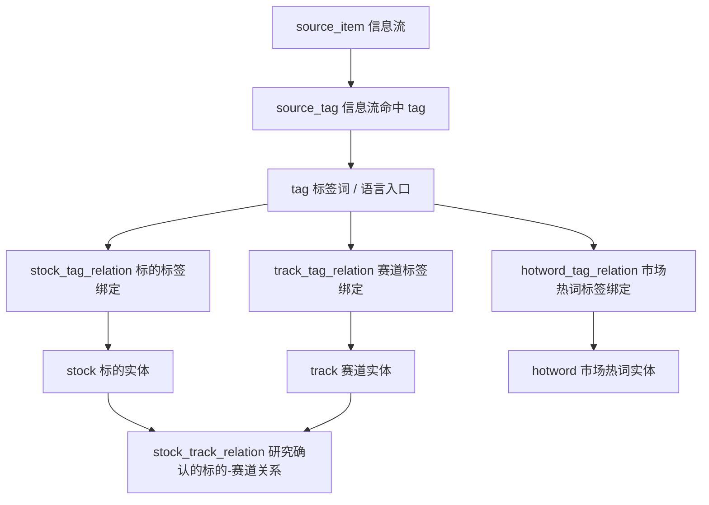
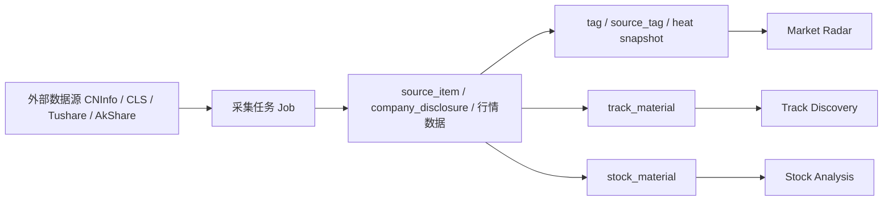
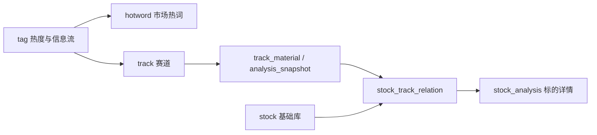
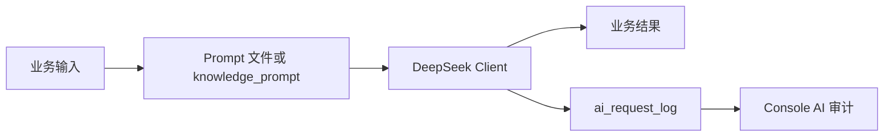

# liuli 系统规格说明书 v26

> 项目名称：`liuli`  
> 当前实现版本：v2 / `0.1.0`  
> 文档版本：v26  
> 生成日期：2026-06-25  
> 定位：个人投资辅助系统  
> 形态：Web + 后端服务，Android 保留规划边界  
> 用户模式：单用户安全登录，业务上按个人投资系统设计  
> 架构原则：业务与数据分层，模块内聚优先，复用后置抽象，AI 作为业务工具，不做过度平台化

---

## 0. v26 定位与当前实现同步点

v26 是当前平台的完整技术快照与后续长期维护基线，可独立替代 v25。v25 仅作为历史版本参考；后续如需要删除 v25 或将 v26 重命名为 `liuli_system_spec_release.md`，应以本文内容为准。

1. **Web 顶层导航已新增“工作台”**：当前 Web 是“工作台 + 六个业务模块 + 控制台”的结构。工作台提供今日看板、操作面板、最新报告，不改变六个业务模块的能力归属。
2. **控制台已扩展为运维入口**：控制台二级页包含系统状态、任务中心、数据源、股票基础库、标签索引、公告财报库、系统配置、AI 审计日志；控制台仍不承接业务主能力。
3. **Market Radar 已从 `tag-candidates` 收敛为 `ai_tag_suggestion`**：当前 API 使用 `/api/market-radar/ai-tag-suggestions`，并支持审核、拒绝、恢复；市场热词使用 `hotword` + `hotword_tag_relation`。
4. **Market Radar 已补充信息流统计与图谱 API**：包括信息流每日统计、标签趋势、标签来源、标的-热词图谱、赛道-热词图谱。
5. **Track Discovery 已落地最小重构模型**：当前保留 `track`、`track_material`、`track_analysis_snapshot`、`track_status_history`，不再建设 `track_thesis / track_validation_indicator / track_evidence / track_heat_snapshot`。
6. **Stock Analysis 已扩展行情与估值能力**：当前新增 `stock_daily_bar`、`stock_valuation_snapshot`，并提供日 K 数据、评分对比、估值对比接口。
7. **Stock Analysis 已落地标的事件模型**：当前使用 `stock_material` 承接标的事件/材料，并提供列表、详情标的材料、AI 复盘入口。
8. **Disclosure Library 已扩展业务转化入口**：公告可转为 `source_item`、`track_material` 或 `stock_material`，支持补齐缺失信息流条目。
9. **Knowledge Base 已新增 Prompt 管理与笔记分组**：当前包含 `knowledge_prompt`、`knowledge_note_group`，Prompt 文件也已按模块落在 `knowledge_base/prompts/*`。
10. **AI 服务已从预留状态推进到可审计调用**：当前包含 DeepSeek 服务适配、AI 调试日志与 `ai_request_log` 审计表；系统配置仍可承载多服务商 Key。
11. **外部行情/数据服务已新增 Tushare 与 AkShare 适配**：`services/tushare`、`services/akshare` 已成为跨模块候选复用服务。
12. **前端技术栈现状同步**：Web 使用 React 18、Vite 5、Ant Design 6、ECharts；当前依赖中已出现 `lightweight-charts`，用于后续 K 线/分时图，实际图表仍应优先使用 ECharts，K 线需求出现时再纳入页面实现。
13. **数据库后端现状同步**：默认 SQLite，依赖中已加入 `psycopg[binary]`，说明 PostgreSQL 作为后续可配置数据库方向，但当前运行默认仍是 `var/db/liuli.sqlite3`。
14. **任务体系现状同步**：APScheduler 工厂、Job Center、`job_run_request`、Worker 轮询执行已经形成当前任务执行链路。

---

## 1. 系统目标

`liuli` 是面向个人投资者的投资辅助系统，目标是把外部信息流、行情变化、公司公告、财报、舆情评论和研究过程，转化为可跟踪、可复盘、可反哺 AI 的投资认知闭环。

系统不直接给出买卖指令，而是辅助用户完成：

1. 发现好赛道：持续更新、持续验证、持续证伪。
2. 发现好标的：持续筛选、持续 PK、持续冒泡。
3. 发现好时机：持续预警、持续跟踪、持续等待。
4. 调整资产结构：持续复盘、持续优化、持续调整。
5. 沉淀认知资产：将研究笔记、Prompt、Skills、Agents、反馈记录形成可复用知识库。

---

## 2. 当前核心投资闭环

```text
工作台
  ↓
市场雷达
  ↓
赛道发现
  ↓
标的分析
  ↓
预警中心
  ↓
组合管理
  ↓
知识库沉淀
  ↓
Prompt / Skills / Agents
  ↓
AI 审计与反馈
  ↓
业务反哺
```

### 2.1 模块定位

| 模块 | 层级 | 作用 | 当前目录 |
|---|---|---|---|
| 工作台 `dashboard` | 聚合入口 | 汇总今日看板、操作面板、最新报告 | `invest_assistant/ui/web/src/pages/dashboard` |
| 市场雷达 `market_radar` | 信号层 | 发现市场正在关注什么 | `invest_assistant/modules/market_radar` |
| 赛道发现 `track_discovery` | 判断层 | 判断方向是否值得长期跟踪 | `invest_assistant/modules/track_discovery` |
| 标的分析 `stock_analysis` | 研究层 | 找出能承接赛道的公司 | `invest_assistant/modules/stock_analysis` |
| 预警中心 `alert_center` | 时机层 | 跟踪价格、估值、事件、热度异动 | `invest_assistant/modules/alert_center` |
| 组合管理 `portfolio` | 行动层 | 管理实盘持仓、调仓记录、组合复盘 | `invest_assistant/modules/portfolio` |
| 知识库 `knowledge_base` | 认知沉淀层 | 沉淀笔记、Prompt、Skills、Agents、反馈 | `invest_assistant/modules/knowledge_base` |
| 控制台 `console` | 运维管理层 | 管理状态、任务、数据源、基础库、配置、AI 审计 | `invest_assistant/modules/console` |

---

## 3. 技术栈

| 层级 | 当前技术 |
|---|---|
| Web | React 18、TypeScript、Vite 5、Ant Design 6、React Router 6、Axios、ECharts、echarts-for-react |
| Web 图表补充依赖 | `lightweight-charts` 已在依赖中，限定用于 K 线/分时类图表，不替代 ECharts 作为默认图表栈 |
| API | Python 3.11+、FastAPI、Uvicorn、Pydantic v2、SQLAlchemy 2 |
| 调度/任务 | APScheduler、Job Center、Worker 轮询执行 |
| 鉴权 | python-jose、passlib[bcrypt]、python-multipart |
| 数据库 | SQLite 默认；`database_url` 可配置；依赖已预留 PostgreSQL `psycopg[binary]` |
| 外部数据服务 | 巨潮 CNInfo、财联社 CLS、Tushare、AkShare、DeepSeek |
| 测试 | Pytest；Web 侧使用 Node/Vite 生态下的轻量 `.test.mjs/.test.ts` 结构测试 |

---

## 4. 架构原则与边界

### 4.1 业务模块内聚优先

继续沿用 v25 原则：一个业务能力尽量收敛在一个模块目录内；外部接口 client 优先贴近使用模块；只有两个以上模块稳定复用时才上移到 `services` 或 `shared`。

### 4.2 `modules`、`shared`、`services` 边界

| 目录 | 作用 | 当前口径 |
|---|---|---|
| `modules` | 业务能力归属 | 保存业务模型、schema、service、router、jobs |
| `shared` | 无业务含义公共工具 | 时间、分页、响应、错误、文件路径、DB 类型等 |
| `services` | 跨模块外部服务适配 | DeepSeek、Tushare、AkShare、AI debug logger 等 |
| `bootstrap` | 启动基础设施 | FastAPI 组装、配置、数据库、日志、调度器 |

### 4.3 控制台边界

控制台是运维和配置入口，不是业务能力 owner。标签定义、股票基础库、任务、配置、公告库可以从控制台进入，但实体标签绑定、赛道研究、标的研究等业务动作仍归属业务模块。

---

## 5. 当前后端目录结构

```text
invest_assistant/
├── bootstrap/                  # FastAPI app、配置、数据库、日志、调度器
├── shared/                     # 公共工具、分页、响应、错误、时间、DB 类型
├── services/                   # DeepSeek、Tushare、AkShare、AI 调试日志
├── modules/
│   ├── basic/
│   │   ├── auth/               # 登录、当前用户、改密
│   │   ├── stock_master/       # 股票基础库
│   │   ├── system_config/      # 系统配置、运行态
│   │   ├── job_center/         # 任务定义、请求、日志、调度、执行分发
│   │   ├── report_library/     # 报告库
│   │   ├── disclosure_library/ # 公告财报库、巨潮抓取、解析、转业务材料
│   │   └── ai_audit/           # AI 请求审计
│   ├── market_radar/           # 信息流、标签、热词、AI 推荐词、图谱、日报
│   ├── track_discovery/        # 赛道、赛道动态、赛道分析快照、状态历史
│   ├── stock_analysis/         # 标的池、笔记、评分、行情、估值、材料、关系绑定
│   ├── alert_center/           # 预警规则、预警事件
│   ├── portfolio/              # 组合、分组、持仓、复盘
│   ├── knowledge_base/         # 笔记、分组、Prompt、Skills、Agents、反馈
│   └── console/                # 控制台聚合 API
├── ui/web/                     # React Web 应用
├── main.py                     # API 入口
└── worker.py                   # Worker 入口
```

---

## 6. Web 信息架构

### 6.1 一级导航

| Key | 名称 | 路径 | 定位 |
|---|---|---|---|
| `dashboard` | 工作台 | `/` | 今日聚合入口 |
| `market-radar` | 市场雷达 | `/market-radar` | 市场信息流与热度 |
| `track-discovery` | 赛道发现 | `/track-discovery` | 赛道研究与动态 |
| `stock-analysis` | 标的分析 | `/stock-analysis` | 标的池、事件、对比、详情 |
| `alerts` | 预警中心 | `/alerts` | 规则与事件 |
| `portfolio` | 组合管理 | `/portfolio` | 组合、持仓、复盘 |
| `knowledge` | 知识库 | `/knowledge` | 笔记、Prompt、Skills、Agents、反馈 |
| `console` | 控制台 | `/console` | 运维、配置、基础库 |

### 6.2 二级页签

| 模块 | 当前二级页签 |
|---|---|
| 工作台 | 今日看板、操作面板、最新报告 |
| 市场雷达 | 市场看板、信息流、市场热度、关系图谱、AI 推荐词、市场热词 |
| 赛道发现 | 赛道看板、赛道库、赛道动态、赛道对比 |
| 标的分析 | 标的看板、标的池、标的事件、标的对比 |
| 预警中心 | 预警事件、预警规则、预警复盘 |
| 组合管理 | 组合看板、实盘持仓、调仓记录、组合复盘 |
| 知识库 | 知识笔记、Prompt、Skills、Agents、反哺记录 |
| 控制台 | 系统状态、任务中心、数据源、股票基础库、标签索引、公告财报库、系统配置、AI 审计日志 |

---

## 7. 数据模型总览

### 7.1 基础模块表

| 模块 | 表 |
|---|---|
| Auth | `user_account` |
| Stock Master | `stock` |
| System Config | `system_config`、`runtime_state` |
| Job Center | `job_config`、`job_run_request`、`job_run_log` |
| Report Library | `report` |
| Disclosure Library | `company_disclosure` |
| AI Audit | `ai_request_log` |

### 7.2 业务模块表

| 模块 | 表 |
|---|---|
| Market Radar | `tag`、`stock_tag_relation`、`track_tag_relation`、`hotword`、`hotword_tag_relation`、`source_item`、`source_tag`、`tag_heat_snapshot`、`tag_edge_snapshot`、`ai_tag_suggestion` |
| Track Discovery | `track`、`track_material`、`track_analysis_snapshot`、`track_status_history` |
| Stock Analysis | `stock_pool`、`stock_research_note`、`stock_score_snapshot`、`stock_daily_bar`、`stock_valuation_snapshot`、`stock_compare_group`、`stock_track_relation`、`stock_thesis`、`stock_material` |
| Alert Center | `alert_rule`、`alert_event` |
| Portfolio | `portfolio`、`portfolio_group`、`portfolio_position`、`portfolio_review` |
| Knowledge Base | `knowledge_note_group`、`knowledge_note`、`knowledge_note_tag_relation`、`knowledge_skill`、`knowledge_agent`、`knowledge_prompt`、`knowledge_feedback_log` |


### 7.3 数据表字段快照

> 本节按当前 SQLAlchemy model 字段同步，是 v26 能替代 v25 的关键部分之一。字段语义以模块内 service/router 使用为准；涉及 JSON 的字段应保持模块内聚，不向跨模块平台化扩散。

#### 基础与运维表

| 表 | 当前字段 |
|---|---|
| `user_account` | `id`, `username`, `password_hash`, `display_name`, `email`, `status`, `last_login_at`, `created_at`, `updated_at` |
| `stock` | `id`, `symbol`, `stock_code`, `stock_name`, `name_pinyin`, `name_abbr`, `market`, `exchange`, `status`, `created_at`, `updated_at` |
| `system_config` | `id`, `config_key`, `config_value`, `config_type`, `module_name`, `description`, `enabled`, `created_at`, `updated_at` |
| `runtime_state` | `id`, `namespace`, `state_key`, `state_value`, `value_type`, `ext_json`, `created_at`, `updated_at` |
| `job_config` | `id`, `job_name`, `module_name`, `display_name`, `description`, `config_json`, `ext_json`, `last_run_at`, `last_status`, `next_run_at`, `created_at`, `updated_at` |
| `job_run_request` | `id`, `job_name`, `params_json`, `status`, `requested_by`, `requested_at`, `started_at`, `finished_at`, `error_message` |
| `job_run_log` | `id`, `job_name`, `module_name`, `trigger_type`, `status`, `params_json`, `result_json`, `started_at`, `finished_at`, `duration_ms`, `fetched_count`, `processed_count`, `inserted_count`, `updated_count`, `error_message` |
| `report` | `id`, `title`, `report_type`, `source_module`, `target_type`, `target_id`, `summary`, `file_format`, `file_path`, `generated_by`, `status`, `publish_time`, `created_at`, `updated_at` |
| `company_disclosure` | `id`, `stock_id`, `source`, `disclosure_type`, `title`, `publish_time`, `report_period`, `source_url`, `file_path`, `parsed_text_path`, `parsed_markdown_path`, `parse_status`, `created_at`, `updated_at` |
| `ai_request_log` | `id`, `request_id`, `provider`, `model`, `task_name`, `status`, `prompt_tokens`, `completion_tokens`, `total_tokens`, `duration_ms`, `error_message`, `created_at` |

#### Market Radar 表

| 表 | 当前字段 |
|---|---|
| `tag` | `id`, `name`, `type`, `source`, `status`, `created_at`, `updated_at` |
| `stock_tag_relation` | `id`, `stock_id`, `tag_id`, `source`, `status`, `created_at`, `updated_at` |
| `track_tag_relation` | `id`, `track_id`, `tag_id`, `source`, `status`, `created_at`, `updated_at` |
| `hotword` | `id`, `name`, `description`, `status`, `created_at`, `updated_at` |
| `hotword_tag_relation` | `id`, `hotword_id`, `tag_id`, `source`, `status`, `created_at`, `updated_at` |
| `source_item` | `id`, `source_type`, `source_name`, `title`, `content`, `source_url`, `publish_time`, `related_type`, `related_id`, `created_at` |
| `source_tag` | `id`, `source_item_id`, `tag_id`, `trigger_text`, `confidence`, `extractor`, `created_at` |
| `tag_heat_snapshot` | `id`, `tag_id`, `window_type`, `stat_time`, `trigger_count`, `source_count`, `heat_score`, `avg_count`, `rank_no`, `created_at` |
| `tag_edge_snapshot` | `id`, `stock_tag_id`, `related_tag_id`, `related_tag_type`, `window_type`, `stat_time`, `cooccur_count`, `source_count`, `weight`, `latest_source_item_id`, `created_at` |
| `ai_tag_suggestion` | `id`, `suggested_text`, `final_tag_name`, `score`, `reason`, `status`, `rejected_count`, `final_tag_id`, `ext_json`, `created_at`, `updated_at` |

#### 研究与交易闭环表

| 表 | 当前字段 |
|---|---|
| `track` | `id`, `name`, `description`, `status`, `track_score`, `current_view`, `stage`, `confidence_level`, `created_at`, `updated_at` |
| `track_material` | `id`, `track_id`, `material_type`, `material_id`, `direction`, `importance_level`, `status`, `note`, `created_at`, `updated_at` |
| `track_analysis_snapshot` | `id`, `track_id`, `analysis_date`, `market_space`, `market_size`, `growth_rate`, `heat_summary`, `ai_summary`, `opportunity_points`, `risk_points`, `watch_signals`, `score`, `confidence_level`, `created_at` |
| `track_status_history` | `id`, `track_id`, `old_status`, `new_status`, `old_stage`, `new_stage`, `reason`, `changed_by`, `changed_at` |
| `stock_pool` | `id`, `stock_id`, `status`, `source`, `reason`, `created_at`, `updated_at` |
| `stock_research_note` | `id`, `stock_id`, `note_type`, `title`, `content`, `related_track_id`, `created_at`, `updated_at` |
| `stock_score_snapshot` | `id`, `stock_id`, `score_date`, `track_id`, `growth_score`, `valuation_score`, `moat_score`, `risk_score`, `total_score`, `created_at` |
| `stock_daily_bar` | `id`, `stock_id`, `ts_code`, `trade_date`, `open`, `high`, `low`, `close`, `pre_close`, `change`, `pct_chg`, `vol`, `amount`, `ma5`, `ma20`, `ma60`, `ma250`, `source`, `adj`, `created_at`, `updated_at` |
| `stock_valuation_snapshot` | `id`, `stock_id`, `company`, `company_code`, `report_period`, `report_release_date`, `current_market_value`, `financial_performance_json`, `trend_reference_json`, `guidance_check_json`, `quarter_performance`, `quarter_main_reason`, `profit_model_json`, `fcf_model_json`, `revenue_model_json`, `primary_model`, `expected_market_value_3y`, `expectation_gap_rate`, `analysis_date`, `researcher`, `created_at` |
| `stock_compare_group` | `id`, `name`, `track_id`, `stock_ids`, `description`, `created_at`, `updated_at` |
| `stock_track_relation` | `id`, `stock_id`, `track_id`, `relation_type`, `conviction`, `reason`, `status`, `created_at`, `updated_at` |
| `stock_thesis` | `id`, `stock_id`, `thesis_text`, `key_logic`, `validation_indicators`, `falsification_conditions`, `status`, `created_at`, `updated_at` |
| `stock_material` | `id`, `stock_id`, `material_type`, `material_id`, `impact_direction`, `importance_level`, `status`, `note`, `created_at`, `updated_at` |
| `alert_rule` | `id`, `user_id`, `name`, `rule_type`, `target_type`, `target_id`, `condition_json`, `enabled`, `status`, `created_at`, `updated_at` |
| `alert_event` | `id`, `rule_id`, `event_time`, `event_level`, `title`, `message`, `status`, `created_at` |
| `portfolio` | `id`, `user_id`, `name`, `base_currency`, `created_at`, `updated_at` |
| `portfolio_group` | `id`, `portfolio_id`, `name`, `group_type`, `target_weight`, `max_stock_count`, `sort_order`, `note`, `status`, `created_at`, `updated_at` |
| `portfolio_position` | `id`, `portfolio_id`, `group_id`, `stock_id`, `quantity`, `cost_price`, `current_price`, `previous_close`, `market_value`, `quote_time`, `price_source`, `target_weight`, `note`, `status`, `created_at`, `updated_at` |
| `portfolio_review` | `id`, `portfolio_id`, `title`, `content`, `risk_summary`, `created_at` |

#### Knowledge Base 表

| 表 | 当前字段 |
|---|---|
| `knowledge_note_group` | `id`, `name`, `sort_order`, `status`, `created_at`, `updated_at` |
| `knowledge_note` | `id`, `title`, `content`, `note_type`, `group_id`, `related_module`, `related_id`, `tags`, `status`, `created_at`, `updated_at` |
| `knowledge_note_tag_relation` | `id`, `note_id`, `tag_id`, `created_at` |
| `knowledge_skill` | `id`, `title`, `skill_type`, `principle`, `description`, `input_schema`, `output_schema`, `prompt_template`, `status`, `created_at`, `updated_at` |
| `knowledge_agent` | `id`, `name`, `target_module`, `description`, `skills_json`, `workflow_json`, `status`, `created_at`, `updated_at` |
| `knowledge_prompt` | `id`, `prompt_key`, `title`, `target_task`, `provider`, `model`, `system_prompt`, `user_prompt`, `response_format`, `status`, `created_at`, `updated_at` |
| `knowledge_feedback_log` | `id`, `agent_id`, `target_module`, `target_id`, `feedback_type`, `result_summary`, `effectiveness`, `created_at` |

### 7.4 当前不应恢复的历史结构

以下结构与当前 v26 快照不一致，不应因参考旧项目而恢复：

- `track_related_stock`：当前统一由 `stock_track_relation` 承载标的-赛道确认关系。
- `track_thesis / track_validation_indicator / track_evidence / track_heat_snapshot`：当前赛道研究使用 `track_material` 与 `track_analysis_snapshot`，热度由标签绑定关系聚合。
- `tag_candidate` API/表口径：当前使用 `ai_tag_suggestion`。
- `stock_alias / track_alias / hotword_alias` 独立别名表：当前没有对应 model，标签与实体绑定优先通过三层模型表达。

---

## 8. 标签、热词、实体绑定模型

当前标签、热词、实体绑定采用三层模型：



关键约束：

1. `tag` 是语言入口和离散语义锚点。
2. `stock`、`track`、`hotword` 是业务实体。
3. 实体标签绑定分别由 `stock_tag_relation`、`track_tag_relation`、`hotword_tag_relation` 承载。
4. `stock_track_relation` 是研究确认后的标的-赛道业务绑定，不等同于标签共现。
5. Console 可管理标签索引，但不成为实体标签绑定主工作流 owner。
6. 市场热度由 `source_item/source_tag/tag_heat_snapshot` 以及实体标签关系聚合，不为赛道单独建设 `track_heat_snapshot`。

---

## 9. 核心模块现状

### 9.1 工作台

工作台是 Web 聚合入口，当前主要承接：

- 今日看板：系统状态、任务状态、市场/研究/报告摘要。
- 操作面板：高频操作入口。
- 最新报告：报告库最新产物入口。

工作台不新增后端业务模块；后端聚合数据主要来自 Console、Report Library、Job Center 和各业务模块。

### 9.2 Market Radar（市场雷达）

职责：

- 承接统一信息流 `source_item`。
- 管理标签索引 `tag`。
- 管理市场热词 `hotword` 及热词-标签绑定。
- 生成标签热度、标签趋势、关系图谱。
- 承接 AI 推荐词 `ai_tag_suggestion` 的审核、拒绝、恢复。
- 生成市场日报和回填请求。

当前重点 API：

- `GET /api/market-radar/overview`
- `GET /api/market-radar/source-items`
- `GET /api/market-radar/source-items/daily-stats`
- `POST /api/market-radar/source-items/sync-cls`
- `GET/POST/PUT/DELETE /api/market-radar/tags`
- `GET /api/market-radar/tags/{tag_id}/trend`
- `GET/POST /api/market-radar/hotwords`
- `GET /api/market-radar/hotwords/stats`
- `GET/POST /api/market-radar/hotwords/{hotword_id}/tags`
- `GET /api/market-radar/rankings`
- `GET /api/market-radar/graphs/stock-track`
- `GET /api/market-radar/graphs/stock-hotword`
- `GET /api/market-radar/graphs/track-hotword`
- `GET/POST /api/market-radar/ai-tag-suggestions`
- `POST /api/market-radar/ai-tag-suggestions/{suggestion_id}/approve|reject|restore`

### 9.3 Track Discovery（赛道发现）

职责：

- 维护赛道实体 `track`。
- 维护赛道动态/材料 `track_material`。
- 维护赛道分析快照 `track_analysis_snapshot`。
- 记录赛道状态历史 `track_status_history`。
- 维护赛道标签绑定 `track_tag_relation`。
- 维护赛道关联标的，即 `stock_track_relation` 的赛道侧入口。

当前明确不建设：

- `track_thesis`
- `track_validation_indicator`
- `track_evidence`
- `track_heat_snapshot`
- 历史遗留 `track_related_stock`

当前重点 API：

- `GET /api/track-discovery/dashboard`
- `GET/POST /api/track-discovery/tracks`
- `GET/PUT/DELETE /api/track-discovery/tracks/{track_id}`
- `GET /api/track-discovery/tracks/{track_id}/detail`
- `GET/POST /api/track-discovery/tracks/{track_id}/tags`
- `GET/POST /api/track-discovery/tracks/{track_id}/materials`
- `GET/POST /api/track-discovery/tracks/{track_id}/analysis-snapshots`
- `POST /api/track-discovery/tracks/{track_id}/status`
- `GET/POST /api/track-discovery/tracks/{track_id}/stocks`

### 9.4 Stock Analysis（标的分析）

职责：

- 维护标的池 `stock_pool`。
- 维护研究笔记 `stock_research_note`。
- 维护评分快照 `stock_score_snapshot`。
- 维护日行情 `stock_daily_bar` 与估值快照 `stock_valuation_snapshot`。
- 维护标的对比组 `stock_compare_group`。
- 维护标的-赛道关系 `stock_track_relation`。
- 维护投资论点 `stock_thesis`。
- 维护标的事件/材料 `stock_material`。

当前重点 API：

- `GET /api/stock-analysis/dashboard`
- `GET/POST/PUT /api/stock-analysis/pool`
- `GET /api/stock-analysis/candidates`
- `GET /api/stock-analysis/stocks/{stock_id}`
- `GET /api/stock-analysis/stocks/{stock_id}/detail`
- `GET /api/stock-analysis/stocks/{stock_id}/daily-bars`
- `GET/POST /api/stock-analysis/stocks/{stock_id}/notes`
- `GET/POST /api/stock-analysis/stocks/{stock_id}/scores`
- `GET /api/stock-analysis/score-comparison`
- `GET /api/stock-analysis/valuation-comparison`
- `GET/POST /api/stock-analysis/compare-groups`
- `GET /api/stock-analysis/reports`
- `GET/POST /api/stock-analysis/stocks/{stock_id}/tags`
- `GET/POST /api/stock-analysis/stocks/{stock_id}/tracks`
- `GET /api/stock-analysis/materials`
- `GET/POST /api/stock-analysis/stocks/{stock_id}/materials`

### 9.5 Alert Center（预警中心）

职责：

- 管理预警规则 `alert_rule`。
- 生成和处理预警事件 `alert_event`。
- 支持规则启用、停用，事件已读、处理、删除与统计。

当前重点 API：

- `GET/POST/PUT/DELETE /api/alerts/rules`
- `POST /api/alerts/rules/{rule_id}/enable|disable`
- `GET /api/alerts/events`
- `GET /api/alerts/events/stats`
- `POST /api/alerts/events/read-all`
- `GET /api/alerts/events/{event_id}`
- `POST /api/alerts/events/{event_id}/read|handle`

### 9.6 Portfolio（组合管理）

职责：

- 管理实盘组合 `portfolio`。
- 管理组合分组 `portfolio_group`。
- 管理持仓 `portfolio_position`。
- 管理复盘 `portfolio_review`。
- 支持持仓行情刷新。

当前重点 API：

- `GET/POST /api/portfolios`
- `GET/PUT/DELETE /api/portfolios/{portfolio_id}`
- `GET /api/portfolios/{portfolio_id}/dashboard`
- `GET/POST/PUT /api/portfolios/{portfolio_id}/groups`
- `GET/POST/PUT/DELETE /api/portfolios/{portfolio_id}/positions`
- `POST /api/portfolios/{portfolio_id}/positions/refresh-quotes`
- `GET/POST /api/portfolios/{portfolio_id}/review`

### 9.7 Knowledge Base（知识库）

职责：

- 管理知识笔记 `knowledge_note`。
- 管理笔记分组 `knowledge_note_group`。
- 管理笔记标签关系 `knowledge_note_tag_relation`。
- 管理可复用 Skills `knowledge_skill`。
- 管理 Agents `knowledge_agent`。
- 管理 Prompt `knowledge_prompt`。
- 管理反哺记录 `knowledge_feedback_log`。

当前 Prompt 文件目录：

```text
invest_assistant/modules/knowledge_base/prompts/
├── market_radar/
├── track_discovery/
└── stock_analysis/
```

当前重点 API：

- `GET/POST/PUT/DELETE /api/knowledge/notes`
- `POST /api/knowledge/notes/{note_id}/archive|restore`
- `GET/POST/PUT /api/knowledge/note-groups`
- `GET/POST/PUT /api/knowledge/skills`
- `GET/POST/PUT /api/knowledge/agents`
- `GET/POST/PUT/DELETE /api/knowledge/prompts`
- `POST /api/knowledge/agents/{agent_id}/run`
- `GET /api/knowledge/feedback-logs`

### 9.8 Console（控制台）

职责：

- 汇总控制台 Dashboard。
- 提供工作台今日聚合接口。
- 展示系统状态。
- 展示数据源状态。
- 展示 AI 审计统计和日志。
- Web 侧挂载任务中心、股票基础库、标签索引、公告财报库、系统配置等基础模块入口。

当前重点 API：

- `GET /api/console/dashboard`
- `GET /api/console/workbench-today`
- `GET /api/console/system-status`
- `GET /api/console/data-sources`
- `GET /api/console/ai-logs/stats`
- `GET /api/console/ai-logs`

---

## 10. 基础模块现状

### 10.1 Auth

- 登录：`POST /api/auth/login`
- 登出：`POST /api/auth/logout`
- 当前用户：`GET /api/auth/me`
- 修改密码：`POST /api/auth/change-password`

### 10.2 Stock Master

股票基础库当前保留核心股票资料编辑与导入能力：

- `GET /api/stocks`
- `GET /api/stocks/search`
- `POST /api/stocks/import`
- `GET/PUT /api/stocks/{stock_id}`

当前没有独立 `stock_alias` 表；别名能力如需恢复，应优先审视 `stock` 字段与标签关系模型，而不是照搬旧项目结构。

### 10.3 System Config

- `GET/POST /api/system-config`
- `GET/PUT/DELETE /api/system-config/{config_key}`

系统配置承载数据库连接、AI Key、任务参数等配置项；运行态另由 `runtime_state` 承载。

### 10.4 Job Center

当前任务执行链路：

```text
JobDefinition 注册
  ↓
job_config 同步/编辑
  ↓
手动触发或调度触发
  ↓
job_run_request
  ↓
Worker 轮询执行
  ↓
job_run_log 记录
```

当前重点 API：

- `GET /api/jobs`
- `POST /api/jobs/sync-definitions`
- `GET /api/jobs/run-requests`
- `GET/PUT /api/jobs/{job_name}`
- `POST /api/jobs/{job_name}/run`
- `GET /api/jobs/{job_name}/logs`

### 10.5 Report Library

- `GET/POST /api/reports`
- `GET/PUT/DELETE /api/reports/{report_id}`
- `GET /api/reports/{report_id}/content`
- `GET /api/reports/{report_id}/download`

### 10.6 Disclosure Library

职责：

- 维护公告财报记录 `company_disclosure`。
- 对接巨潮 CNInfo。
- 下载、解析公告文件。
- 将公告转为信息流、赛道动态或标的材料。

当前重点 API：

- `GET/POST /api/disclosures`
- `POST /api/disclosures/fetch`
- `POST /api/disclosures/to-source-items-missing`
- `GET/PUT /api/disclosures/{disclosure_id}`
- `POST /api/disclosures/{disclosure_id}/download`
- `POST /api/disclosures/{disclosure_id}/parse`
- `GET /api/disclosures/{disclosure_id}/file`
- `GET /api/disclosures/{disclosure_id}/parsed`
- `POST /api/disclosures/{disclosure_id}/to-source-item`
- `POST /api/disclosures/{disclosure_id}/to-track-material`
- `POST /api/disclosures/{disclosure_id}/to-stock-analysis`

---

## 11. 外部服务与 AI 能力

### 11.1 外部服务

| 服务 | 当前目录 | 用途 |
|---|---|---|
| DeepSeek | `invest_assistant/services/deepseek` | AI 分析、推荐词、复盘等调用 |
| Tushare | `invest_assistant/services/tushare` | 股票、行情、财务等数据候选来源 |
| AkShare | `invest_assistant/services/akshare` | 行情与金融数据候选来源 |
| CNInfo | `invest_assistant/modules/basic/disclosure_library/cninfo_client.py` | 公告财报抓取，当前贴近公告库模块 |
| CLS | `invest_assistant/modules/market_radar` | 财联社信息流同步 |

### 11.2 AI 审计

AI 调用必须可审计。当前 `ai_request_log` 用于记录服务商、模型、输入/输出摘要、Token、耗时、状态、错误信息与成本相关字段。Console 提供 AI 审计统计与日志入口。

### 11.3 Prompt 管理

当前 Prompt 有两种形态：

1. 文件态 Prompt：随代码放在 `knowledge_base/prompts/<module>/<prompt_key>/system.md|user.md`。
2. 数据态 Prompt：通过 `knowledge_prompt` 表和 `/api/knowledge/prompts` 管理。

两者应保持清晰边界：文件态适合内置默认 Prompt，数据态适合运行期编辑、调试和版本记录。

---

## 12. 当前 API 总览

| 模块 | 前缀 | 代表性端点 |
|---|---|---|
| Health | `/api` | `GET /health` |
| Auth | `/api/auth` | `POST /login`, `POST /logout`, `GET /me`, `POST /change-password` |
| Stock Master | `/api/stocks` | `GET /`, `GET /search`, `POST /import`, `GET/PUT /{stock_id}` |
| System Config | `/api/system-config` | `GET/POST /`, `GET/PUT/DELETE /{config_key}` |
| Job Center | `/api/jobs` | `GET /`, `POST /sync-definitions`, `GET /run-requests`, `GET/PUT /{job_name}`, `POST /{job_name}/run`, `GET /{job_name}/logs` |
| Report Library | `/api/reports` | `GET/POST /`, `GET/PUT/DELETE /{report_id}`, `GET /{report_id}/content`, `GET /{report_id}/download` |
| Disclosure Library | `/api/disclosures` | `GET/POST /`, `POST /fetch`, `POST /to-source-items-missing`, `POST /{id}/to-source-item`, `POST /{id}/to-track-material`, `POST /{id}/to-stock-analysis` |
| Console | `/api/console` | `GET /dashboard`, `GET /workbench-today`, `GET /system-status`, `GET /data-sources`, `GET /ai-logs/stats`, `GET /ai-logs` |
| Market Radar | `/api/market-radar` | `GET /overview`, `GET /source-items`, `GET /source-items/daily-stats`, `GET/POST /tags`, `GET/POST /hotwords`, `GET /rankings`, `GET /graphs/*`, `GET/POST /ai-tag-suggestions` |
| Track Discovery | `/api/track-discovery` | `GET /dashboard`, `GET/POST /tracks`, `GET/PUT/DELETE /tracks/{id}`, `GET/POST /tracks/{id}/materials`, `GET/POST /tracks/{id}/analysis-snapshots`, `GET/POST /tracks/{id}/stocks` |
| Stock Analysis | `/api/stock-analysis` | `GET /dashboard`, `GET/POST/PUT /pool`, `GET /stocks/{id}/daily-bars`, `GET /score-comparison`, `GET /valuation-comparison`, `GET/POST /stocks/{id}/materials`, `GET/POST /stocks/{id}/tracks` |
| Alert Center | `/api/alerts` | `GET/POST/PUT/DELETE /rules`, `POST /rules/{id}/enable`, `GET /events`, `GET /events/stats`, `POST /events/read-all`, `POST /events/{id}/handle` |
| Portfolio | `/api/portfolios` | `GET/POST /`, `GET /{id}/dashboard`, `GET/POST/PUT /{id}/groups`, `GET/POST/PUT/DELETE /{id}/positions`, `POST /{id}/positions/refresh-quotes`, `GET/POST /{id}/review` |
| Knowledge Base | `/api/knowledge` | `GET/POST/PUT/DELETE /notes`, `GET/POST/PUT /note-groups`, `GET/POST/PUT /skills`, `GET/POST/PUT /agents`, `GET/POST/PUT/DELETE /prompts`, `POST /agents/{id}/run`, `GET /feedback-logs` |

---


## 13. 当前任务注册表

当前 Job Center 通过模块 `JOBS` 列表汇总到 `JOB_REGISTRY`，任务定义同步到 `job_config` 后由调度器或手动触发产生 `job_run_request`，Worker 轮询执行并写入 `job_run_log`。

| Job Name | 模块 | 用途 |
|---|---|---|
| `stock_master.sync_stock_basic` | Stock Master | 同步股票基础库 |
| `disclosure_library.fetch_stock_announcements` | Disclosure Library | 拉取股票公告 |
| `disclosure_library.download_file` | Disclosure Library | 下载公告财报文件 |
| `disclosure_library.parse_pdf` | Disclosure Library | 解析公告财报文件 |
| `market_radar.fetch_stock_news` | Market Radar | 拉取标的相关新闻/信息流 |
| `market_radar.fetch_news` | Market Radar | 拉取市场新闻/信息流 |
| `market_radar.fetch_futu_news` | Market Radar | 拉取富途新闻/信息流 |
| `market_radar.extract_tags` | Market Radar | 从信息流抽取标签命中关系 |
| `market_radar.backfill_source_tags` | Market Radar | 信息流标签回填请求处理 |
| `market_radar.extract_daily_hotwords_deepseek` | Market Radar | 使用 DeepSeek 抽取每日热词 |
| `market_radar.aggregate_heat` | Market Radar | 聚合标签热度快照 |
| `market_radar.aggregate_edges` | Market Radar | 聚合标签关系快照 |
| `market_radar.generate_daily_report` | Market Radar | 生成市场日报 |
| `track_discovery.review_track_events_deepseek` | Track Discovery | 使用 DeepSeek 复盘赛道动态 |
| `stock_analysis.sync_daily_bars` | Stock Analysis | 同步标的日行情/K 线基础数据 |
| `stock_analysis.review_stock_events_deepseek` | Stock Analysis | 使用 DeepSeek 复盘标的事件 |
| `alert_center.evaluate_rules` | Alert Center | 执行预警规则 |

任务约束：

1. `job_config` 只保存任务身份、展示信息、配置 JSON、扩展 JSON 与最近运行态；调度参数、Cron、超时、重试、参数 Schema 等必须继续收敛进 JSON 字段。
2. Worker 启动时可调用 `create_all_tables()` 补齐表结构，但不得执行清库、删库、重置数据库行为。
3. 任何会删除、清空、重建真实 `var/db/liuli.sqlite3` 数据的测试或脚本，必须先备份并取得明确确认。
4. AI 任务必须记录 `ai_request_log` 或同等审计信息，并尽量使用 `knowledge_prompt` 或内置 Prompt 文件作为可追溯 Prompt 来源。

## 14. 数据流与业务流程

### 14.1 信息流到研究材料



### 14.2 赛道到标的确认关系



### 14.3 AI 处理与审计



---

## 15. 运行与启动

### 15.1 Windows 一键启动

```powershell
.\start.bat
```

默认访问：

- Web: `http://127.0.0.1:5173`
- API Health: `http://127.0.0.1:8000/api/health`

默认账号：`admin / admin123`

### 15.2 手动启动

```powershell
# API
python -m uvicorn invest_assistant.main:app --host 127.0.0.1 --port 8000

# Worker
python -m invest_assistant.worker

# Web
cd invest_assistant\ui\web
npm.cmd install --no-audit --no-fund
npm.cmd run dev -- --host 127.0.0.1 --port 5173
```

---

## 16. 后续演进约束

1. 不复制旧项目目录结构、模块边界、表结构或架构设计。
2. `old/` 只能作为功能参考，如采集逻辑、解析细节、历史脚本、Prompt、样例数据。
3. 新实现必须落在当前 v26 模块边界内。
4. 默认数据库仍以 SQLite 为本地运行基线；任何清表、删表、重置数据库的命令必须先备份并获得明确确认。
5. Web 技术栈不得随意切换；ECharts 仍是默认图表栈，`lightweight-charts` 只用于 K 线/分时场景。
6. 控制台只作为运维面板，不夺取六个业务模块和基础模块的业务归属。
7. 标签、业务实体、业务绑定必须继续分层：`tag` 是语言入口，`stock/track/hotword` 是实体，`*_tag_relation` 是实体标签绑定，`stock_track_relation` 是研究确认关系。
8. AI 能力必须可审计、可回溯，不能绕过 `ai_request_log` 或同等审计机制。
9. Prompt、Skills、Agents 应服务于业务闭环，不提前建设重型平台化 Agent 框架。
10. v26 可作为长期维护规格的初始内容；后续如重命名为 `liuli_system_spec_release.md`，应保持完整快照口径，而不是以历史差异补丁形式维护。
