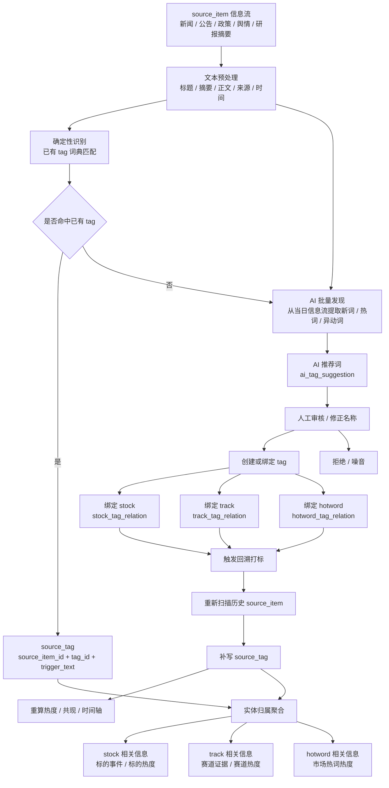

# 琉璃标签模型小重构说明

> 目的：把本次关于「信息流 → AI 推荐词 → 标签 → 标的 / 赛道 / 市场热词」的业务模型梳理，整理成一份可直接交给编码 AI 执行的小重构说明。  
> 性质：开发阶段的小范围业务模型对齐，不是平台重构，不是全量重写。  
> 原则：保留现有可复用工程结构、页面框架、接口框架、任务框架和组件；凡是旧代码或旧文档与本文冲突，以本文为准。

---

## 1. 核心结论

本次调整的核心是：

```text
删别名表；
增实体-标签绑定表；
把 tag 降级为语言入口；
把 stock / track / hotword 提升为业务主体。
```

新的三层模型：

```text
信息层：source_item
语言层：tag
业务层：stock / track / hotword
```

一句话：

```text
标签负责识别语言，实体负责承载业务，绑定关系负责归属，信息流关联负责市场信号。
```

---

## 2. 核心概念

### 2.1 source_item：原始信息流

`source_item` 是系统统一外部信息条目，包括新闻、公告摘要、政策、舆情、研报摘要等。

它回答：

```text
市场说了什么？
```

### 2.2 tag：标签词 / 语言入口

`tag` 不再是最终业务主体，而是：

```text
可被信息流识别的标签词
离散语义锚点
语言入口
```

它回答：

```text
信息流里出现了哪些词？
```

例如：

```text
宁德时代
宁王
CATL
AI算力
算力链
特朗普
川普
```

### 2.3 stock / track / hotword：业务实体

三类业务实体：

```text
stock   标的实体 / 股票基础主数据
track   赛道实体
hotword 市场热词实体
```

它们回答：

```text
这个词最终属于哪个业务对象？
```

示例：

```text
stock：宁德时代
绑定 tag：宁德时代、宁王、CATL、宁德

track：AI算力
绑定 tag：AI算力、算力链、AI服务器、智算中心

hotword：特朗普
绑定 tag：特朗普、川普、Trump、Donald Trump
```

---

## 3. 绑定和关联

### 3.1 绑定

绑定是人工确认、主数据关系、稳定归属。

对应表：

```text
stock_tag_relation
track_tag_relation
hotword_tag_relation
stock_track_relation
```

含义：

```text
stock_tag_relation   = 这只股票叫什么
track_tag_relation   = 这个赛道叫什么
hotword_tag_relation = 这个市场热词叫什么
stock_track_relation = 这只股票属于哪个赛道
```

### 3.2 关联

关联是信息流自动发现、统计共现、动态关系。

对应表：

```text
source_tag
tag_edge_snapshot
```

含义：

```text
source_tag        = 某条信息流命中了哪些 tag
tag_edge_snapshot = 哪些 tag 在信息流中经常共现
```

最终边界：

```text
绑定是业务确认关系；
关联是市场信息流发现关系。
```

---

## 4. 表结构变更总览

本次调整：

```text
新增表：5 张
删除 / 停用表：4 张
修改核心表：1 张
保留但调整业务口径表：3 张
```

新增 5 张表：

```text
1. stock_tag_relation
2. track_tag_relation
3. hotword
4. hotword_tag_relation
5. ai_tag_suggestion
```

删除 / 停用 4 张表：

```text
1. stock_alias
2. track_alias
3. hotword_alias
4. tag_candidate
```

修改核心表 1 张：

```text
1. tag
```

保留但调整业务口径 3 张表：

```text
1. source_tag
2. tag_heat_snapshot
3. tag_edge_snapshot
```

保持不变的关键表：

```text
stock
stock_pool
track
stock_track_relation
source_item
```

---

## 5. 新增表结构

### 5.1 stock_tag_relation

```sql
CREATE TABLE stock_tag_relation (
    id INTEGER NOT NULL,
    stock_id INTEGER NOT NULL,
    tag_id INTEGER NOT NULL,
    source VARCHAR(32),
    status VARCHAR(32) NOT NULL,
    created_at DATETIME NOT NULL,
    updated_at DATETIME NOT NULL,
    PRIMARY KEY (id),
    UNIQUE (stock_id, tag_id)
);
```

含义：

```text
stock_tag_relation = 标的绑定哪些标签词。
```

例子：

```text
宁德时代 stock 绑定：
- 宁德时代
- 宁王
- CATL
- 宁德
```

### 5.2 track_tag_relation

```sql
CREATE TABLE track_tag_relation (
    id INTEGER NOT NULL,
    track_id INTEGER NOT NULL,
    tag_id INTEGER NOT NULL,
    source VARCHAR(32),
    status VARCHAR(32) NOT NULL,
    created_at DATETIME NOT NULL,
    updated_at DATETIME NOT NULL,
    PRIMARY KEY (id),
    UNIQUE (track_id, tag_id)
);
```

含义：

```text
track_tag_relation = 赛道绑定哪些标签词。
```

例子：

```text
AI算力 track 绑定：
- AI算力
- 算力链
- AI服务器
- 智算中心
```

### 5.3 hotword

```sql
CREATE TABLE hotword (
    id INTEGER NOT NULL,
    name VARCHAR(128) NOT NULL,
    description TEXT,
    status VARCHAR(32) NOT NULL,
    created_at DATETIME NOT NULL,
    updated_at DATETIME NOT NULL,
    PRIMARY KEY (id),
    UNIQUE (name)
);
```

含义：

```text
hotword = 市场热词实体。
```

注意：

```text
hotword 是业务实体，不再只是 tag(type=hotword)。
```

### 5.4 hotword_tag_relation

```sql
CREATE TABLE hotword_tag_relation (
    id INTEGER NOT NULL,
    hotword_id INTEGER NOT NULL,
    tag_id INTEGER NOT NULL,
    source VARCHAR(32),
    status VARCHAR(32) NOT NULL,
    created_at DATETIME NOT NULL,
    updated_at DATETIME NOT NULL,
    PRIMARY KEY (id),
    UNIQUE (hotword_id, tag_id)
);
```

含义：

```text
hotword_tag_relation = 市场热词绑定哪些标签词。
```

例子：

```text
特朗普 hotword 绑定：
- 特朗普
- 川普
- Trump
- Donald Trump
```

### 5.5 ai_tag_suggestion

```sql
CREATE TABLE ai_tag_suggestion (
    id INTEGER NOT NULL,
    suggested_text VARCHAR(128) NOT NULL,
    final_tag_name VARCHAR(128),
    score FLOAT,
    reason TEXT,
    status VARCHAR(32) NOT NULL,
    final_tag_id INTEGER,
    ext_json TEXT NOT NULL,
    created_at DATETIME NOT NULL,
    updated_at DATETIME NOT NULL,
    PRIMARY KEY (id)
);
```

含义：

```text
ai_tag_suggestion = AI 推荐词审核池。
```

它替代原来的：

```text
tag_candidate
```

中文页面名：

```text
AI 推荐词
```

不要叫：

```text
候选标签
```

不要增加以下字段：

```text
suggested_type
normalized_text
source_item_ids
hit_count
first_seen_at
last_seen_at
target_entity_type
target_entity_id
```

原因：

```text
suggested_type
→ 外部 AI 不需要理解 stock / track / hotword 业务分类

normalized_text
→ 可由程序临时计算，不必落库

source_item_ids
→ 可放 ext_json，第一版不摊字段

hit_count / first_seen_at / last_seen_at
→ 后续可通过 source_tag / source_item 统计

target_entity_type / target_entity_id
→ 业务绑定由 stock_tag_relation / track_tag_relation / hotword_tag_relation 表达
```

---

## 6. 修改 tag 表

旧定位：

```text
tag = 正式统计标签
```

新定位：

```text
tag = 标签词 / 语言入口 / 离散语义锚点
```

推荐表结构：

```sql
CREATE TABLE tag (
    id INTEGER NOT NULL,
    name VARCHAR(128) NOT NULL,
    type VARCHAR(32),
    status VARCHAR(32) NOT NULL,
    source VARCHAR(32),
    created_at DATETIME NOT NULL,
    updated_at DATETIME NOT NULL,
    PRIMARY KEY (id),
    UNIQUE (name)
);
```

字段说明：

```text
name   = 标签词
type   = stock / track / hotword / general，可选
status = active / archived / rejected
source = ai / rule / manual / system，可选
```

注意：

```text
tag 不再直接代表标的、赛道、市场热词的最终统计主体。
tag 是词级对象。
stock / track / hotword 才是业务实体。
```

---

## 7. 删除 / 停用旧表

删除 / 停用：

```text
stock_alias
track_alias
hotword_alias
tag_candidate
```

删除原因：

```text
不再使用“别名表”。
所谓别名统一理解为：同一个业务实体绑定多个 tag。
```

旧模型：

```text
stock_alias   → stock
track_alias   → track
hotword_alias → tag(type=hotword)
```

新模型：

```text
stock   → stock_tag_relation   → tag
track   → track_tag_relation   → tag
hotword → hotword_tag_relation → tag
```

---

## 8. 保留但调整业务口径的表

### 8.1 source_tag

保留。

建议表结构：

```sql
CREATE TABLE source_tag (
    id INTEGER NOT NULL,
    source_item_id INTEGER NOT NULL,
    tag_id INTEGER NOT NULL,
    trigger_text VARCHAR(128),
    confidence FLOAT,
    extractor VARCHAR(32),
    created_at DATETIME NOT NULL,
    PRIMARY KEY (id),
    UNIQUE (source_item_id, tag_id)
);
```

含义：

```text
source_tag = source_item 命中了哪些标签词 tag。
```

关系：

```text
source_item → source_tag → tag
```

不要在 `source_item` 上直接放：

```text
tag_id
```

### 8.2 tag_heat_snapshot

保留。

含义调整为：

```text
标签词热度
```

不再直接等于：

```text
标的热度
赛道热度
市场热词热度
```

实体热度通过绑定关系聚合：

```text
stock_heat   = stock 绑定的所有 tag 热度聚合
track_heat   = track 绑定的所有 tag 热度聚合
hotword_heat = hotword 绑定的所有 tag 热度聚合
```

### 8.3 tag_edge_snapshot

保留。

含义调整为：

```text
标签词之间的信息流共现关系。
```

它是自动关联，不是业务绑定。

```text
tag_edge_snapshot = 关联
stock_track_relation = 绑定
```

---

## 9. 关键业务规则

### 9.1 stock 不批量生成 tag

同步 A 股基础库时：

```text
stock_master 同步 A 股基础库
→ 只写 stock
→ 不批量生成 tag
```

只有这些情况才生成或绑定 tag：

```text
加入研究池
信息流命中
人工确认
业务激活
```

### 9.2 添加研究标的时自动生成同名 tag

```text
添加研究标的 / 加入 stock_pool
→ ensure tag(name=stock.stock_name)
→ 写 stock_tag_relation
```

示例：

```text
stock：安集科技
加入 stock_pool
→ ensure tag：安集科技
→ stock_tag_relation(stock_id=安集科技, tag_id=安集科技)
```

### 9.3 新建赛道时自动生成同名 tag

```text
新建 track
→ ensure tag(name=track.name)
→ 写 track_tag_relation
```

示例：

```text
track：AI算力
→ ensure tag：AI算力
→ track_tag_relation(track_id=AI算力, tag_id=AI算力)
```

### 9.4 新建市场热词时自动生成同名 tag

```text
新建 hotword
→ ensure tag(name=hotword.name)
→ 写 hotword_tag_relation
```

示例：

```text
hotword：特朗普
→ ensure tag：特朗普
→ hotword_tag_relation(hotword_id=特朗普, tag_id=特朗普)
```

### 9.5 不需要 is_primary

第一版不需要：

```text
is_primary
```

原因：

```text
主名称由实体表自己承担：
stock.name / stock.stock_name
track.name
hotword.name
```

relation 表只表达：

```text
这个 tag 归属这个实体
```

不负责主次。

---

## 10. AI 推荐词流程

### 10.1 AI 只负责推荐词

AI 不负责判断：

```text
stock
track
hotword
```

AI 只输出：

```text
name
score
reason
```

示例输出：

```json
{
  "suggestions": [
    {
      "name": "神舟22号",
      "score": 8.5,
      "reason": "今日多条航天相关新闻集中提及，市场关注度上升"
    }
  ]
}
```

### 10.2 AI 推荐词审核逻辑

```text
AI 推荐词
→ 写 ai_tag_suggestion
→ 人工审核
→ 创建或绑定 tag
→ 绑定业务实体 stock / track / hotword
```

审核规则：

```text
如果 final_tag_name 为空：
→ 使用 suggested_text 创建 / 绑定 tag

如果 final_tag_name 不为空：
→ 使用 final_tag_name 创建 / 绑定 tag
→ suggested_text 作为 AI 原始推荐记录保留
```

示例 1：AI 推荐准确

```text
suggested_text = 玻璃基板
final_tag_name = null

审核通过后：
tag.name = 玻璃基板
```

示例 2：人工修正

```text
suggested_text = 神舟22号
final_tag_name = 神舟

审核通过后：
tag.name = 神舟
```

### 10.3 完整流程

```text
source_item 当日信息流
→ 结构化聚合
→ AI 提取值得关注的新词 / 热词 / 异动词
→ 写 ai_tag_suggestion
→ 人工审核
→ 创建或绑定 tag
→ 绑定业务实体 stock / track / hotword
→ 回溯 source_item 打标
→ 写 source_tag
→ 重算热度、共现、事件时间轴
```

---

## 11. 信息流打标流程

已有 tag 命中时，不需要 AI。

```text
source_item
→ 规则 / 词典 / tag 匹配
→ source_tag
→ tag
```

例如：

```text
新闻：宁王业绩大超预期
```

系统已有：

```text
tag：宁王
stock_tag_relation：宁王 → 宁德时代
```

则直接写：

```text
source_tag.source_item_id = 当前新闻
source_tag.tag_id = 宁王 tag_id
source_tag.trigger_text = 宁王
extractor = rule
```

后续通过：

```text
stock_tag_relation
```

聚合到：

```text
stock：宁德时代
```

---

## 12. 从信息流到业务实体的流程图



---

## 13. 页面入口调整

市场雷达：

```text
信息流
标签热度
AI 推荐词
市场热词
关系图谱
```

标的详情：

```text
管理该 stock 绑定的 tag
```

赛道详情：

```text
管理该 track 绑定的 tag
```

市场热词详情：

```text
管理该 hotword 绑定的 tag
```

控制台 / 标签索引：

```text
查看 tag
查重
停用
查看绑定关系
不作为主要业务创建入口
```

---

## 14. 不做复杂合并体系

第一版不做：

```text
tag.merged_into_tag_id
track.merged_into_track_id
tag_merge_history
track_merge_history
term 统一词项层
entity_alias
is_primary
```

如果标签绑定错了，用：

```text
删除
停用
重新绑定
回溯打标
```

解决。

---

## 15. 给编码 AI 的执行要求

```text
1. 不要全量重写。
2. 不要做平台重构。
3. 不要做兼容旧模型。
4. 不考虑正式数据迁移，项目仍处于开发阶段。
5. 删除或停用旧 alias 表相关逻辑。
6. 将旧 tag_candidate 相关逻辑改为 ai_tag_suggestion。
7. 将旧 hotword_alias 改为 hotword + hotword_tag_relation。
8. 修改 source_tag、热度统计、实体聚合逻辑，使其适配“tag 词项 + 实体绑定”的模型。
9. 先完成后端模型、关系、服务逻辑，再调整页面。
10. 如果遇到旧代码和本文冲突，以本文为准。
```

---

## 16. 最终一句话

```text
信息流产生语言信号，AI 推荐词负责发现未知词，tag 承载语言词项，stock / track / hotword 承载业务实体，relation 表负责把语言绑定到业务对象。
```
